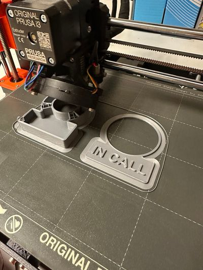

# meeting_mate

## Zadanie projektu
Tento projekt sa zameriava na vývoj zariadenia, ktoré slúži na indikáciu stavu dostupnosti počas pracovných online stretnutí. Navrhované zariadenie bude monitorovať aktivitu používateľa a farebným osvetlením zobrazí jeho dostupnosť. Ak je používateľ na pracovnom hovore, zariadenie rozsvieti červené svetlo, čo signalizuje, že by nemal byť rušený. Naopak, ak nie je na hovore, rozsvieti sa zelené svetlo, čo dáva ostatným najavo, že ho môžu osloviť. Tento jednoduchý vizuálny systém umožní členom domácnosti rýchlo a jasne rozlíšiť, kedy je vhodné osobu osloviť a kedy nie. 

## Motivácia
V dnešnej dobe, keď mnoho ľudí pracuje z domu, často dochádza k situáciám, kedy ostatní členovia domácnosti nevedia, či je osoba na dôležitom hovore alebo ju môžu ju vyrušiť. To môže viesť k nechceným prerušením, ktoré negatívne ovplyvňujú produktivitu a taktiež to je nepríjemné počas dôležitých pracovných stretnutí.

## Biznis koncept
Práca z domu prináša viacero výhod v oblasti time manažmentu. Pri práci z domu je potrebné častokrát komunikovať s kolegami aj

### Prípady použitia 

### Aktivity diagram  

## Návrh

### Inšpirácia
Generovanie pomocu GPT

### 3D Model 

### Tlač modelu

### Schéma prepojenie a výber komponentov

### Zapojenie kompomentov

### Test FIT

### Testovanie

### Kód
Bližšie popísaný v priečinku zdrojový kód

### Finálny produkt

## Zhodnotenie
