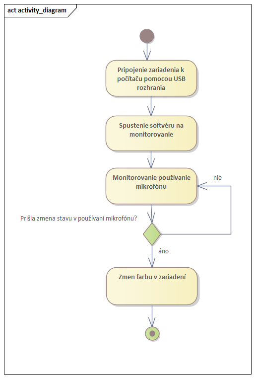
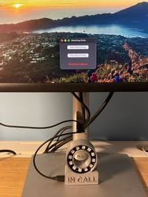
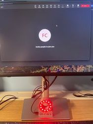

# Meeting Mate

## Zadanie projektu
Tento projekt sa zameriava na vývoj zariadenia, ktoré slúži na indikáciu stavu dostupnosti počas pracovných online stretnutí. Navrhované zariadenie bude monitorovať aktivitu používateľa a farebným osvetlením zobrazí jeho dostupnosť. Ak je používateľ na pracovnom hovore, zariadenie rozsvieti červené svetlo, čo signalizuje, že by nemal byť rušený. Naopak, ak nie je na hovore, rozsvieti sa zelené svetlo, čo dáva ostatným najavo, že ho môžu osloviť. Tento jednoduchý vizuálny systém umožní členom domácnosti rýchlo a jasne rozlíšiť, kedy je vhodné osobu osloviť a kedy nie. 

## Motivácia
V dnešnej dobe, keď mnoho ľudí pracuje z domu, často dochádza k situáciám, kedy ostatní členovia domácnosti nevedia, či je osoba na dôležitom hovore alebo ju môžu ju vyrušiť. To môže viesť k nechceným prerušením, ktoré negatívne ovplyvňujú produktivitu a taktiež to je nepríjemné počas dôležitých pracovných stretnutí.

## Biznis koncept
Práca z domu prináša množstvo výhod, najmä v oblasti správy času. Jednou z výziev však býva potreba pravidelnej komunikácie s kolegami, ktorá často prebieha prostredníctvom online meetingov. Tieto stretnutia si vyžadujú plnú pozornosť a sústredenosť, aj keď nie vždy je nevyhnutné aktívne sa zapojiť do diskusie. Aj keď práve nehovoríte, očakáva sa od vás, že budete plne sústredení, pričom akékoľvek vyrušenia sú nežiaduce.

Nie každý má možnosť pracovať v samostatnej kancelárii. Ak však takýto priestor doma máte, môže nastať problém s jasnou signalizáciou toho, či ste momentálne na pracovnom stretnutí. Často sa stáva, že kolega zavolá nečakane, alebo si jednoducho zabudnete vyvesiť ceduľku „nerušiť“. Tradičné metódy, ako zatvorenie dverí či manuálne vyznačenie nerušenia, nemusia byť vždy praktické a spoľahlivé.

Preto má zmysel vyvinúť zariadenie, ktoré by automaticky monitorovalo vašu aktivitu a dokázalo vizuálne signalizovať váš stav, napríklad pripojenie na online meeting. Takéto riešenie by bolo obzvlášť užitočné v domácom prostredí, no má potenciál aj pre širšie uplatnenie v kanceláriách

Nasledujúci obrázok popisuje biznis koncept a motiváciu za vyvojom tohto zariadenia.

### Prípady použitia 
Zariadenie má 2 primárne využitia. Pre pracovníka Home Office poskytuje možnosť reportovania dostupnosti ostatným v domácnosti. Pre člena domácnosti je na druhú stranu výhodou možnsť zistenia dostupnosti tohto člena domácnosti alebo v pracovnom právnom koncepte - pracovníka. Prípadne ako bolo spomínané sa dá tento prípad použitia replikovať aj v kancelárii.

## Návrh

### Inšpirácia
Inšpirácie boli generované pomocou DALL-E modelu a po opísaní zadania a konceptu tohto zariadenia. Pri inšpirácii pre tvar zariadenia boli generované viaceré obrázky avšak tieto 2 ma najviac zaujali a následne aj inšpirovali k vytvoreniu 3D modelu.

### 3D Model 
Model zariadenia bol navrhnutý po inpirácii z generovaných obrázkov na základe biznis konceptu. Rozmety boli prispôsobené pre zhodné uloženie kompomentov a to mikrokontroléra Raspberry Pi Pico a RGB LED kruhu s dvanástimi adresovateľnými diódami.

### Aktivity diagram  
Navrhovaný aktivity diagram znázorňujúci fungovanie a jednotlivé kroky v procese. Člen domácnosti, ktorý pracuje ako Home Office pracovník si zapojí navrhované zariadenie k počítaču, následne spustí softvér dostupný k tomu zariadeniu, ktorý poskytuje monitorovanie používania mikrofónu. Po spustení tohto softvéru sa začne monitorovanie používania mikrofónu. Ak nastane zmena pri používaní mikrofónu je reflektovaná zmenou farby zariadenia. Presnejšie ak sa mikrofón nepoužíva, zariadenie svieti na zeleno, v prípade aktívneho používania mikrofónu zariadenie zmení farbu na červeno. Pri tomto diagrame je podstatné podotknúť, že počítač vyhodnocuje používanie mikrofónu akonáhle je používateľ účastníkom online hovoru bez ohľadu na stav jeho mikrofónu. Teda bez ohľadu na to, či je používateľov mikrofón zapnutý alebo vypnutý. Vďaka tomuto dizajnu online meetingov je možné používať zobrazený diagram na reportovanie, či je používateľ účastníkom konferenčného hovoru alebo nie.

### Tlač modelu
Po vymodelovaní v programe SketchUp, bol model vytlačený. Tlač bola opakované pre lepšie prispôsobenie jednotlivých kompomentov v modeli.

Výsledný model, pripravený pre uloženie kompomentov.

### Schéma prepojenie a výber komponentov
Pre tento projekt boli zvolené nasledujúce kompomenty:

Mikrokontróler RASPBERRY Pi Pico - https://www.alza.sk/raspberry-pi-pico-d6313108.htm?o=1

Kruh RGB LED-iek 12 - https://techfun.sk/produkt/kruh-rgb-led-iek-81224-3240/?gad_source=1&attribute_pa_pocet-led-v-kruhu=12

Komponenty boli zvolené pre ich dostupnosť, rozmery, ktoré boli vhodné pre tento projekt a taktiež pre ich dostačujúce technické parametre pre tejto projekt.

Schéma zapojenia kompomentov bola vypracovaná v programe fritzing, ktorý poskytuje aj vizualizáciu jednotlivých kompomentov. Komponenty však bolo potrebné do programu importovať samostatne, kedže neboli natívne dostupné.

### Zapojenie kompomentov
Podľa navrhnutej schémy boli zapojené jednotlivé kompomenty. Pri narábaní s mikrokontrolérmi je možné používať aj nepájivé kontaktné pole, kde jednoduchšie môže vývojár testovať jednotlivé idei. Pre estetiku 3D modelu a veľkosť zariadenia bola preto zvolená metóda priameho letovania kontektorov na mikrokontrolér.

### Test FIT
Testovanie uloženia komponentov do vytlačeného modelu.

### Kód
Zdrojový kód s komentármi sa nachádza v priečinku code. Pre správne fungovanie je potrebné spustiť kód a následne zapnúť monitorovanie.

### Finálny produkt
Finálnym produktom je zariadenie ktoré pozostáva z 3D vytlačeného modelu, LED kruhu a mikrokontrolera. Pre fungovanie zariadenia je potrebná aj aplikácia, ktorá vykonáva meranie vyúžívania mikrofónu.

Aplikácia po spustení pozostáva z 2 tlačidiel a indikátora, či je monitorovanie spustené alebo nie.

Po spustení monitorovania sa zapne LED kruh na farbu podľa toho či je miktofón používaný alebo nie. V prípade, že používateľ nie je na online hovore, zariadenie svieti na zeleno a v prípade, že je pripojený na online meeting tak sa svetlo zmení na červené. 

Aplikácia na monitorovanie je spustená ale používateľ nie je pripojený na žiadnom meetingu. 

Aplikácia na monitorovanie je spustená a používateľ je pripojený na Microsoft team meetingu. Zariadenie funguje rovnako so všetkými aplikáciami skrz to, že monitoruje používanie mikrofónu a nie používanie rôznych aplikácii.

## Zhodnotenie
Výsledkom tohto projektu je funkčné zariadenie, ktoré po spustení softvéru reflektuje stav používateľa na online meetingu. Praktické využitie tohto zariadenie môže byť na pracovnom stole pri dobrej viditeľnosti ostatných členov domácnosti.

Počas práce na tomto projekte bolo vytvorených viacero iterácii či už 3D modelu, pre lepšie uloženie komponentov. Rovnako bolo vytvorených viacero verzií softvéru pre docielenie korektného monitorovania používania mikrofónu.

#### LinkedIn link - https://www.linkedin.com/company/105199254/
#### Youtube link - https://www.youtube.com/@meeting-mate