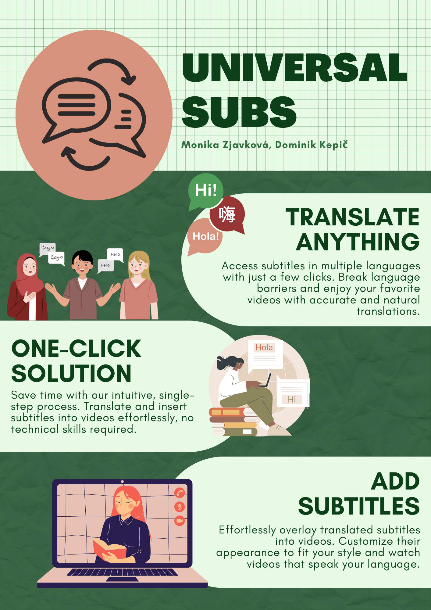
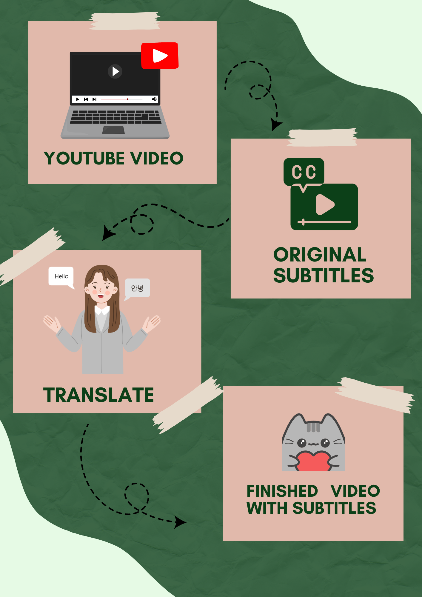

# 🌍 UniversalSubs - Videá bez hraníc! 🎥

UniversalSubs je aplikácia, ktorá umožňuje generovať a prekladať titulky pre YouTube videá pomocou umelej inteligencie. Jednoducho vložte odkaz na video, vyberte jazyk a získajte presné titulky v priebehu niekoľkých sekúnd!  

---

## 📜 **Funkcionality**
- **Preklad titulkov:** Podpora viacerých jazykov cez AI modul.  
- **Prispôsobenie:** Úprava a export titulkov vo formáte, ktorý potrebujete.
- **Vloženie tituliek:** Vkladanie nových upravených tituliek do požadovaného videa.

---

## 🗂️ **Štruktúra projektu**
- **`/promo_images`**  
  Obsahuje promo obrázky, ktoré môžete použiť na prezentáciu projektu.  

- **`/python`**  
  Obsahuje zdrojový kód aplikácie vrátane všetkých funkcií pre spracovanie videí, generovanie titulkov a UI aplikácie.  

- **`/model`**  
  Obsahuje predtrénované modely a súbory pre AI modul na generovanie a prekladanie titulkov.  

---

## 🚀 **Ako spustiť aplikáciu?**

### **1. Klonovanie repozitára**
Najskôr si stiahnite projekt:  
```bash
git clone https://github.com/yourusername/yourtube-translate.git
cd yourtube-translate
```

## **2. Inštalácia závislostí**
Uistite sa, že máte nainštalovaný Python 3.9+, a následne nainštalujte všetky potrebné balíčky:
pip install -r requirements.txt

## **3. Spustenie aplikácie**
Aplikáciu môžete spustiť nasledujúcim príkazom:
```bash
python app/main.py
```


## 📊 **Ako funguje AI modul?**
Preklad titulkov:
Preklady zabezpečuje moderný jazykový model uložený v adresári /model. Tento model je schopný spracovať rôzne jazyky s vysokou presnosťou.

## 📸 **Promo obrázky**
V priečinku /promo_images nájdete promo materiály na prezentáciu projektu. Tieto obrázky môžete použiť na marketingové účely alebo ich zdieľať s komunitou.




## 💡 **Budúce plány**
Offline spracovanie: Možnosť používať aplikáciu bez pripojenia na internet.  
Viacjazyčné titulky: Generovanie jedného súboru tituliek, ktoré obsahujú rôzne jazyky.  
Rozšírené UI nástroje: Integrácia editoru pre úpravu časovania a obsahu titulkov.  
