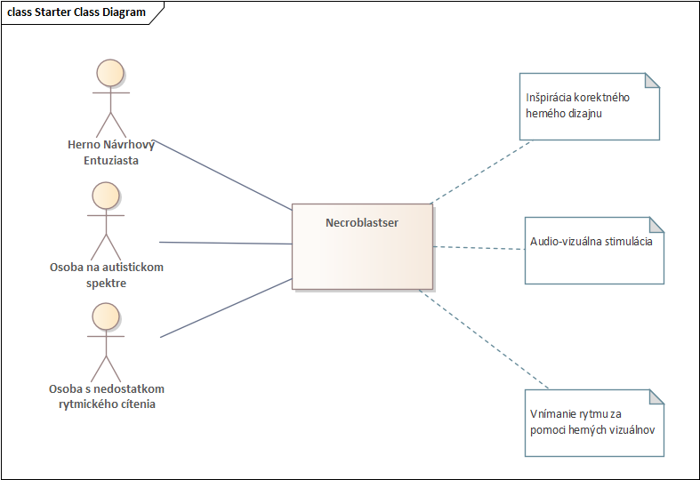
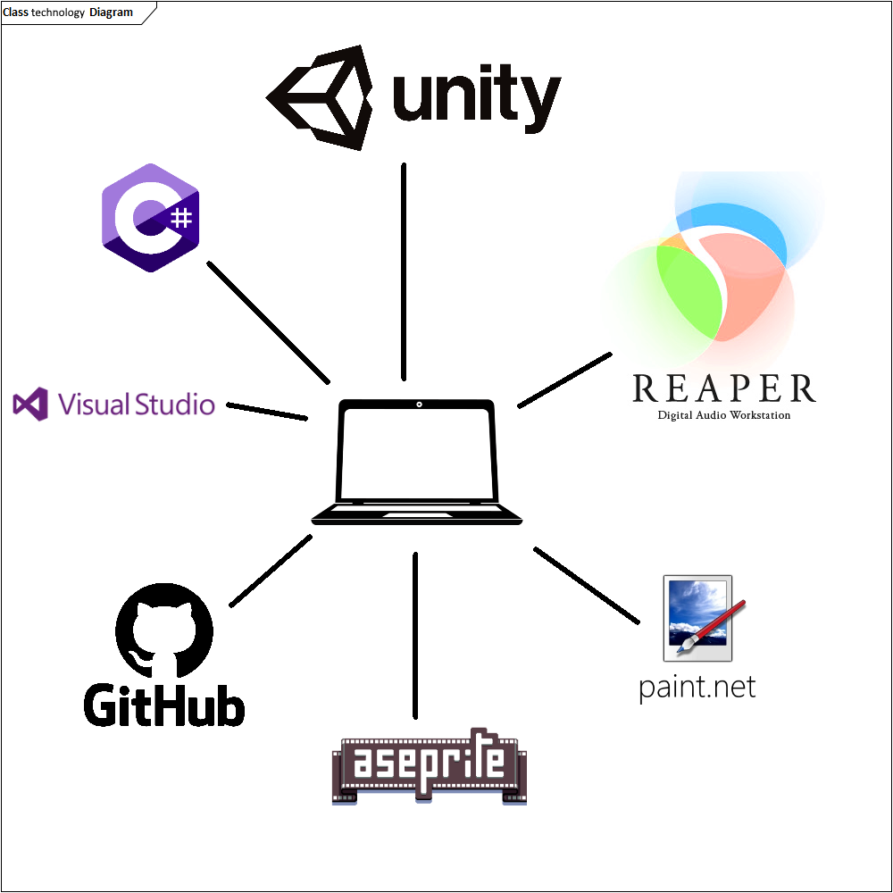
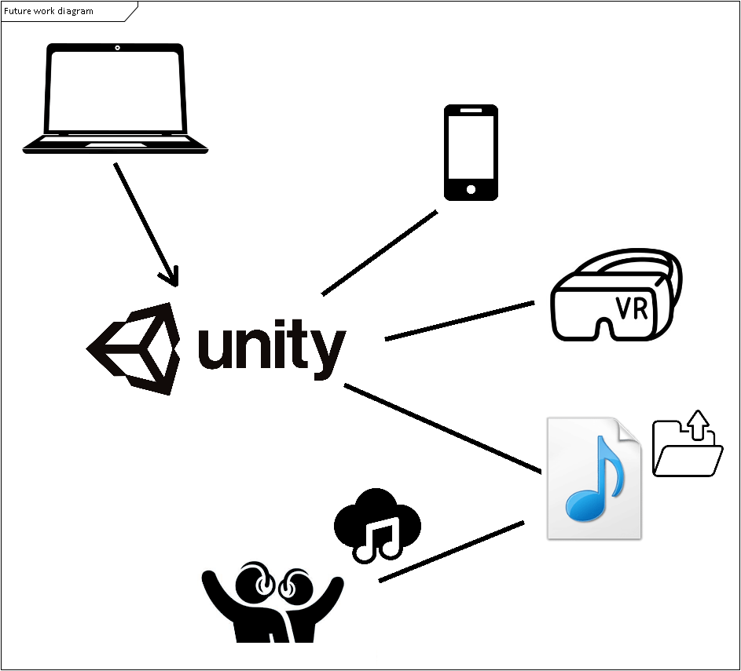

# Necroblaster: Rhythm of the Dead

Výsledkom tohto projektu je hra Necroblaster: Rhythm of the Dead ktorá nie je iba tradičným zdrojom relaxu a zábavy, ale ponúka hlbší a zmysluplnejší zážitok pre hráčov. Okrem toho, že hráči môžu vypnúť a zabaviť sa v temnom fantasy svete plnom výziev, hra podporuje rozvoj rytmického cítenia a motorickej koordinácie. Prostredníctvom interaktívnych herných mechaník, ktoré sú priamo prepojené s hudobným tempom, sa hráči učia reagovať na rytmus a vnímať hudbu nielen ako zvuk, ale ako neoddeliteľnú súčasť ich akcií.

Inšpiráciu sme čerpali aj z vedeckých štúdií, ktoré sa zaoberajú pozitívnym vplyvom audio stimulácie na ľudí s neurodiverzitou, najmä na autistickom spektre[1, 2]. Metalová hudba, so svojou intenzitou a rytmickou štruktúrou, dokáže podporovať emocionálnu stabilitu, zvyšovať schopnosť sústredenia a dokonca poskytovať formu terapeutického uvoľnenia. Necroblaster tieto poznatky prenáša do interaktívneho prostredia, čím sa stáva potenciálnym nástrojom nielen pre bežných hráčov, ale aj pre tých, ktorí hľadajú spôsob, ako cez hudbu trénovať svoje schopnosti.

[1] [Autism and Metal Music: The Surprising Connection and Therapeutic Power of Heavy Sounds](https://neurolaunch.com/autism-and-metal-music/)
[2] [Personalized Music Recommendation for People with Autism Spectrum Disorder](https://iris.unito.it/handle/2318/2033411)

Okrem toho, *Necroblaster* funguje ako jedinečná platforma na propagáciu hudobnej tvorby. Hra je prepojená s originálnym soundtrackom, ktorý hráči zažívajú nielen pasívne, ale aktívne – každý level, každá výzva a každé rozhodnutie je previazané s dynamikou hudby. Navyše, hra umožňuje používateľom vkladať vlastnú hudbu, čím si môžu prispôsobiť herný zážitok podľa svojich preferencií. Táto funkcia otvára aj priestor na zdieľanie vlastných skladieb v rámci hernej komunity, čím podporuje kreativitu a vzájomnú interakciu hráčov. Tento interaktívny formát dáva skladbám nový rozmer a umožňuje ich hlbšie zakoreniť v pamäti hráčov. Vďaka tejto kombinácii zábavy, vzdelávania a umeleckého prejavu sa *Necroblaster: Rhythm of the Dead* stáva unikátnym projektom, ktorý spája herný priemysel s terapeutickými a kultúrnymi možnosťami.

# Technologická špecifikácia

### Herný engine a programovanie: Unity a C#  

Pri vývoji Necroblastera sme využili výhody Unity – nástroja, ktorý je známy svojou flexibilitou a možnosťou vytvárať pútavé interaktívne svety. Skriptovanie hry v jazyku C# nám umožnilo navrhnúť herné mechaniky, ktoré harmonicky splývajú s rytmom hudby. Každý aspekt hry, od pohybu postavy až po súboje, bol vytvorený tak, aby hráči zažili plynulý a pohlcujúci zážitok.

### Vývojové prostredie: Visual Studio a GitHub

Celý proces vývoja bol podporený spoľahlivými nástrojmi. Visual Studio nám poskytlo platformu na tvorbu a ladenie herných skriptov, pričom GitHub zabezpečil hladkú spoluprácu medzi členmi tímu. Táto kombinácia nám umožnila efektívne tvoriť a zdieľať nové nápady, pričom sme vždy mali istotu, že pracujeme s najnovšou verziou hry.

### Grafické spracovanie: Aseprite a Paint.NET

Vizuálny štýl Necroblastera je inšpirovaný pixel art estetikou, ktorá dokonale zapadá do temného a rytmického prostredia hry. Aseprite nám umožnil vytvoriť pútavé animácie postáv, nepriateľov a efektov, zatiaľ čo Paint.NET bol využitý na doladenie textúr a ďalších vizuálnych detailov. Výsledkom je svet, ktorý hráčov pohltí svojou atmosférou a štýlom.

### Zvuk a hudba: Reaper DAW

Hudba je srdcom Necroblastera. Každý level sprevádza originálny soundtrack, ktorý bol vytvorený pomocou Reaper DAW. Táto platforma nám umožnila skomponovať skladby, ktoré dokonale vystihujú dynamiku hry. Rytmus každej skladby sa mení s postupujúcimi úrovňami, čím zvyšuje napätie a intenzitu herného zážitku. Navyše, zvukové efekty boli starostlivo navrhnuté tak, aby umocnili atmosféru a posilnili spojenie medzi hrou a hudbou.

### Kompatibilita

V súčasnom štádiu je projekt kompatibilný s operačným systémom Windows (8 a vyššie). Projekt má prípravu pre spustenie mobilných verzií na android a IOS.

# Rozšírenie systému a budúca práca

### Zdieľanie hudby medzi hráčmi

Jedným z našich cieľov je umožniť hráčom nahrávať do hry vlastné skladby a zdieľať ich s ostatnými členmi hernej komunity. Táto funkcia poskytne platformu pre amatérskych aj profesionálnych hudobníkov, ktorí chcú prezentovať svoju tvorbu v interaktívnom prostredí. Zdieľané skladby sa budú dať hodnotiť a komentovať, čím sa vytvorí priestor pre spätnú väzbu a kreativitu.

### Podpora pre iOS a Android

Aby sme sprístupnili Necroblaster širšiemu publiku, plánujeme hru portovať na mobilné zariadenia so systémami iOS a Android. Mobilná verzia bude optimalizovaná pre dotykové ovládanie, pričom si zachová plynulosť a vizuálny štýl pôvodnej hry. Táto expanzia umožní hráčom užívať si hru kdekoľvek, či už počas prestávky v práci alebo na cestách.

### Virtuálna realita (VR)

Herný engine (motor) “Unity” umožňuje ľahkú export projektu do Virtuálnej Reality (VR). VR poskytuje nekonečnú mieru interaktivity - toto bude slúžiť na zvýšenie fyzickej aktivity hráčov. Tí sa do rytmu budú musieť nielen rozhodovať v rámci hry, ale aj pohybovať celým telom!

## Tím
- Peter Debnár
- Sebastián Čambál
- Kristián Jablonický