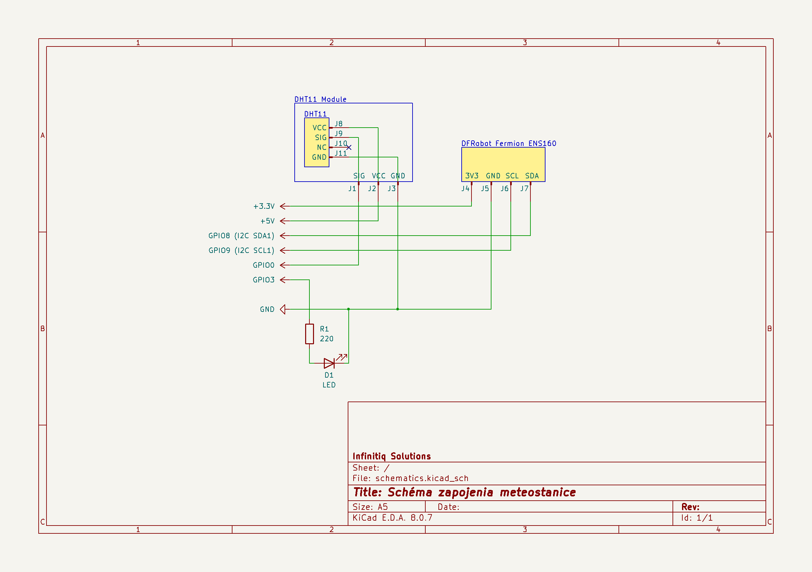
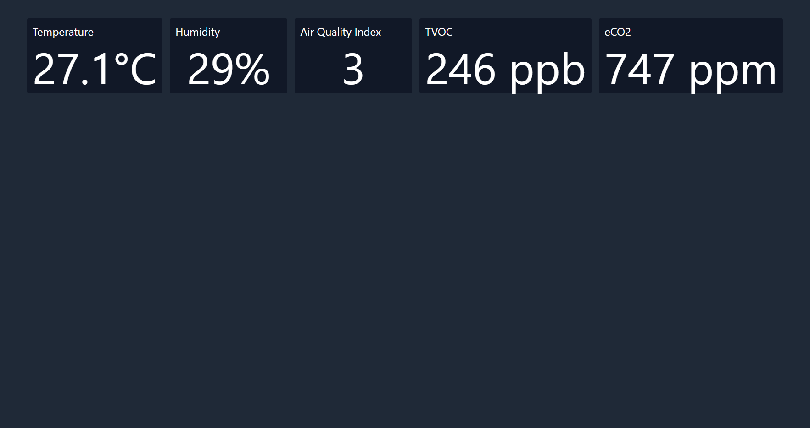
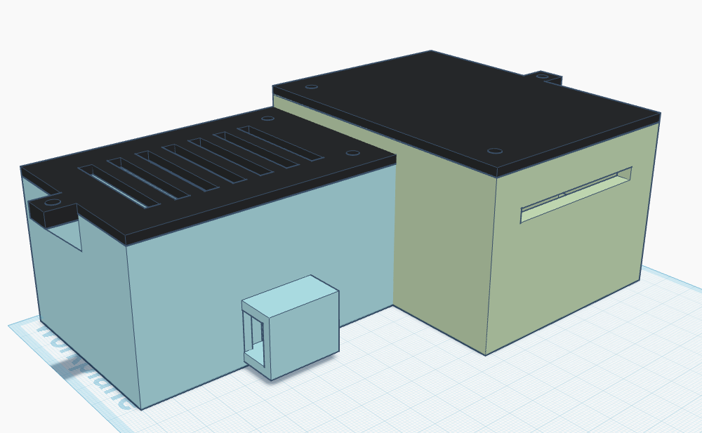
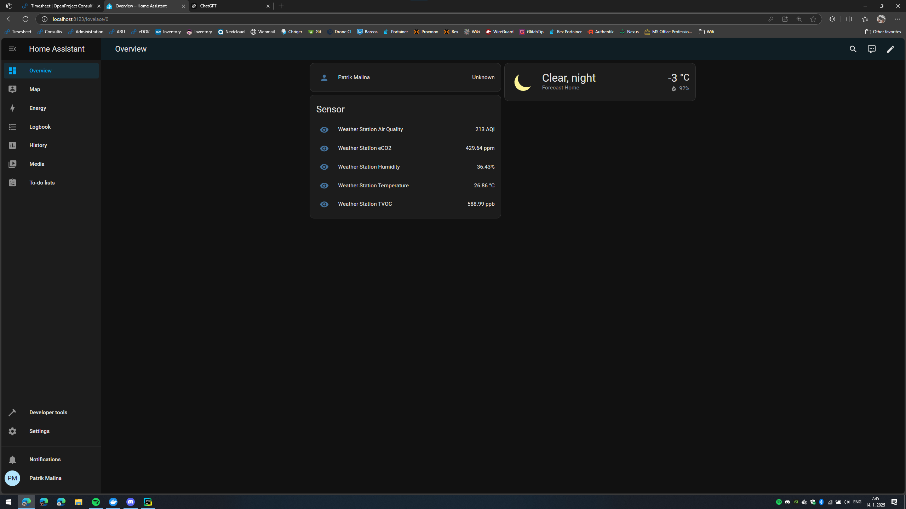

# Meteorologická stanica
**Systémové Myslenie v IT**

Bc. Christian Danižek, Bc. Patrik Malina, Bc. Ondrej Lesák, Bc. Dávid Kováľ

Slovenská technická univerzita v Bratislave

Fakulta informatiky a informačných technológií


# **Zámer projektu**

Cieľom tohto projektu je navrhnúť a zostrojiť vlastnú, cenovo dostupnú, modulárnu a univerzálnu meteorologickú stanicu pomocou 3D tlačených dielov, komponentov Raspberry Pi 2 model B a niekoľkých ďalších senzorov a modulov. Meteorologická stanica bude zbierať údaje rôznych premenných prostredia a bude komunikovať s aplikáciou Home Assistant, populárnou open-source platformou pre domácu automatizáciu. Integráciou s aplikáciou Home Assistant umožní stanica používateľom automatizáciu vnútorného prostredia na základe aktuálnych podmienok ovplyvneného prostredia, napríklad prispôsobenie termostatu, zopnutie prístrojov pre úpravu kvality ovzdušia, klimatizáciu a podobne.

# **Cieľ a motivácia**

Medzi hlavné ciele projektu, ktoré sme si v rámci tímu stanovili, sú:

1. Vytvorenie modulárnej a univerzálnej meteorologickej stanice
    - Zariadenie bude schopné monitorovať rôzne premenné prostredia, ako je napríklad teplota, vlhkosť alebo kvalitu ovzdušia. Ďalej to poskytne flexibilitu pre rozšírenie o ďalšie senzory podľa potrieb užívateľa
2. Integrácia s Home Assistant
    - Naša meteorologická stanica bude plne kompatibilná s aplikáciou Home Assistant, čo umožňuje efektívnu automatizáciu do domáceho prostredia na základe daných podmienok v prostredí
3. Podpora automatizácie pre zlepšenie kvality života
    - Zariadenie bude schopné púšťať automatizačné procesy, ktoré dokážu zlepšiť napríklad komfort, zdravie používateľov, zlepšenie a šetrenie životného prostredia, napríklad reguláciou vykurovania, klimatizácie alebo napríklad čistenia vzduchu
4. Optimalizácia nákladov na prostredie
    - Zariadenie bude schopné aktívne monitorovať teplotu a vlhkosť, a spolu s automatickými procesmi dokáže prispieť k zníženiu nákladov na klimatizáciu alebo vykurovanie

Motivácia pre vytvorenie meteorologickej stanice je hlavne spojená s efektívnosťou, ktorá dokáže zabezpečiť pohodlie užívateľa, zlepšenie kvality života alebo optimalizáciu nákladov používateľa, čím dokáže časom ušetriť nemalé peniaze. Ďalšou motiváciou pre nás vytvoriť a implementovať projekt je prispieť k rýchlo rastúcemu technologickému odvetviu a automatizáciou pre zlepšenie životných podmienok a využívaniu zdrojov, čo je v dnešnej dobe veľkou celosvetovou témou.

Na záver sme si pripravili motivačný diagram, ktorý zhrnie naše ciele a motivácie do diagramovej podoby.


## **Komponenty projektu:**

- 3D tlačený kryt: Prispôsobiteľné puzdrá odolné voči fyzickému poškodeniu a počítač Raspberry Pi, navrhnuté tak, aby odolali podmienkam vonkajšieho prostredia.
- Počítač Raspberry Pi 2 model B: Základná spracovateľská jednotka na zber údajov z rôznych snímačov a komunikáciu s domácim asistentom.
- Senzory:
  - Snímač teploty
  - Snímač vlhkosti
  - Snímač kvality ovzdušia
  - Domáci asistent - Home Assistant

## **Projektové aplikácie a prípady použitia:**

Meteorologická stanica bude generovať cenné údaje o prostredí, ktoré môžu spustiť automatizačné postupy prostredníctvom aplikácie Home Assistant, čím sa zvýši energetická účinnosť, bezpečnosť a pohodlie domova. Niektoré praktické príklady automatizácie zahŕňajú:

- Nastavenie HVAC: Teplota a vlhkosť môžu optimalizovať vykurovanie, vetranie a klimatizáciu, automaticky upravovať vnútorné podmienky na základe aktuálneho stavu, prípadne rutiny
- Automatizácia čistenia vzduchu: Aktívne monitorovanie kvality ovzdušia prostredníctvom senzorov, v prípade poklesu kvality pod stanovený limit, zašle udalosť do aplikácie Home Assistant, ktorá spustí rutinu pre úpravu kvality ovzdušia v prípade, že používateľ takým prístrojom disponuje
- Starostlivosť o vnútorné rastliny: Niektoré rastliny vyžadujú pre ich optimálny rast stabilné podmienky prostredia. Automatizácia prostredníctvom monitorovania kvality a teploty ovzdušia umožňuje takéto prostredie vytvoriť a zabezpečiť tak optimálny rast rastlín
- Znižovanie podielu stimulov respiračných ochorení v ovzduší: Až 10% svetovej populácie trpí alergiou na prach. Nízka vlhkosť významne vplýva na vytváranie prachových častíc a ich rýchlejšej distribúcii v prostredí. Meteorologická stanica so snímačom vlhkosti a kvality ovzdušia môže jednoducho aktivovať rutinu, ktorú si používateľ prispôsobí podľa zdravotného stavu a tak môžu byť podmienky v uzavretom priestore optimalizované pre maximálne minimalizovanie alergénov
- Optimalizácia nákladov na energie: V neposlednom rade je pre používateľov zariadenie, ktoré dokáže optimalizovať náklady veľmi atraktívnou voľbou. Aktívnym monitorovaním a automatizáciou prostredníctvom aplikácie Home Assistant dokáže modulárna meteorologická stanica optimalizovať náklady na vykurovanie, resp. ochladzovanie na základe udržiavania teploty v intervaloch, ktoré zamedzia potrebe akútnej úpravy teploty alebo vlhkosti prostredia.

## **Uce Case diagram a Business Process diagram**


Kroky pre jednotlivé prípady použitia:

1. Nastavenie HVAC
    - Užívatelia nakonfigurujú požadované teplotné a vlhkostné úrovne v Home Assistant aplikácií
    - Meteorologická stanica bude pravidelne zbierať údaje o teplote a vlhkosti
    - Spracované údaje sa odošlú do systému HVAC
    - HVAC systém prispôsobí vykurovanie, chladenie alebo vetranie podľa aktuálnych podmienok
2. Automatizácia čistenia vzduchu
    - Meteorologická stanica monitoruje kvalitu ovzdušia prostredníctvom senzorom
    - Ak kvalita klesne pod nastavený limit, stanica spustí udalosť v Home Assistant aplikácií
    - HA spustí príkaz na aktiváciu čistenia vzduchu
    - Čistenie vzduchu sa zapne
    - Po dosiahnutí optimálnej hodnoty sa čistenie vzduchu zastaví
3. Optimalizácia nákladov na energie
    - Meteorologická stanica monitoruje teplotu a vlhkosť prostredia
    - Údaje sa vyhodnocujú HA aplikáciou na základe preddefinovaných parametrov
    - Systém automaticky optimalizuje využitie HVAC zariadení podľa potreby
    - Používateľ dostane prehľad o energetickej úspore prostredníctvom HA aplikácie
    - Na základe zhromaždených dát sa môžu generovať dlhodobé odporúčania na zníženie spotreby
4. Starostlivosť o vnútorné rastliny
    - Používateľ zadá požiadavky na optimálne podmienky pre rastliny do aplikácie HA
    - Meteorologická stanica pravidelne bude zbierať údaje o vnútornom prostredí
    - Ak sa parametre odchýlia od požadovaných hodnôt, aplikácia vyšle príkaz na aktiváciu HVAC alebo zvlhčovača
    - Používateľ dostane správu o aktuálnych podmienkach a stave rastlín
5. Znižovanie rizika respiračných ochorení
    - Meteorologická stanica monitoruje kvalitu ovzdušia, teplotu a vlhkosť v prostredí
    - Pri identifikácií nízkej vlhkosti alebo nízkej kvality ovzdušia vyšle stanica upozornenie do HA aplikácie
    - Aplikácia aktivuje zvlhčovač
    - Systém upravuje činnosť zariadení na základe kontinuálneho monitorovania
    - Používateľ bude dostávať pravidelné notifikácie na zlepšenie prostredia

Na lepšie porozumenie komunikácie meteorologickej stanice, používateľa a aplikáciou Home Assistant sme pripravili Business process view diagram, ktorý vizualizuje procesy od momentu monitorovania prostredia - získaniu údajov - odoslanie do systému až po zmenu prostredia.


## **Technická špecifikácia**

Technická špecifikácia a upresnenie komponentov využitých na implementáciu:

- Python
- C++
- Docker Compose, Docker
- Raspberry Pi 2B
- DHT11 senzor vlhkosti a teploty
- DFRobot Fermion ENS160
- Tlačiareň Prusa Mk4

Pre lepšie znázornenie a pre lepší prehľad máme Technology Diagram, kde sú komponenty a technológie, ktoré využívame, vrátane ich prepojení a spôsob ich "spolupráce".


## **Meteorologická stanica**

Komponenty, z ktorých je implementovaná samotná meteorologická stanica:

- Raspberry Pi 2B - hlavný modul systému, ktorý spracúva údaje zo senzorov a riadi komunikáciu s aplikáciou Home Assistant
- DHT11 senzor vlhkosti a teploty - Zaisťuje meranie teploty a relatívnej vlhkosti vzduchu. Údaje sú zasielané do Raspberry Pi
- DFRobot Fermion ENS160 Senzor kvality ovzdušia - Senzor monitorujúci kvalitu vzduchu
- LED indikátor - slúži na spätnú väzbu o stave systému alebo zmenách prostredia
- Breadboard - slúži na prepojenie senzorov s Raspberry Pi
- Ochranný obal


Na základe komponent diagramu sme implementovali aj v reálnej podobe prototyp meteorologickej stanice:


Naľavo je možné vidieť Raspberry Pi v ochrannom obale a napravo zapojený senzor DHT11 senzor vlhkosti a teploty na Breadboard experimentálnej doske.

Na obrázku máme znázornenú aj schému zapojenia, ako je to všetko zapojené:



Čo sa týka priamo implementačnej časti, je naimplementovaný daemon na čítanie dát zo senzorov dht11 + ens160, ktorý zapisuje dáta do súborov a zároveň ovláda LED indikátor. Je implementovaný aj dashboard , ktorý číta dáta zo súborov a na princípe API ich ďalej posiela na frontend. Je naimplementovaný ďalší daemon, ktorý číta dáta zo súborov a tie sú následne zasielané do aplikácie Home Assistant.



## ** 3D Tlačiareň a obal pre meteorologickú stanicu**

Po zapojení Raspberry a potrebných komponentov sme sa rozhodli navrhnúť a vytlačiť ochranný obal pre meteorologickú stanicu.

Model je vytvorený z materiálu PETG, ktorý je mimoriadne odolný a silný, je rezistentný proti vode, kvapalinám, čím je vhodný do rôznych prostredí či už vnútri alebo vonku. Dokáže zvládnuť až teplotu do 70-80 stupňov Celzia. 



Namodelovali sme obal, ktorý sa skladá z 2 častí. V jednej časti bude uložené Raspberry a v druhej Breadboard so senzormi. Takisto sme zabezpečili ventilačné otvory, ktoré umožnia cirkuláciu vzduchu, čím zabránime prehriatiu. Na boku su vedené otvory na pripojenie cez port.
Výsledný vytlačený obal s uloženými komponentami:


## **Home Assistant aplikácia**

Aplikáciu, ktorá bude prepojená s meteorologickou stanicou, sme implementovali v prrograme Python pomocou MQTT protokolu. Prostredie beží na dockeri. 
Na začiatok pre spustenie je potrebné si nainštalovať nasledovné požiadavky do systému:
- certifi==2024.8.30
- charset-normalizer==3.4.0
- idna==3.10
- paho-mqtt==2.1.0
- python-dotenv==1.0.1
- urllib3==2.2.3

Po nainštalovaní naštartujeme docker cez príkaz “docker compose up -d” a spustíme na prehliadači “http:--localhost:8123”. V prostredí spustíme hlavný python script “python main.py”, v ktorom sa nachádzajú nasledovné hlavné funkcie aplikácie:

- pripojenie k MQTT brokeru

- Čítanie dát zo súborov: táto funkcia číta dáta zo súborov, ktoré sú definované v prostredí, napríklad súbory obsahujúce teplotu, vlhkosť, … 

- Publikácia správ: kontroluje sa tu stav odoslania a prípadne zaznamenaný úspech alebo neúspech

- Hlavná časť a zobrazenie údajov: Tu sa načítavajú údaje zo senzorov (teplota, vlhkosť, kvalita vzduchu, TVOC, CO2) a odosielajú sa do Home Assistant pomocou MQTT brokera

Grafické rozhranie pre aplikáciu vyzerá nasledovne:



Takisto aplikácia loguje všetky správy, ktoré vyzerajú nasledovne:
```

[2025-01-11 14:49:01] LOG: Message `{"temperature": 26.5, "humidity": 87}` sent to topic `home/sensor/weather_station`
[2025-01-11 14:49:04] LOG: Message `{"temperature": 25.4, "humidity": 67}` sent to topic `home/sensor/weather_station`
[2025-01-11 14:49:07] LOG: Message `{"temperature": 27.6, "humidity": 78}` sent to topic `home/sensor/weather_station`
[2025-01-14 07:41:21] LOG: Message `{"temperature": 24.86, "humidity": 46.47, "air_quality": 439, "tvoc": 1396.26, "eco2": 939.03}` sent to topic `home/sensor/weather_station`
[2025-01-14 07:41:24] LOG: Message `{"temperature": 27.78, "humidity": 54.01, "air_quality": 447, "tvoc": 1130.53, "eco2": 814.89}` sent to topic `home/sensor/weather_station`
[2025-01-14 07:41:27] LOG: Message `{"temperature": 26.71, "humidity": 28.82, "air_quality": 163, "tvoc": 931.48, "eco2": 461.16}` sent to topic `home/sensor/weather_station`

```