# Meowcraft - Dokumentácia (Single Page)

Pre plnú verziu dokumentácie prosím klikni [sem](https://johnnyjonky.github.io/meowcraft-smvit/)

# Intro projektu

V tejto časti nájdete základné informácie o projekte a jeho cieľoch.

## Kto spolupracuje na projekte?

Tím MeowCraft sa skladá z nasledovných členov:

- Bc. Bruno Hanus
- Bc. Ján Herceg
- Bc. Roman Matúš
- Bc. Patrik Serzodi

## Naše "socials"

- [Youtube](https://www.youtube.com/@MeowCraft-Company)
- [LinkedIn](https://www.linkedin.com/company/meowcraft/)
- [Patreon](https://www.patreon.com/profile?u=145741883)

## Videá z exkurzií

### [Exkurzia v LabCafé](https://www.youtube.com/embed/LEws6UwPSik?si=GtWLkysiOCX3Idxn)

### [Exkurzia v Laboratóriu vnorených systémov](https://www.youtube.com/embed/K9J3rwezU3Q?si=0teu2AaNkyHAR02G)

---

## Stojan v tvare mačacej hlavy

Stojan v tvare mačacej hlavy je produkt, ktorý slúži na nabíjanie Apple Watch, alebo Apple Airpods so štýlom. Veď predsa každý programátor chce mať na stole hlavu mačky! 🐱

Nápad na stojan pre nabíjanie Apple hodiniek (a krabičky na Apple slúchadlá) vznikol z dôvodu, že samotná nabíjačka, na nabíjanie daných produktov nemá žiadne fixné miesto na pracovnom stole. 

Samotný produkt by mal byť v štýle **low-poly** mačky, ktorá by mala na hlave držiak pre nabíjačku na hodinky.

Na základe sketch-u sme začali modelovať 3D model, avšak tento pokus zatiaľ skončil modelom, ktorý nie je vhodný pre 3D tlač. Na druhý pokus je však výsledkom už tlačiteľný model. Model bol vytlačený a v tejto dokumentácii je aj evaluovaný.

### Sketch

Prvotný návrh a rozmýšľanie nad stojanom, v tvare mačacej hlavy, pre Apple produkty.

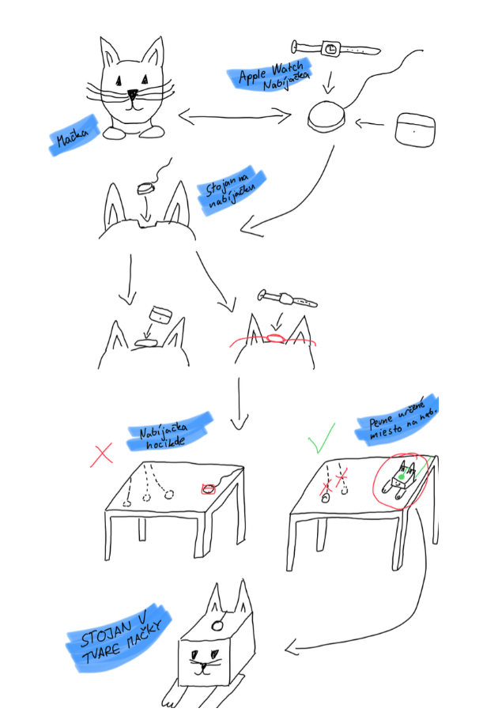

### Diagramy

Pre zvolený produkt sme zatiaľ vytvorili nasledovné diagramy:

#### Use Case Diagram
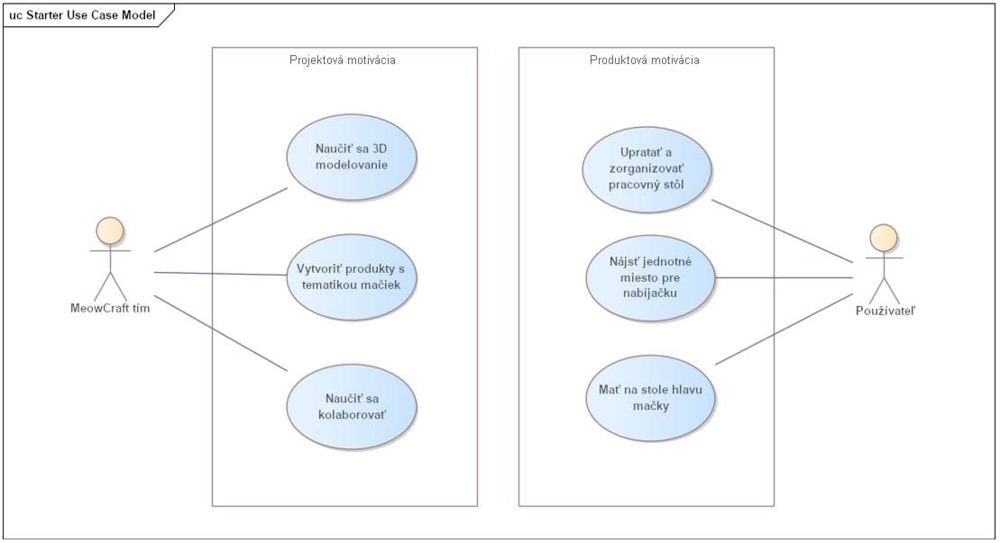

#### Activity Diagram
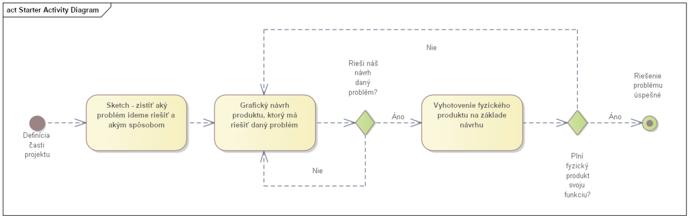

### Tvorba 3D modelu

#### Použitý nástroj

Samotná tvorba 3D modelov prebiehala v nástroji [SketchUp](https://app.sketchup.com). Tento nástroj je dostupný zadarmo vo webovej verzii a je jednoduchý na používanie. Návod na to, ako to nerobiť sme spísali [nižšie](#prv%C3%BD-pokus).

Následná kontrola, či je model spôsobilý na 3D tlač prebiehala v nástroji [Ultimaker Cura](https://ultimaker.com/software/ultimaker-cura).

#### Prvý pokus

Nakoľko sa jednalo o náš prvý pokus vytvoriť 3D model, prvý prototyp sa ani nedostal do tlače, nakoľko bol nevyhovujúci. Dôvodom bola neznalosť spôsobu modelovania modelov pre 3D tlač.

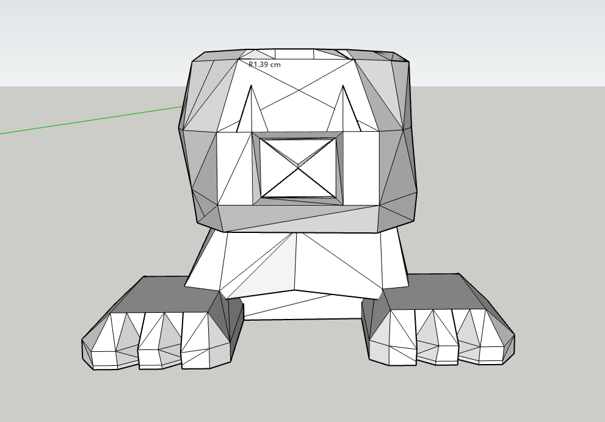

Dôvod, prečo tento model nie je možné vytlačiť je, že obsahuje príliš veľa polygonov vo vnútri modelu, viď foto nižšie.

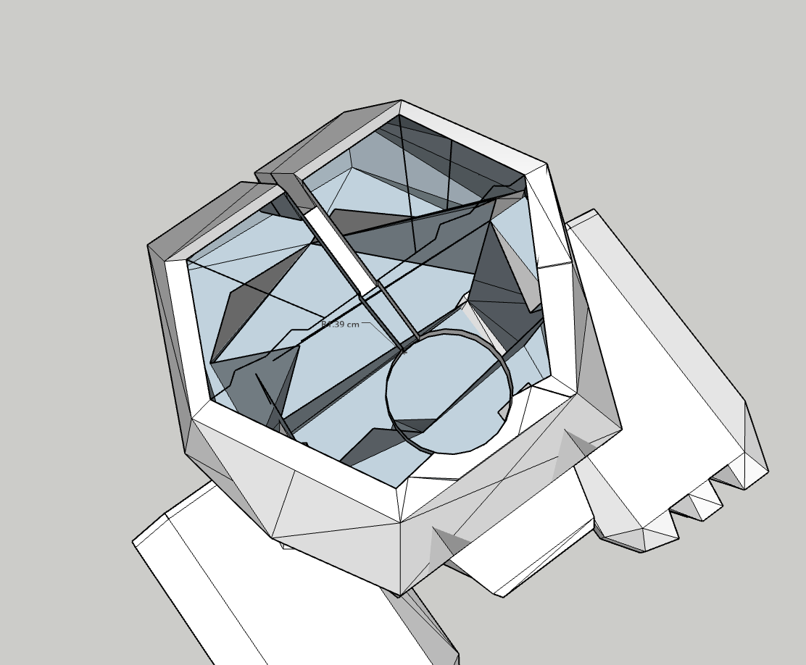

:::warning

Pri modelovaní v nástroji SketchUp je potrebné dbať na to, aby bol model zvnútra dutý.

:::

Model taktiež nesmie obsahovať polygony, ktoré su v nástroji SketchUp zobrazené bledomodrou farbou, nakoľko sa jedná o diery v modeli, a teda model nie je uzavretý.

|  |  |
|:------------------------:|:---------------------------:|
| Farba signalizujúca dieru v modeli                    | Korektná farba polygonu                     |

:::note

Modré polygony z vnútornej strany modelu sú v poriadku. Modré polygony na vonkajšej strane modelu signalizujú dieru v modeli a je potrebné ich mitigovať.

:::

:::tip

V prípade, že model obsahuje polygony vnútri, v niektorých prípadoch je možné ich odstrániť pomocou nástroja `Outer Shell` v nástroji SketchUp.

:::

### Výsledný model

Výsledný model nájdeš [tu](https://johnnyjonky.github.io/meowcraft-smvit/docs/head-stand/3d-model/)

### Kontrola pred tlačou

Ako sme už spomenuli, tento model nebol vhodný na tlač. Zistili sme to však až pri kontrole v nástroji Ultimaker Cura. Tento nástroj je schopný zobraziť model v reálnom čase a teda je možné zistiť, či je model tlačiteľný.

Tento nástroj poskytuje zobrazenie častí modelu, ktoré sú chybné (červené kruhy na zelenom pozadí)

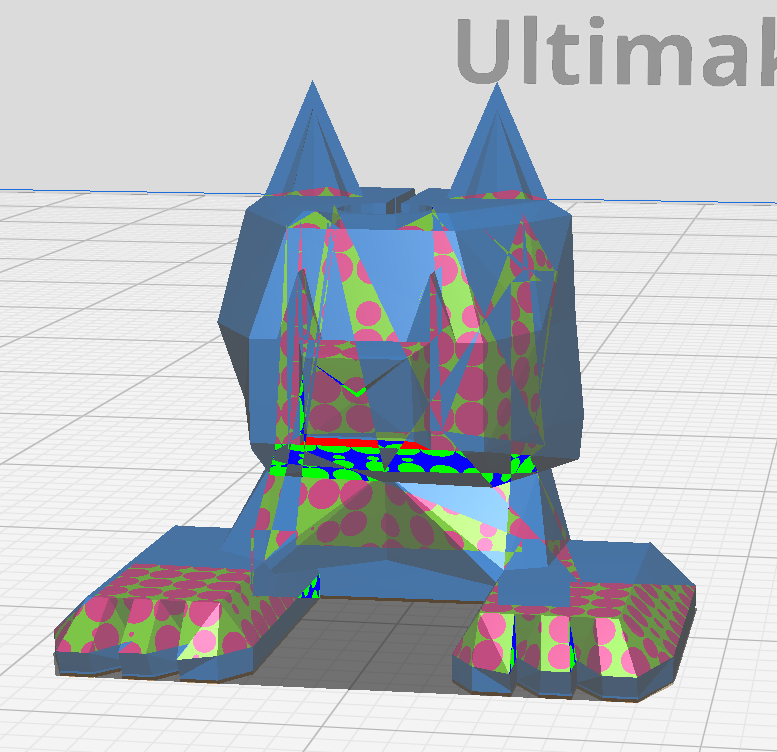

Následne je možné zobraziť aj postup tlačenia modelu, ktorý je v tomto prípade nepoužiteľný.

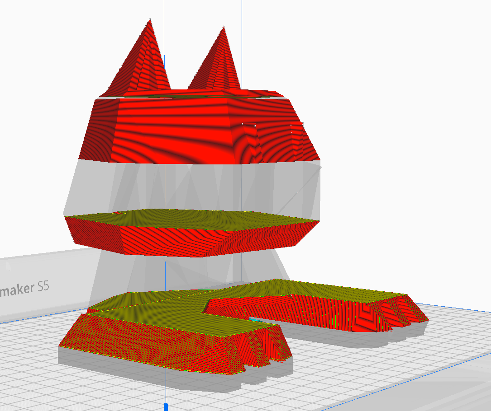

:::tip
Je možné zobraziť aj podporu, ktorá by bola potrebná pre tlač modelu, v tomto prípade by tvorila väčšinu modelu.
:::

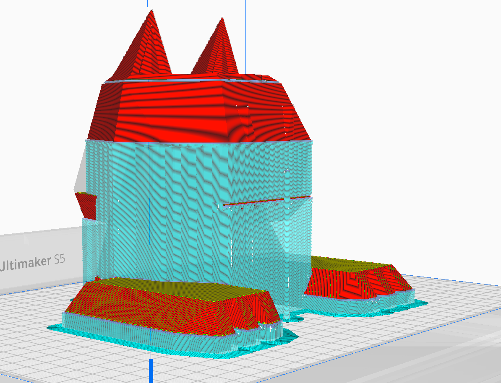

### Druhý pokus

Pri druhom pokuse sme využili poznatky z modelovania prvého modelu a vytvorili sme model, ktorý je tlačiteľný.

### Výsledný model

Výsledný model nájdeš [tu](https://johnnyjonky.github.io/meowcraft-smvit/docs/head-stand/3d-model/)

### Kontrola pred tlačou

Druhý model bol úspešne tlačiteľný, nakoľko neobsahoval vnútorné polygony a bol uzavretý.

Následne je možné zobraziť aj postup tlačenia modelu, ktorý je v tomto prípade nepoužiteľný.

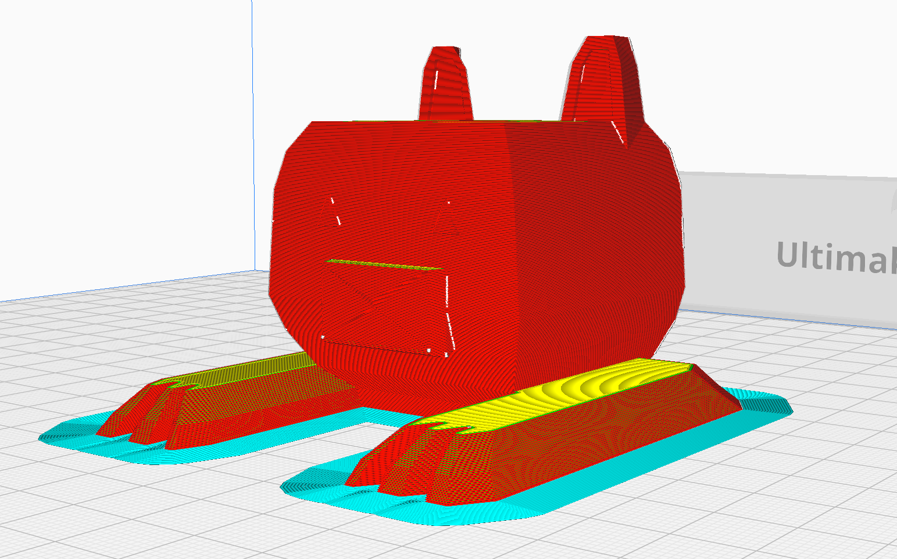

### Priebeh tlače

Naším cieľom bolo vytvoriť stojan na apple watch nabíjačku. Pre tento typ modelu nebolo nutné použiť veľkú hustostu výplne, pretože stojan bude slúžiť len na držanie nabíjačky a nie na ukladanie ťažkých predmetov. Rovnako tak stojan pevne drží na stole a nemusí byť príliš robustný.

**Teplota tlačovej dosky**: 60 °C

**Teplota trysky**: 200 °C

**Hrúbka vrstvy**: 0.15 mm

**Rýchlosť tlače**: 60 mm/s

**Hustota výplne modelu**: 30 %

**Typ výplne modelu**: Grid

**Typ podporných štruktúr**: Podporné štruktúry obdĺžníkového tvaru

|  |
|:---:|
| Proces tlače modelu |

| 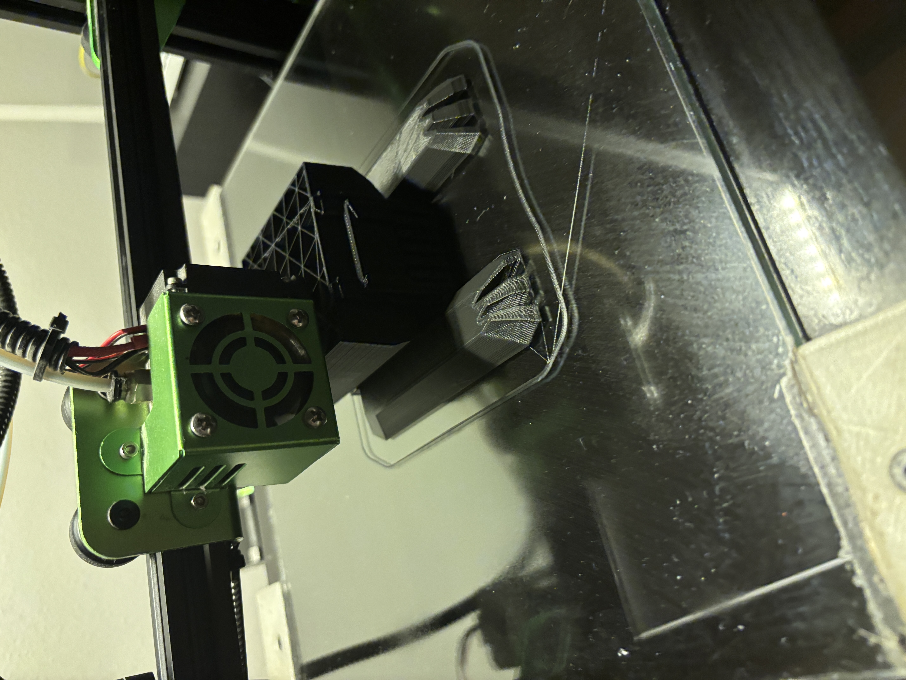 |
|:---:|
| Proces tlače modelu |

|  |
|:---:|
| Proces tlače modelu |

| 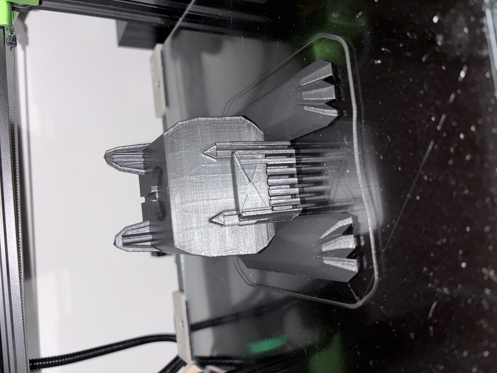 |
|:---:|
| Dokončená tlač |

| 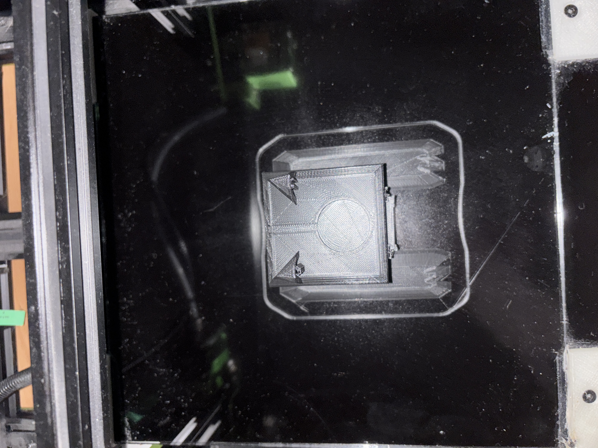 |
|:---:|
| Dokončená tlač |

### Prototyp vytlačeného stojanu

Po úspešnom vytlačení modelu sme sa pustili do jeho otestovania. Stojan bol použiteľný a nabíjačka sa do neho pekne vošla.

### Finálny produkt

Po dokončení tlače sme model vyčistili a odstránili podporné štruktúry. Hodinky môžu byť pohodlne umiestnené na stojane obojsmerme.

|  |
|:---:|
| Finálny produkt |

|  |
|:---:|
| Finálny produkt |

|  |
|:---:|
| Finálny produkt |

|  |
|:---:|
| Finálny produkt |

|  |
|:---:|
| Finálny produkt |

### Záver

Vytlačený stojan na apple watch nabíjačku bol úspešný a plne funkčný. Vďaka tomuto projektu sme sa naučili pracovať s 3D tlačou a vytvárať vlastné modely.

---

## Stojan na sluchátka

Nápad na stojan pre slúchadlá vznikol z potreby zabezpečiť stabilné a praktické miesto na ich uloženie, čím sa zlepší organizácia pracovného priestoru a predíde ich poškodeniu.

Stojan je navrhnutý tak, aby sa dal jednoducho priskrutkovať na bočnú stranu stola. Hlavná časť, ktorá slúži na upevnenie stojana k stolu, je tvarovaná ako hlava mačky, čo mu dodáva estetický a originálny vzhľad. Samotné rameno stojana je dostatočne pevné a priestranné na pohodlné zavesenie slúchadiel, pričom zaisťuje ich bezpečné uloženie a jednoduchý prístup. Tento dizajn spája praktickosť a jedinečný vzhľad, čím sa stáva ideálnym doplnkom pre akýkoľvek pracovný stôl.

Na základe sketch-u sme začali modelovať 3D model. Tentokrát bol model v prvej verzii vhodný na 3D tlač, nakoľko sme sa poučili z chýb modelovania iného produktu. Model bol vytlačený a v tejto dokumentácii je aj evaluovaný.

### Sketch

Prvotný nákres prototypu stojana na sluchátka s úchytom v tvare mačacej hlavy.

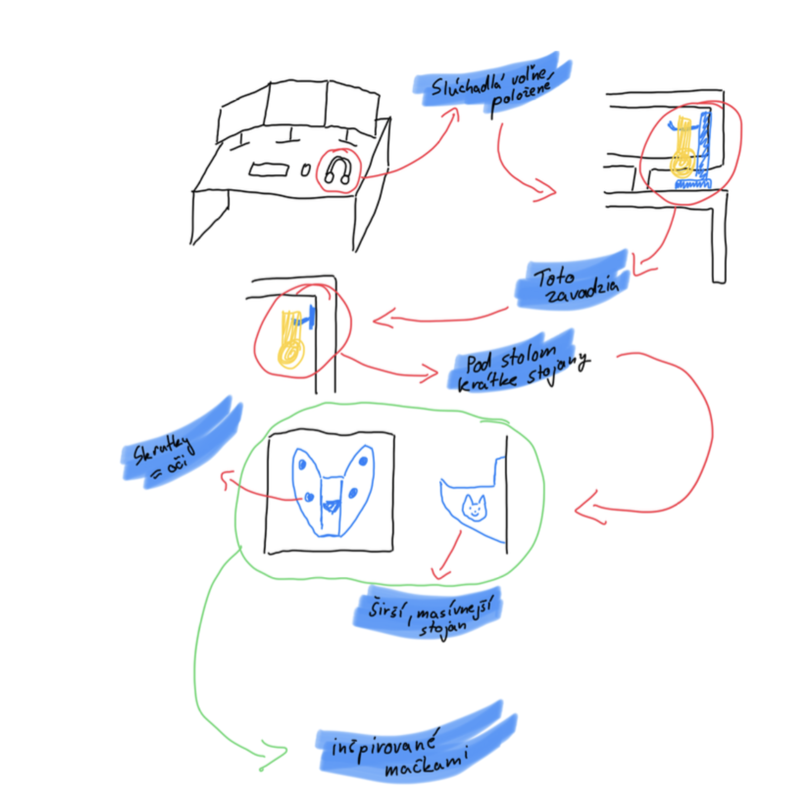

### Riešenie problému s organizáciou slúchadiel

Slúchadlá bývajú často voľne položené na stole, čo nielenže narúša poriadok na pracovnej ploche, ale môže tiež spôsobiť ich opotrebovanie či poškodenie. Voľné umiestnenie navyše často zavadzia, čo môže byť nepraktické, najmä na menších pracovných plochách.

#### Návrh riešenia

- **Inšpirácia mačkami:** Navrhovaný stojan je inšpirovaný motívom mačky. Tvarová inšpirácia pochádza z mačacej hlavy, pričom skrutky, ktoré zabezpečujú upevnenie stojana na stolovú dosku, sú šikovne integrované a pripomínajú oči mačky.
- **Širší a masívnejší dizajn:** Stojan je navrhnutý tak, aby bol dostatočne stabilný a umožnil bezpečné uloženie slúchadiel.
- **Umiestnenie pod stolom:** Stojan je navrhnutý na upevnenie pod dosku stola. Toto umiestnenie zabraňuje tomu, aby slúchadlá zavadzali na pracovnej ploche, a zároveň ich udržiava na dosah ruky.
- **Kombinácia funkčnosti a estetiky:** Hlavná časť stojana esteticky pripomína mačaciu hlavu, čím spája funkčnosť s vizuálnou príťažlivosťou.

Tento koncept kombinuje efektívne využitie priestoru s jedinečným dizajnom, pričom sa zohľadňuje pohodlie používateľa a ochrana uložených slúchadiel.

### Tvorba 3D modelu

#### Použitý nástroj

Samotná tvorba 3D modelov prebiehala v nástroji [SketchUp](https://app.sketchup.com). Tento nástroj je dostupný zadarmo vo webovej verzii a je jednoduchý na používanie.

Kontrolu tlačiteľnosti tohoto modelu sme vykonávali v nástroji [PrusaSlicer](https://www.prusa3d.com/prusaslicer/), ktorý je dostupný zadarmo na stiahnutie. Chceli sme vyskúšať aj iný nástroj ako pri predchádzajúcom produkte, aby sme experimentovali s rôznymi nástrojmi.

### Model

Nakoľko išlo o jednoduchší model, nebolo potrebné vytvárať žiadne zložité geometrické tvary. Model bol vytvorený základnými nástrojmi, ktoré nástroj SketchUp ponúka. V podstate vo svojej prvotnej verzii model neobsahoval žiadne chyby, ktoré by bránili v tlači.

Výsledný model nájdeš [tu](https://johnnyjonky.github.io/meowcraft-smvit/docs/headphone-holder/3d-model/)

### Kontrola pred tlačou

Pre tento model sme využili vyššie spomenutý nástroj PrusaSlicer, ktorý nám poskytol informácie o tlačiteľnosti modelu. Tento nástroj funguje veľmi podobne ako nástroj Ultimaker Cura, ktorý sme použili pri predchádzajúcom produkte.

Následne je možné zobraziť aj postup tlačenia modelu, ktorý bol v tomto prípade v poriadku.

### Náhľad modelu pred tlačou

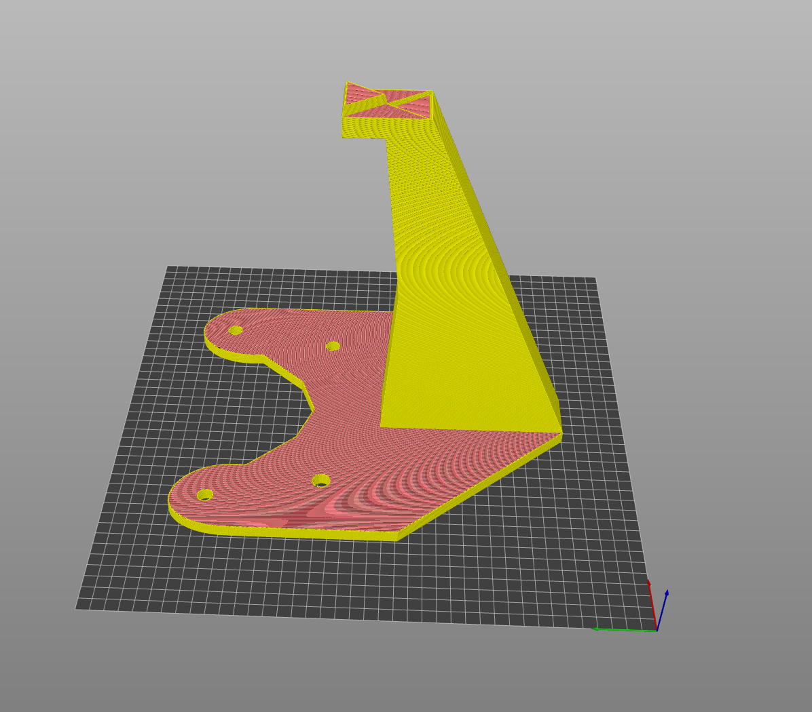

Na model bolo v podstate nutné pridať len podporu pre model, ktorý bol tlačiteľný bez ďalších úprav. Koniec držiaka, ktorý zachytáva slúchadlá, bol tlačiteľný len s podporou, nakoľko išlo o viac ako 45° sklon a teda by sa model nemohol tlačiť bez podpory.

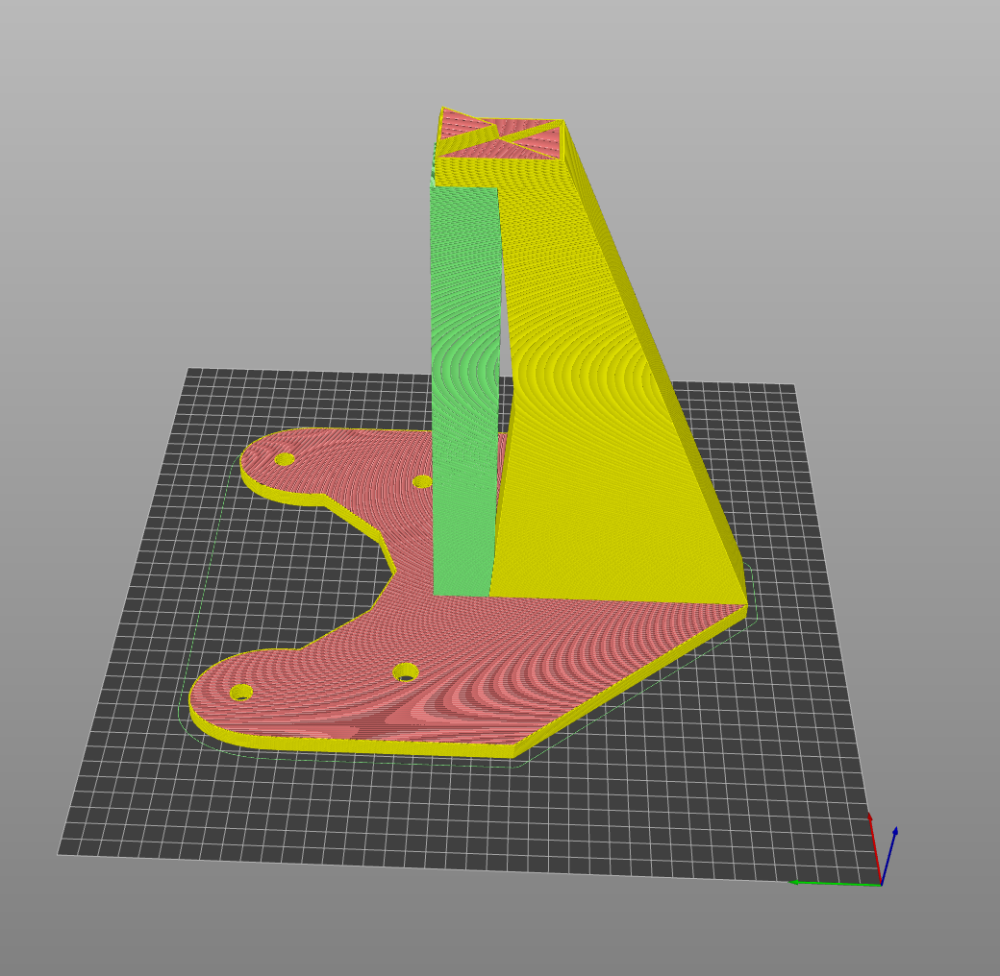

:::note
Na obrázku je zobrazený náhľad modelu s pridanou podporou, ktorá bola nutná pre tlač modelu. Podpora je označená zelenou farbou.
:::

Tvorba 3D modelu pre stojan na slúchadlá prebehla bez problémov. Model bol vytvorený v nástroji SketchUp a následne bol skontrolovaný v nástroji PrusaSlicer. Model bol tlačiteľný bez ďalších úprav, čo nám umožnilo priamo prejsť k tlači prvého prototypu. Samotný model bude tlačený minimálne so 70% výplňou, aby bol dostatočne pevný a stabilný a nezlomil sa pri používaní.

### Priebeh tlače

Po vytvorení modelu sme sa pustili do tlače. Tlač sme vykonali na 3D tlačiarni Tevo Tornado. Tlačili sme z materiálu PLA v čiernej farbe, ktorý je dostatočne pevný a odolný. Tlač sme vykonali s nasledujúcimi parametrami:

**Teplota tlačovej dosky**: 60 °C

**Teplota trysky**: 200 °C

**Hrúbka vrstvy**: 0.15 mm

**Rýchlosť tlače**: 60 mm/s

**Hustota výplne modelu**: 100 %

**Typ výplne modelu**: Grid

**Typ podporných štruktúr**: Podporné štruktúry obdĺžníkového tvaru

|  |
|:---:|
| Prvé vrstvy modelu |

|  |
|:---:|
| Prvé vrstvy modelu |

| 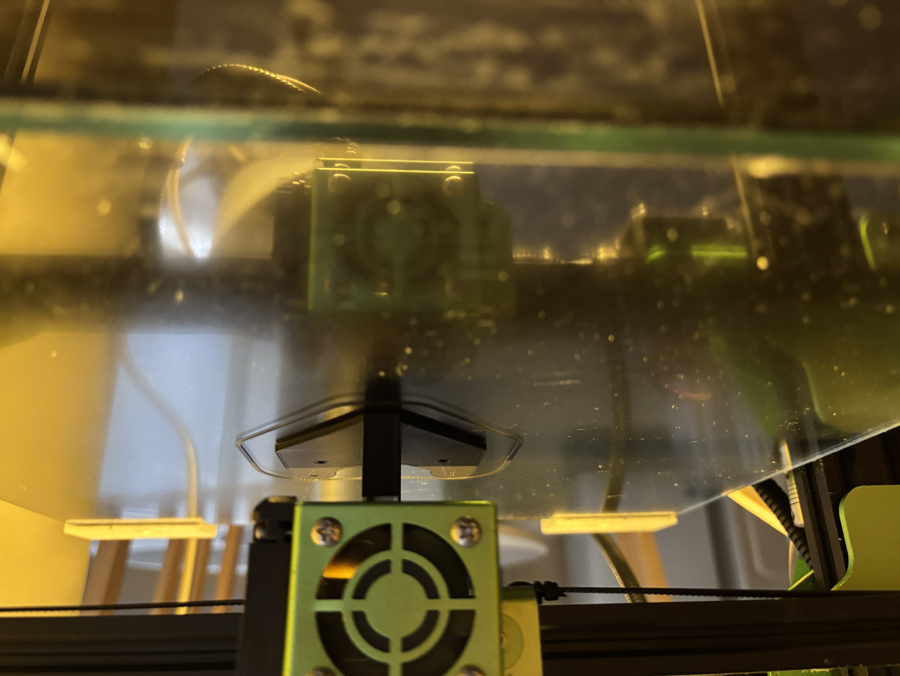 |
|:---:|
| Tlač v pokročilom štádiu |

|  |
|:---:|
| Dokončená tlač prvého stojanu |

### Prototyp vytlačeného stojanu

Po vytlačení stojanu sme ho otestovali počas troch týždňov. Počas tohto obdobia sme sledovali, či je stojan dostatočne stabilný a robustný. Používali sme ho na uloženie relatívne ťažkých bezdrôtových slúchadiel.

| 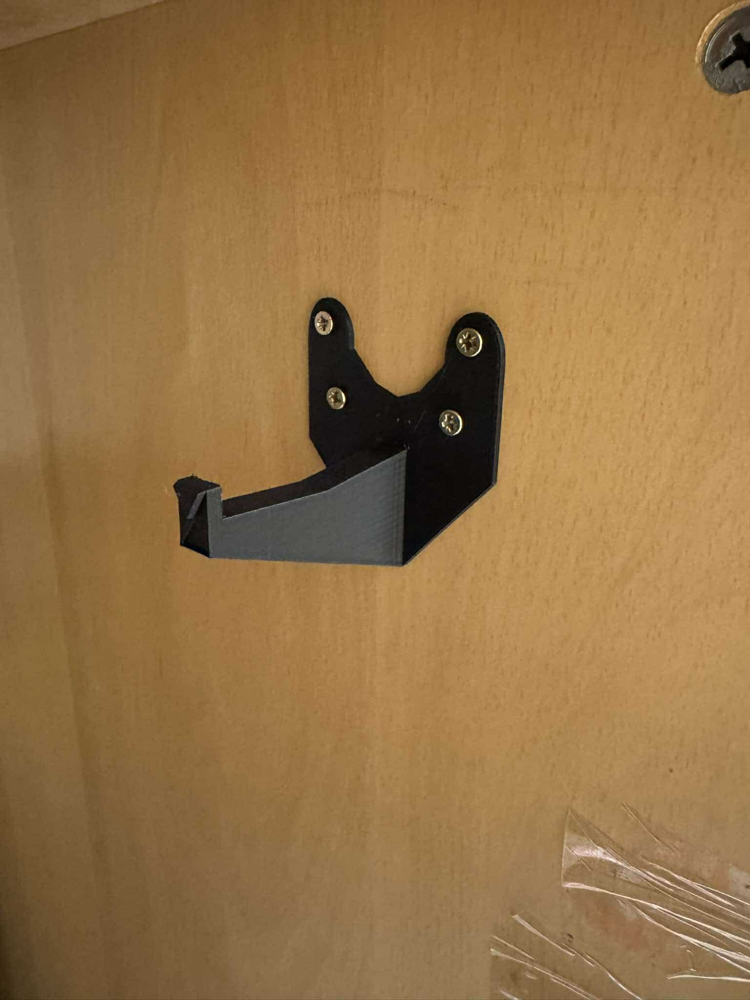 | 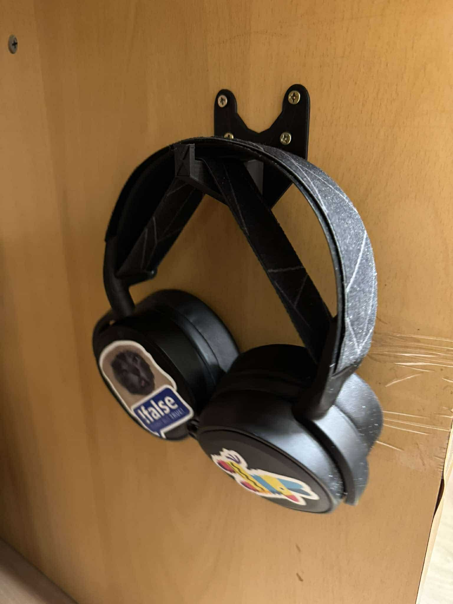 |
|:---:|:---:|
| Stojan bez slúchadiel | Stojan so slúchadlami |

Pri montáži sme zistili, že spôsob uchopenia pomocou skrutiek je dostatočne pevný a stojan sa nám nepohyboval. Taktiež sme však zistili, že skrutky trčia a vizuálne nie je takéto riešenie dokonalé.

| 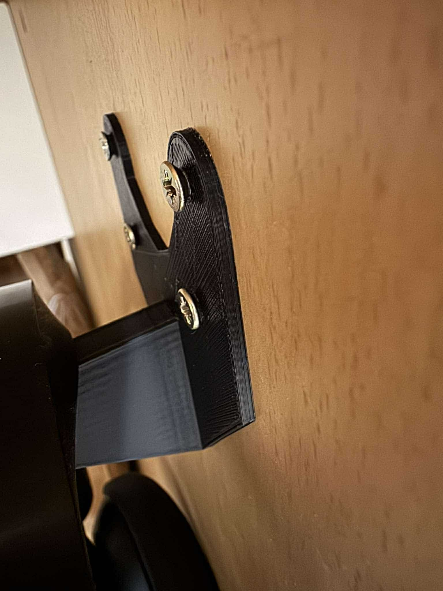 |
|:---:|
| Trčiace skrutky |

Rozhodli sme sa teda vykonať úpravu modelu a skrutky zakomponovať do dizajnu stojanu, respektíve ich zapustiť. Model je možné vidieť nižšie.

Model je možné zobraziť [tu](https://johnnyjonky.github.io/meowcraft-smvit/docs/headphone-holder/)

### Priebeh tlače stojanu verzie 2

Po úprave modelu sme sa pustili do tlače. Tlač sme vykonali s nasledujúcimi parametrami:

**Teplota tlačovej dosky**: 60 °C

**Teplota trysky**: 200 °C

**Hrúbka vrstvy**: 0.1 mm

**Rýchlosť tlače**: 60 mm/s

**Hustota výplne modelu**: 60 %

**Typ výplne modelu**: Grid

**Typ podporných štruktúr**: Podporné štruktúry obdĺžníkového tvaru

Oproti predchádzajúcej verzii sme znížili hustotu výplne modelu, pretože sme zistili, že je zbytočne veľká a stojan je dostatočne pevný aj s nižšou hustotou. Navyše sme zvýšili kvalitu tlače a zvačšili sme model, aby bol stojan stabilnejší.

|  |
|:---:|
| Dokončená tlač druhého modelu |

|  |
|:---:|
| Dokončená tlač druhého modelu |

|  |
|:---:|
| Finálny produkt stojanu |

|  |
|:---:|
| Finálny produkt stojanu |

### Záver

Po troch týždňoch testovania môžeme povedať, že stojan je dostatočne stabilný a robustný. Vďaka úprave modelu je tiež vizuálne príťažlivý a skrutky sú zakomponované do dizajnu. Stojan je vhodný na uloženie slúchadiel a zároveň je aj pekným doplnkom k pracovnému stolu.

---

## Multifunkčný stojan na Apple produkty

### Motivácia:

Keďže sme začali modelovať stojan na hodinky, prečo to nespojiť a nevytvoriť 3D model z mačacím motívom taký,kde dokážeme dať slúchadlá, telefón aj hodinky dobíjať naraz ? Tak sme sa rozhodli, že vytvoríme aj jeden multifunkčný stojan, ktorý funguje na princípe ako náš predchádzajúci stojan, kde vieme pridať a vložiť nabíjačku na magsafe od firmy apple 2x, raz kde vieme dať telefón, raz na to položiť slúchadlá, a menšiu dieru pre nabíjačku na apple watch.

### Nápad a jeho Sketch

Prvotný návrh a myšlienkový pochod.

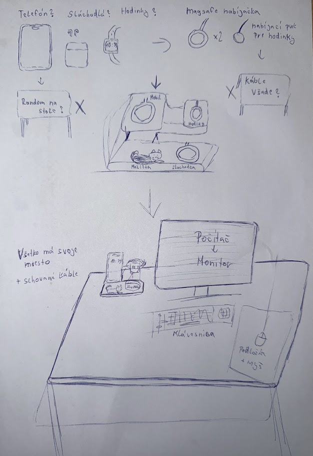

#### Zariadenia na začiatku

Na skici sú znázornené tri základné zariadenia:

- **Telefón**
- **Slúchadlá**
- **Hodinky**

Pri hodinkách je naznačené použitie nabíjacieho **MagSafe adaptéra** alebo „nabíjacieho puku.“

#### Organizačný problém

- **„Random na stole“** – Nesprávne usporiadanie zariadení spôsobuje neporiadok.
- **„Káble všade?“** – Prítomnosť veľkého množstva káblov znižuje estetiku aj praktickosť.

#### Navrhované riešenie

V centre návrhu stojí **stojan alebo dokovacia stanica**, ktorá zabezpečuje:

- **Mobil a hodinky** na vrchnej časti.
- **Slúchadlá a príslušenstvo** (napríklad nabíjací adaptér) na spodnej časti.

#### Finálna realizácia

Cieľom je dosiahnuť **upravený pracovný stôl**:

- **„Všetko má svoje miesto + schované káble.“**

Príklad finálneho usporiadania:

- Na stole sa nachádzajú **monitor**, **klávesnica**, **podložka** a **myš**.
- Naľavo je stojan na zariadenia, kde sú **mobil, hodinky a slúchadlá**, úhľadne usporiadané.

### Diagramy

V tejto časti nájdete diagramy, ktoré vizualizujú aktivity a use case pre náš multistand.

#### Use Case Diagram

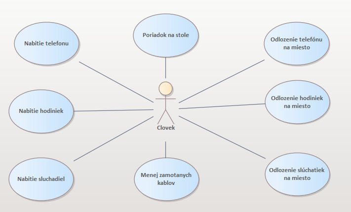

- **Poriadok na stole** – Hlavný cieľ, ktorého dosiahnutie je podporované rôznymi akciami.
- **Nabitie telefónu** – Akcia súvisiaca s udržiavaním poriadku na stole a starostlivosťou o zariadenie.
- **Nabitie hodiniek** – Podobná akcia ako nabíjanie telefónu, orientovaná na hodinky.
- **Nabitie slúchadiel** – Akcia zameraná na slúchadlá.
- **Odloženie telefónu na miesto** – Akcia spojená s udržiavaním poriadku na stole.
- **Odloženie hodiniek na miesto** – Podobná akcia ako odkladanie telefónu, orientovaná na hodinky.
- **Odloženie slúchadiel na miesto** – Akcia súvisiaca so slúchadlami.
- **Menej zamotaných káblov** – Vedľajší cieľ priamo súvisiaci s udržiavaním poriadku.

Týmto diagramom ilustrujeme interakciu medzi používateľom a týmito činnosťami s cieľom dosiahnuť lepšiu organizáciu a efektívnosť.

### Diagram toku dát

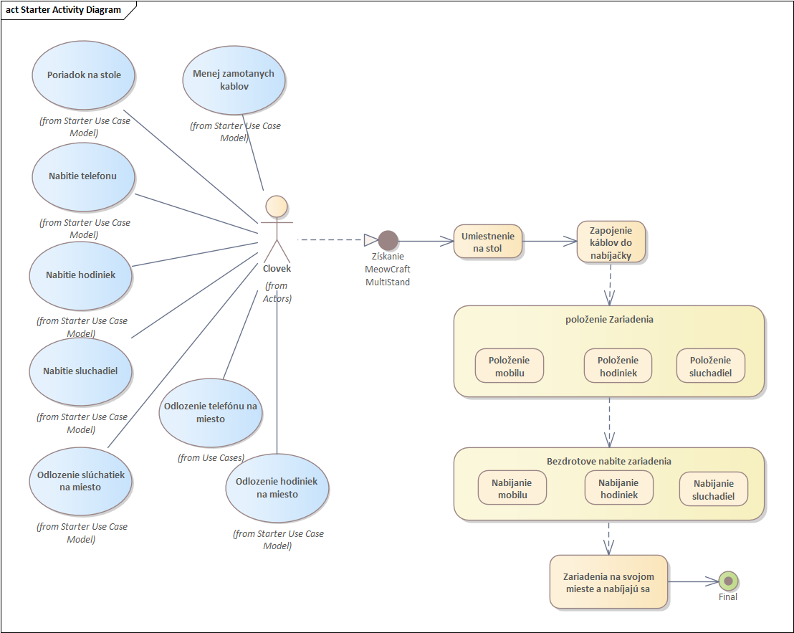

- **Poriadok na stole** a **Menej zamotaných káblov** (z Use Case Modelu).
- **Nabitie telefónu, hodiniek a slúchadiel.**
- **Odloženie telefónu, hodiniek a slúchadiel na miesto.**

#### Proces:

1. Používateľ získa **MeowCraft MultiStand**.
2. Umiestni **MultiStand** na stôl.
3. Pripojí nabíjacie káble do zariadenia.
4. Položí jednotlivé zariadenia (mobil, hodinky, slúchadlá) na určené miesta v MultiStand.
5. Zariadenia sa bezdrôtovo nabíjajú na svojich miestach.
6. **Výsledný stav:** Zariadenia sú na svojich miestach a nabíjajú sa, pričom stôl zostáva uprataný.

Týmnto diagramomv ukazujeme spôsob organizácie zariadení a redukcie neporiadku na stole pomocou MultiStand.

### Tvorba 3D modelu

Tento dokument obsahuje užitočné odkazy a informácie pre tvoju inšpiráciu, ktoré pomôžu pri vývoji a výrobe stojanu pre organizáciu elektronických zariadení na pracovnom stole.

### Research

### Design Guidelines

Oficiálne príručky pre návrh príslušenstva a nabíjacích zariadení nájdete na nasledujúcom odkaze:  
[Accessory Design Guidelines](https://developer.apple.com/accessories/Accessory-Design-Guidelines.pdf#page=568&zoom=100,713,21)  
_Popis: Táto príručka poskytuje technické a dizajnové odporúčania pre vytváranie kompatibilného príslušenstva pre produkty Apple._

### Model stojanu

Na Thingiverse je dostupný model stojanu, ktorý môžete použiť ako základ pre výrobu.  
[Model stojanu na Thingiverse](https://www.thingiverse.com/thing:5234060)  
_Popis: Tento 3D model ponúka praktický a funkčný dizajn pre umiestnenie elektronických zariadení, ako sú mobilné telefóny, slúchadlá a hodinky._

### Model mačky

Dekoratívny model mačky, ktorý je možné pridať k stojanu alebo použiť ako samostatnú súčasť:  
[Model mačky na Printables](https://www.printables.com/model/712286-cat/files)  
_Popis: Tento model dodá stojanu hravý vzhľad alebo môže byť použitý na zdobenie pracovného priestoru._

### Použitý nástroj na 3D modely

Keďže sme absolútni nováčikovia v tvorbe 3D modelov a dizajnu, rozhodli sme sa využiť existujúce riešenia, ktoré sme našli online. Vybrané modely a návrhy sme si prispôsobili tak, aby vyhovovali našim konkrétnym potrebám a požiadavkám. Tento prístup nám umožnil rýchlejšie sa naučiť procesy 3D modelovania a zároveň vytvoriť praktické a funkčné riešenie.

Použitý nástroj:  
[Tinkercad](https://www.tinkercad.com/)  
_Popis: Tinkercad je celkom jednoduchý, intuitívny nástroj na navrhovanie 3D modelov, ideálny pre začiatočníkov aj pokročilých._

(tiež som ho používal prvý krát 😂)

### Proces tvorenia

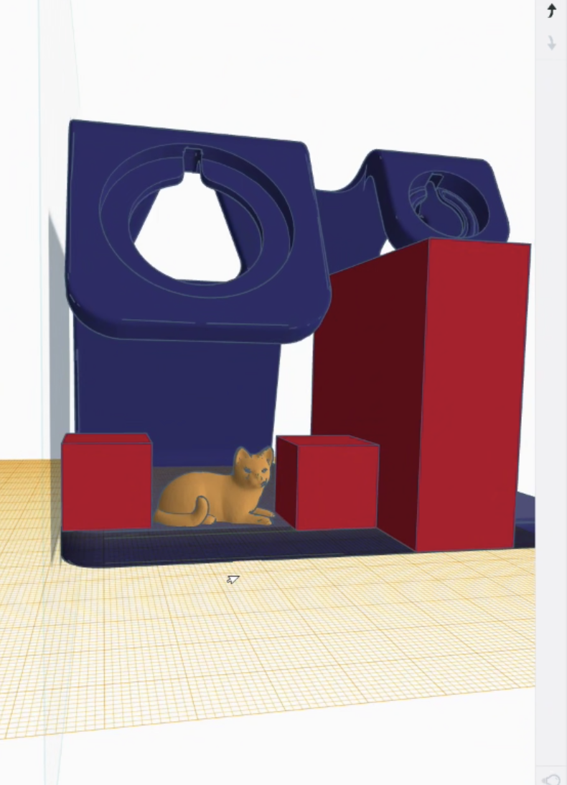  
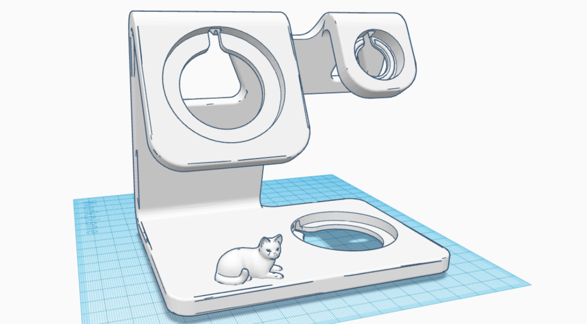  
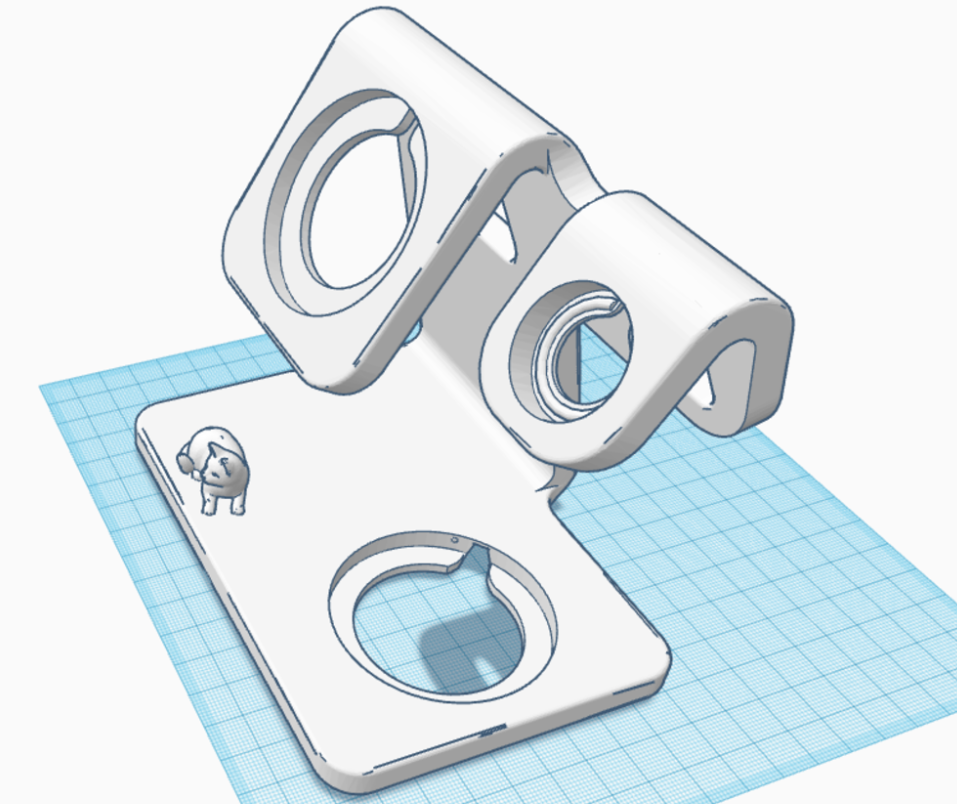

### Výsledný 3D model

Nižšie je zobrazený výsledný model. Model je možné [stiahnuť tu](/models/multistand.stl).

:::tip
Pridali sme modul na zobrazenie 3D modelu. Skús s modelom pohnúť 😁.
:::

:::note
Tento model sme poslali kolegovi Patrikovi na zhodnotenie, či je možné ho vytlačiť. Momentálne čakáme na vytlačenie. 🙂
:::

### Priebeh tlače prototypu

Aby sme vylepšili pracovný stôl a zároveň vytvorili praktický a pekný doplnok, rozhodli sme sa vytlačiť multifunkčný stojan na nabíjanie iphonu, apple watch a airpodov. Aby sme zachovali tematiku mačiek, rozhodli sme sa do stojanu pridať mačku sediacu na stojane.

**Teplota tlačovej dosky**: 60 °C

**Teplota trysky**: 200 °C

**Hrúbka vrstvy**: 0.2 mm

**Rýchlosť tlače**: 60 mm/s

**Hustota výplne modelu**: 20 % / 40 %

**Typ výplne modelu**: Grid/Tree

**Typ podporných štruktúr**: Podporné štruktúry obdĺžníkového tvaru

|  |
|:---:|
| Proces tlače modelu |

|  |
|:---:|
| Proces tlače modelu |

|  |
|:---:|
| Proces tlače modelu |

| 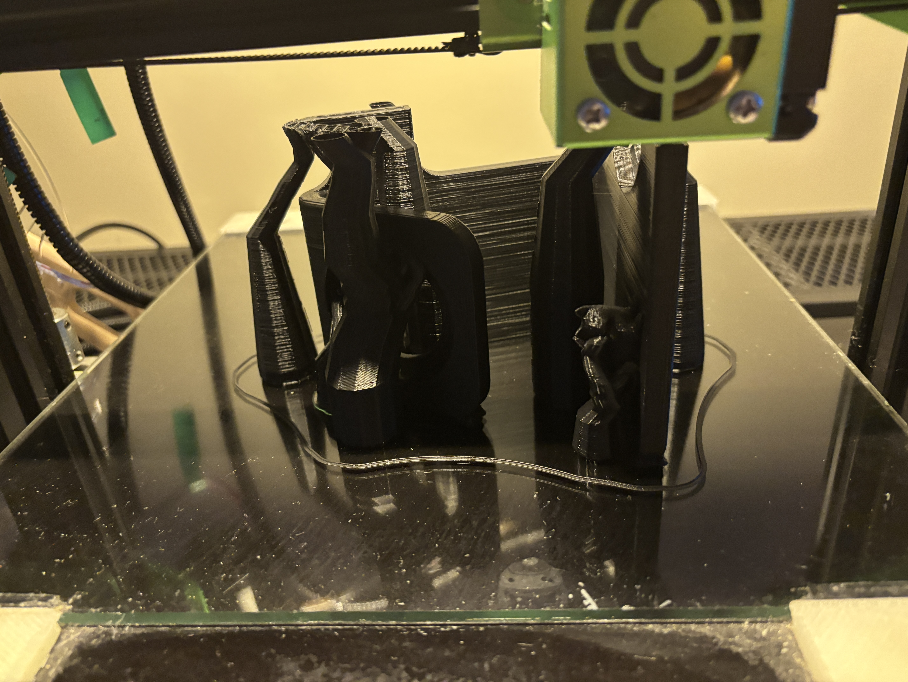 |
|:---:|
| Proces tlače modelu |

| 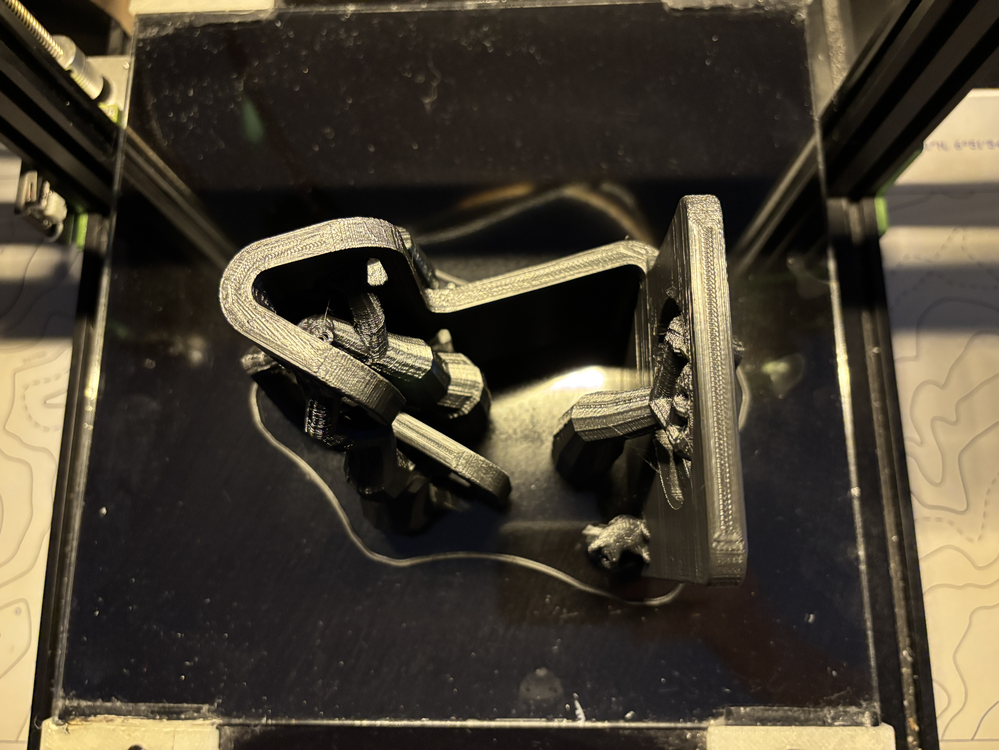 |
|:---:|
| Dokončená tlač |

|  |
|:---:|
| Dokončená tlač |

|  |
|:---:|
| Dokončená tlač |

### Videá z tlače

Videá z tlače sú dostupné [tu](https://www.youtube.com/embed/evFr4zqay3w?si=9oF75RcPwAGd7jUV) a [tu](https://www.youtube.com/embed/k0g31pWWS94?si=I-uuFN4aQMyMgRKo)

### Prototyp vytlačeného stojanu

Prvý vytlačený prototyp bol v horšej kvalite, nakoľko sme zle odhladli použitie podporných štruktúr.
Finálny bol vytlačený pomocou stromových štruktúr, ktoré sa dajú ľahko odstrániť. Z klasických obdĺžnikových štruktúr sme prešli na stromové.
Po úspešnom vytlačení modelu sme sa pustili do jeho otestovania. Stojan bol použiteľný a nabíjačky sa do neho vošli. Finálny produkt bol tiež tlačený s vyššou hustotou výplne pre lepšiu stabilitu a odolnosť.

### Finálny produkt

Po dokončení tlače sme model vyčistili a odstránili podporné štruktúry.

|  |
|:---:|
| Finálny produkt |

|  |
|:---:|
| Finálny produkt |

### Záver

Vytlačený stojan na nabíjanie je praktický a pekný doplnok k pracovnému stolu. Vďaka jeho dizajnu sa hodí do každého interiéru a zároveň je praktickým pomocníkom pri nabíjaní zariadení.

---

## Mačacie tričká
Motivácia na tvorbu tričiek prišla z toho že sme chceli spracovať naše pocity z nástrojov ktoré používame pri každodennej práci do podoby obrázkov.

Hlavným aktérom pri týchto obrázkoch by mali byť samozrejme mačky, ako plynie z názvu Meowcraft.

Design sme taktiež chceli inšpirovať designom starých rockerskych tričiek, ktoré boli čiernobiele.

### Aktuálny stav projektu:

- [x] Nápad
- [x] Sketch toho, ako by to malo vyzerať
- [x] Pripravený dizajn trička
- [x] Vyhotovené tričko

Spracovali náš nápad, vytvorili úvodný koncept a prepracovali prvotné sketche do finálneho dizajnu tričiek.

Tričká sme objednali u nášho dodávateľa a zatiaľ máme fyzicky k dispozícii jeden kus.

Tento prvý vzorový kus bol vyhodnotený ako kvalitný a vyhovujúci našim očakávaniam.

Po dôkladnom výbere sme sa rozhodli pre dva rôzne strihy tričiek, aby sme oslovili širšiu skupinu zákazníkov. V ponuke sú aktuálne tri rôzne verzie našich tričiek:

1. **Klasický strih**
2. **Moderný boxy strih**

Ponuku tričiek sme zatiaľ sprístupnili iba v našom firemnom chate, napriek tomu už evidujeme takmer 10 predbežných objednávok, čo naznačuje pozitívny záujem.

Plánujeme rozšíriť ponuku aj mimo firemného prostredia, pravdepodobne pomocou socíalnych sieti.

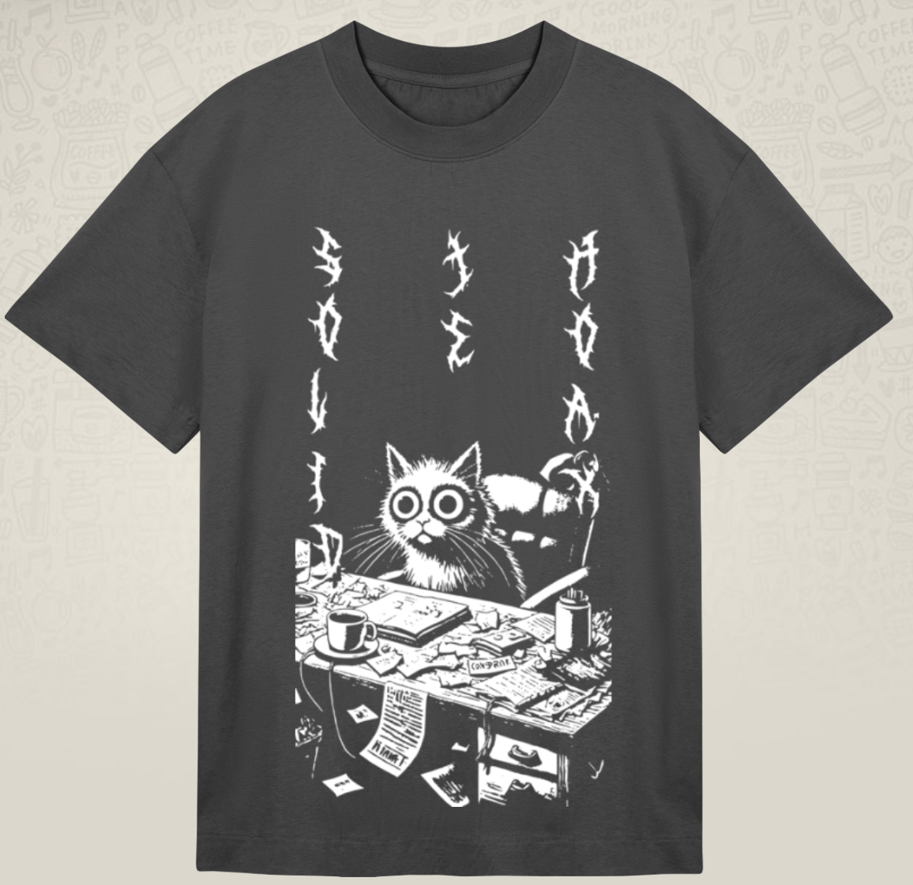
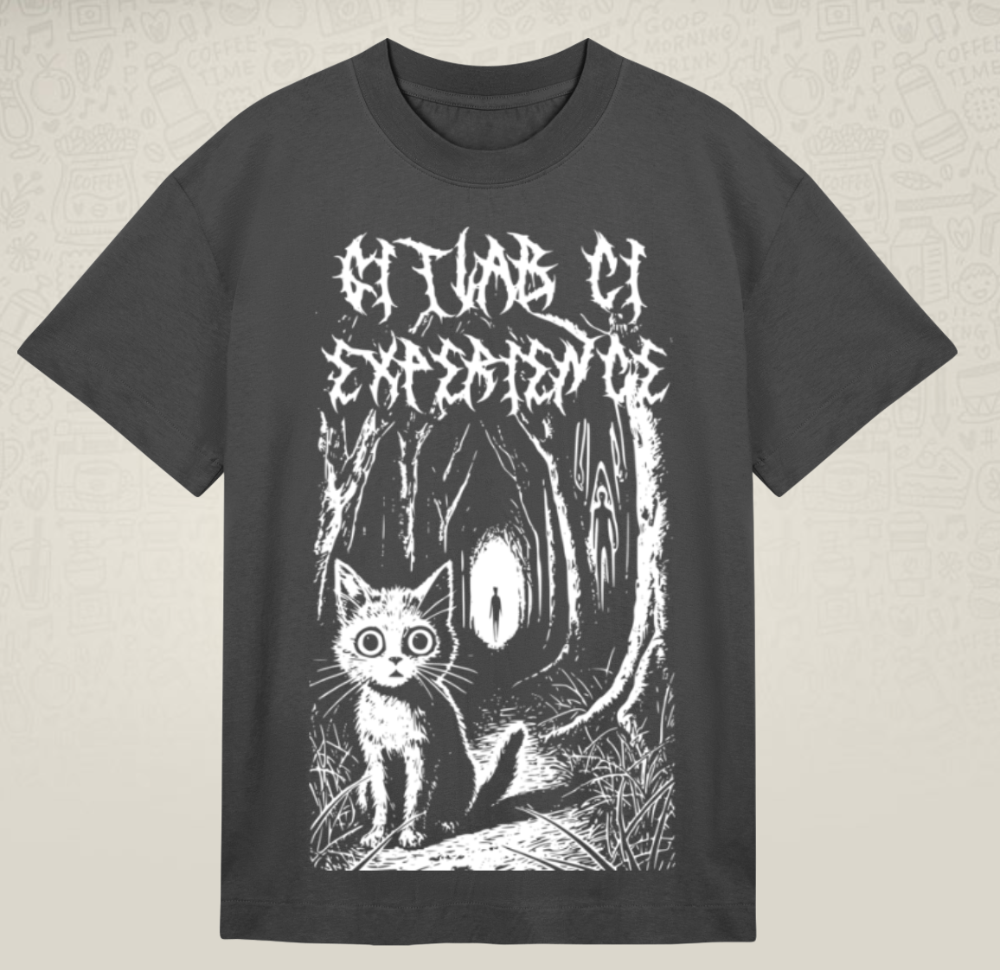

Prvý spokojný zakazník.

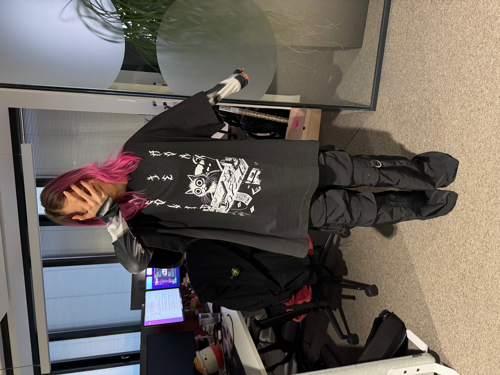

### Sketch

Prvotný návrh a rozmýšľanie nad tričkami s motívom mačiek.

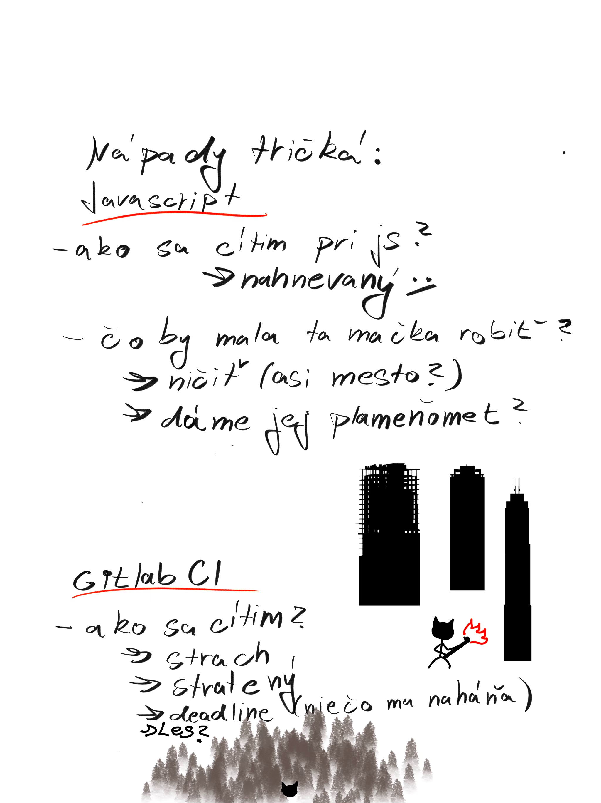

### Diagramy

Pre zvolený produkt sme zatiaľ vytvorili nasledovné diagramy:

#### Activity Diagram
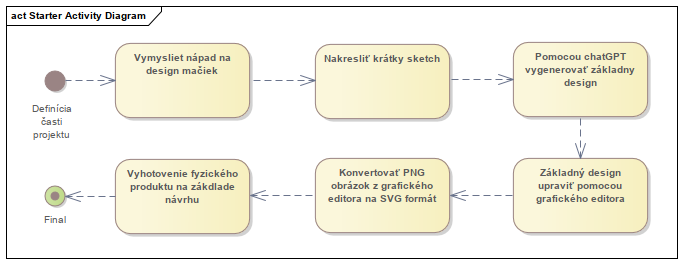

Celý proces tejto časti projektu prebiehal v nasledujúcich krokoch:

1. **Návrh nápadov**  
   Vymysleli sme koncept, ako by mali obrázky vyzerať a aký text by mali obsahovať.

2. **Príprava náčrtu**  
   Na tablete sme nakreslili približný návrh toho, čo by malo byť na tričkách.

3. **Generovanie obrázkov**  
   Pomocou ChatGPT sme ku všetkým našim nápadom vygenerovali obrázky.

4. **Úprava obrázkov**  
   Obrázky sme následne upravili v programe GIMP a pridali k nim texty.

5. **Konverzia na SVG formát**  
   Upravené obrázky sme konvertovali do formátu SVG.

6. **Tlač tričiek**  
   Na záver sme obrázky poslali na tlač prostredníctvom stránky [Shirttuning.sk](https://www.shirttuning.sk).

#### Use Case Diagram
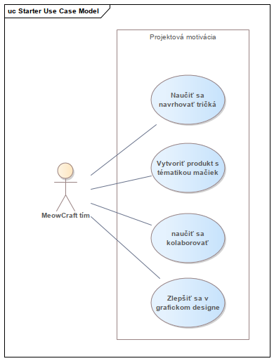

Tento diagram predstavuje **Use Case Model** pre projekt s názvom "Projektová motivácia" a ilustruje ciele a motivácie tímu **MeowCraft**.

Diagram zobrazuje postavu (aktéra), ktorá reprezentuje tím MeowCraft a štyri hlavné oblasti motivácie pre tento projekt.

### Popis jednotlivých motivačných bodov:

1. **Naučiť sa navrhovať tričká**
2. **Vytvoriť produkt s tématikou mačiek**
3. **Naučiť sa kolaborovať**
4. **Zlepšiť sa v grafickom dizajne**  
