# Sonic Sight

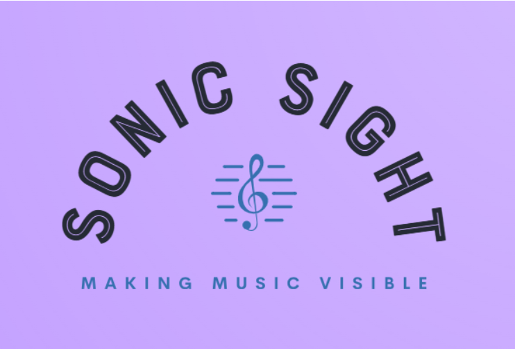

## Description

**Sonic Sight** is an innovative application designed to transform music into vibrant visual experiences. It captures the essence of sound and represents it through colors, shapes and motion. Thus it is accessible to everyone, including individuals with hearing difficulties because of the unique way to perceive and interact with music. The app connects two different factors - hearing and seeing, which makes it perfect not only for music enthusiasts but also for educators and basically anyone looking for a fresh way to experience sound. With a user-friendly interface and customizable visuals, it is an intuitive tool for exploring the beauty of music.

## Motivation

Music is a universal language, but not everyone experiences it in the same way. With this app, the aim is to make music more inclusive by providing a way to visualize sound for those who cannot hear it. It is not only about breaking barriers but also about proving that music can be felt, seen and shared across all senses which can make it easier for education as a valuable tool. Students can grasp concepts more effectively by seeing what they might miss through hearing alone. Ultimately, it is about bridging gaps, inspiring creativity and making music accessible to everyone.

## Business analysis

There are existing tools that offer real-time audio visualization and analysis to enhance music education. These tools provide functionalities that align with the concept of this presenting application, however, there is no application so far that was intended and visualized like the one proposed in this documentation.

Here are three similar and notable examples:
1. Sing&See

Sing&See is software that provides visual feedback of the singing voice, including pitch, dynamics and timbre. It helps singers and teachers identify areas for improvement by displaying real-time pitch graphs and other vocal parameters.

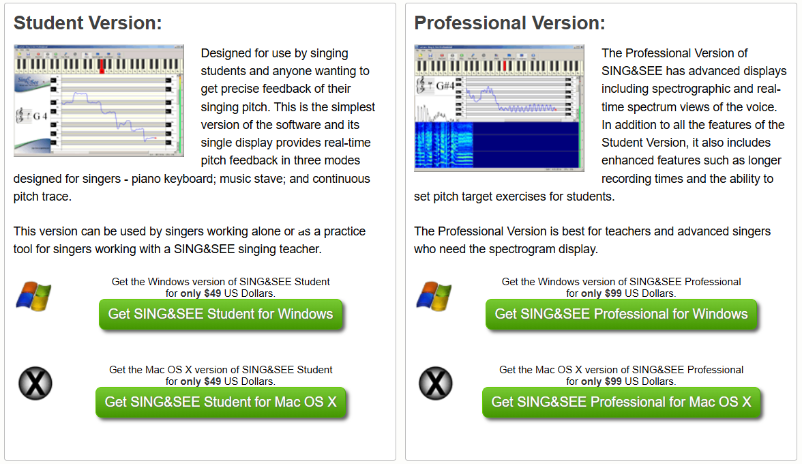

2. Singing carrots' vocal pitch monitor

This online tool offers real-time pitch detection and visualization. It displays the pitch of the user's voice on a musical scale. 

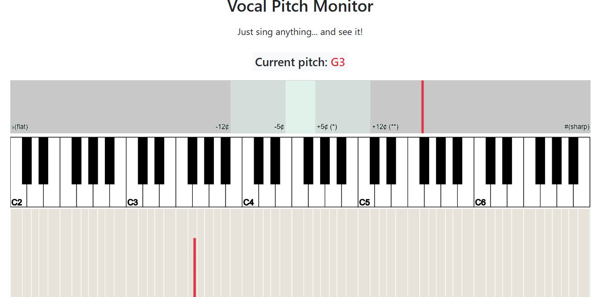

3. Seeing music by Jay Alan Zimmerman

An interactive tool that visualizes music by turning sounds into dynamic visualizations. Users can sing or play sounds and the tool generates corresponding visual patterns, which can aid in understanding musical structures and dynamics. 

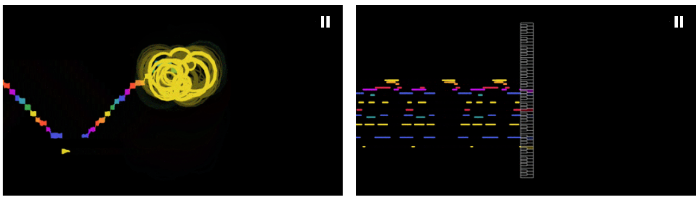

### Visual drafts

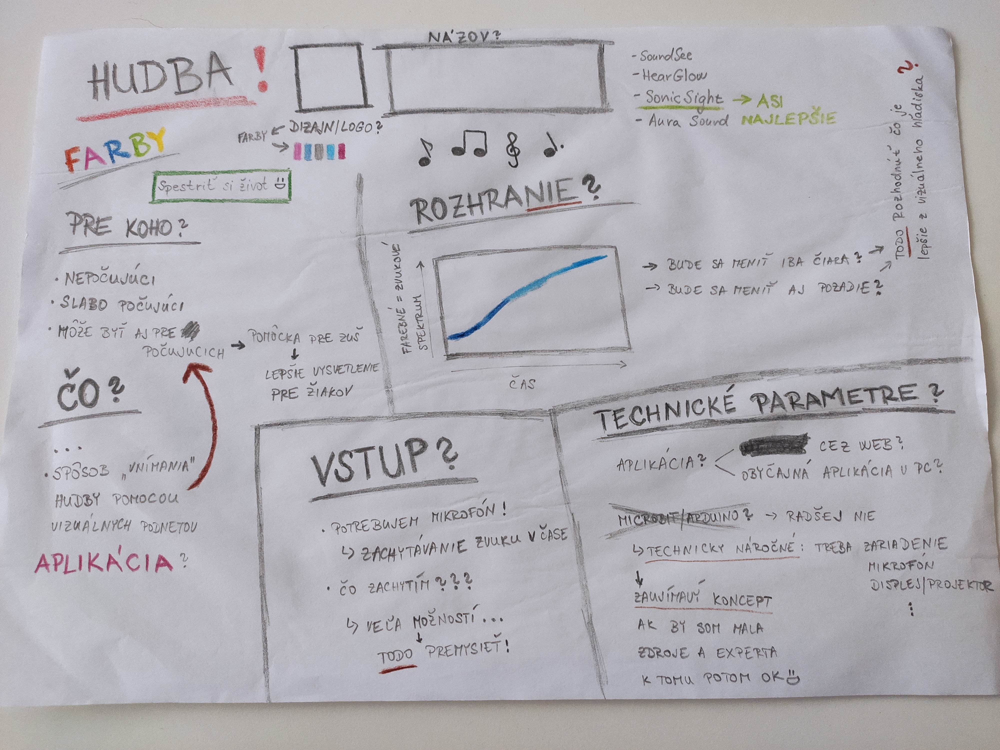

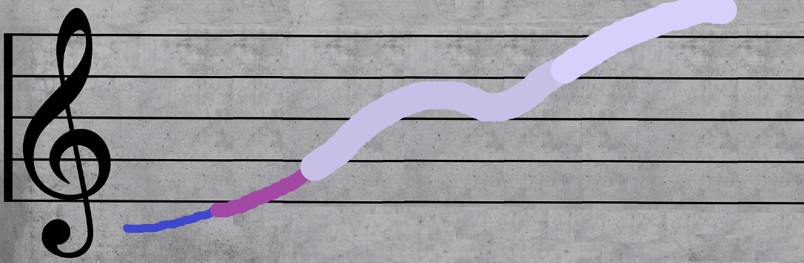

### Stakeholder interviews

This section provides questions and answers as qualitative insights from
stakeholders that can validate or refine the project’s requirements.
Based on these requirements the objective of this project was adjusted
which ensures the project aligns with real-world needs and expectations.

Two participants took part in the interview:

> **Marta** - around 60 years old, an experienced violin teacher
>
> **Petra** - 28 years old, a younger violin teacher with better
> understanding of modern technologies

These are the following questions and answers:

**Q1: Do you use any technological tools in teaching violin? If yes, which ones? If not, why not?**

> **Marta:** I don’t use any technology in my teaching. I’ve always
> relied on traditional methods like demonstrations, sheet music and
> direct feedback. I think technology might complicate things for both
> me and my students.
>
> **Petra:** Yes, I use metronome apps, digital tuners, and occasionally
> video recordings for feedback. I find these tools helpful in making
> lessons more interactive and personalized.

**Q2: Do you think it would be appropriate or necessary to include technology in violin teaching?**

> **Marta:** It might be appropriate for younger teachers or students,
> but for someone like me, I’m not sure how much value it would add. I
> prefer face-to-face interactions, which are crucial for this art.
>
> **Petra:** Absolutely, technology has so much potential to enhance
> learning. It can provide visual and auditory aids that are hard to
> replicate manually. But I must add that individual face-to-face
> interactions are crucial - without it, I think, it would be impossible
> to teach and learn.

**Q3: Do you have access to a computer?**

> **Marta:** Yes, I have a computer at home, but teachers in (music)
> school don’t have computers since there is no need.
>
> **Petra:** No. I mean, yes. I have my own personal laptop but in
> school we don’t have access to one. But if we want to, we can use our
> own.

**Q4: How often does it happen that a student does not understand what you’re trying to explain unless you show multiple examples and practical demonstrations?**

> **Marta:** Quite often, especially with beginners. I need to repeat
> explanations and demonstrate several times until they grasp the
> concept.
>
> **Petra:** It depends on the student, but yes, practical
> demonstrations are crucial. Visual aids can often clarify what words
> cannot.

**Q5: (After explaining the app's functionality and its role in teaching) Do you think this app would help you in your teaching?**

> **Marta:** It sounds interesting, especially if it can visually
> represent sound and techniques. It might help some students better
> understand the nuances. But for me it would be, I think, very
> difficult to understand and use when I teach.
>
> **Petra:** Yes, I think it would be a fantastic addition! It could
> make lessons more engaging and help students practice independently
> with guidance.

**Q6: Do you think such an app could be integrated into the teaching process in general?**

> **Marta:** It could work as a supplementary tool, but I would still
> focus on personal interaction and traditional methods since not
> everyone has access to a computer or they are my age and it could be
> difficult for them to learn how to use it and incorporate it into the
> lessons.
>
> **Petra:** Definitely! It could even become a core part of the
> learning experience, especially for younger students. It can also
> become a useful tool in capturing their attention, because some
> students are so attached to their phones and I think it is sad. Then
> they can’t detach easily and I think that prevents them from truly
> feeling the music.

**Q7: What do you like about this app?**

> **Marta:** I like the idea of visualizing sound. It’s unique and could
> help students, especially the new generations.
>
> **Petra:** I love the interactive and visual aspects and the potential
> to give students instant feedback on their playing. And of course, I
> like the purpose as I said in the previous question.

*(Author's note: The interview was conducted in Slovak and was translated into English for the purposes of this documentation.)*

### Requirements

Creating a new application involves specifying clear and well-defined requirements to ensure the success of a project. These requirements are typically divided into categories like business requirements, functional requirements and non-functional requirements. Within this project requirements for each category were defined to contribute to a better development phase and overall meet the business objectives.

#### Business requirements

Business requirements define the high-level objectives and goals that the application should achieve from a business perspective. Such requirements serve as the foundation for the entire project and for this project the business requirements are defined as following, because they are needed to ensure that the system meets user needs and also aligns with legal and market demands in terms of music education.

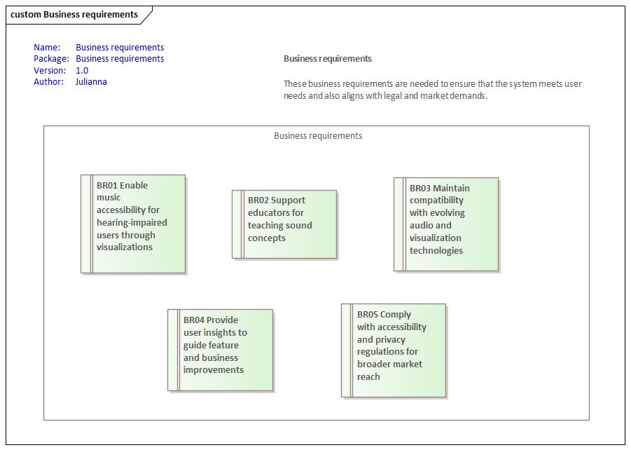

#### Functional and non-functional requirements

Functional requirements specify the features and functionalities that the application must possess to meet the business requirements mentioned above. On the other hand, non-functional requirements define the criteria that measure the performance, usability, reliability and security of the application. Both of these requirements are specified in more detail in the following diagram.

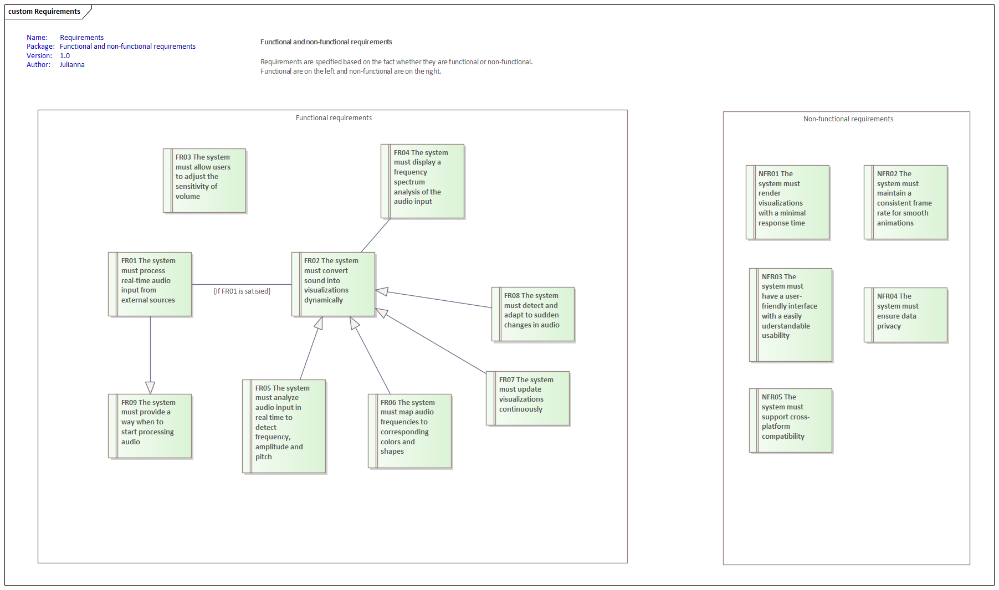

## System modeling

After the requirement specification, the software development phase follows by modeling the system by providing a visual representation of the architecture, processes and interactions. 

### System diagrams

First to mention are use case diagrams. These diagrams provide a high-level overview of the functionality from the user’s perspective. Since this application is intended for 3 roles which are Administrator, Teacher and Student, three use case diagrams are provided to specify use cases for each role separately.

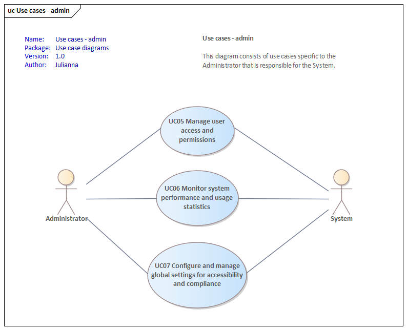

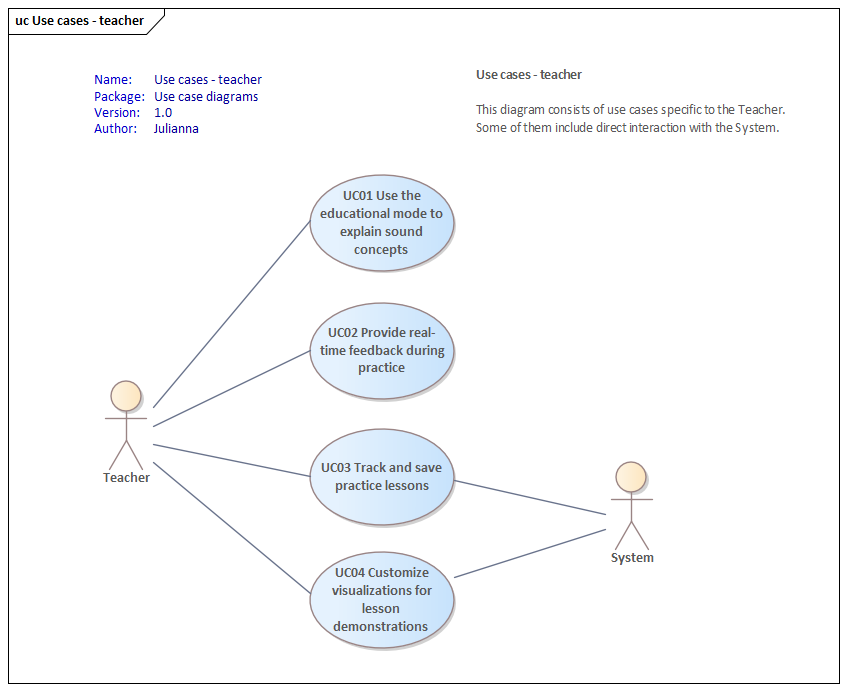

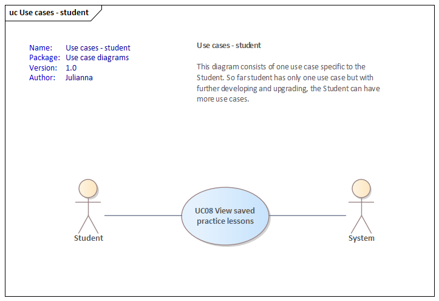

For the main usage of this system, the activity diagram was designed to show the main purpose of this system/application. It shows what should be the main control flow of the utilization when used during a lesson.

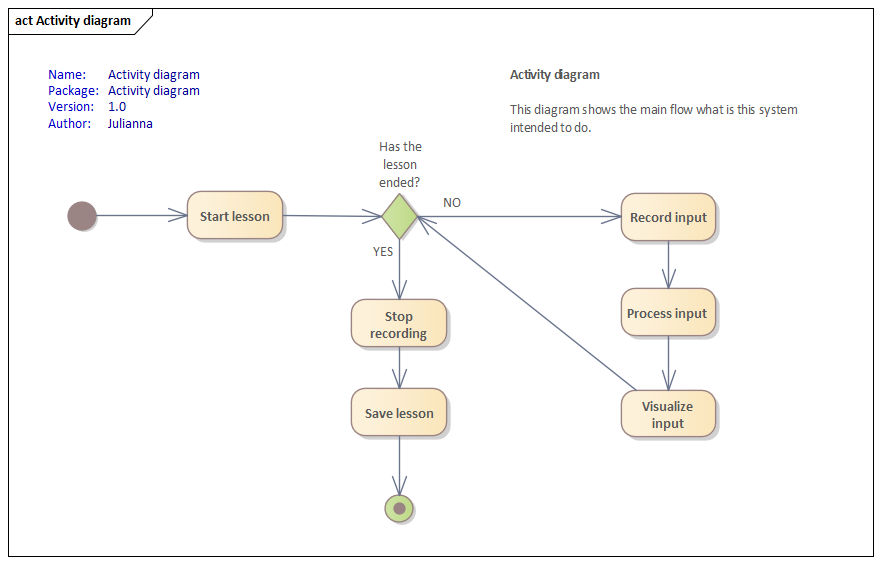

Finally, the component diagram provides a structural view of the system by showing its various components. So far the components are defined as general as possible since this application should not be dependent on hardware. 

*(Author's note: For the initial experiments a computer was chosen as the main device since it meets the specification displayed in the component diagram.)*

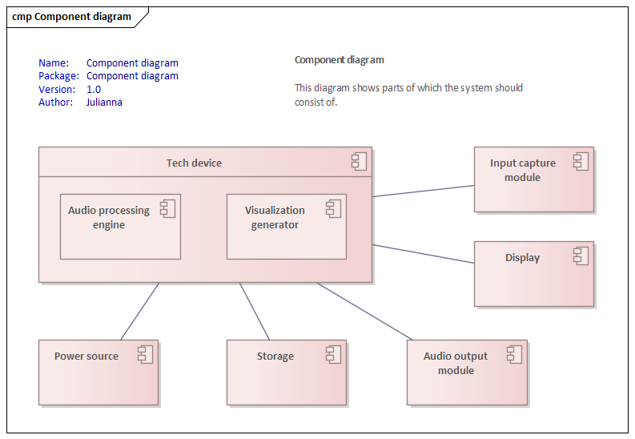

### Implementation

As mentioned before, this application is a real-time audio visualization tool that uses the audio processing and visualizing libraries. It captures audio input, processes it to estimate pitch and visually represents the pitch on a simulated sheet music interface.

For the initial experiment, programming language Python was chosen. The entire logic is so far within one python file that, when executed, it starts the whole app.

Libraries used: 
- PyAudio 
- NumPy 
- Librosa 
- Pygame

Main features:

- frequency mapping - converting frequency values to y-coordinates for simulation of moving visualization
- pitch smoothing - appling a moving average filter to smooth the pitch values
>
- real-time display - continuously updating the graphical interface to show the pitch changes in real-time

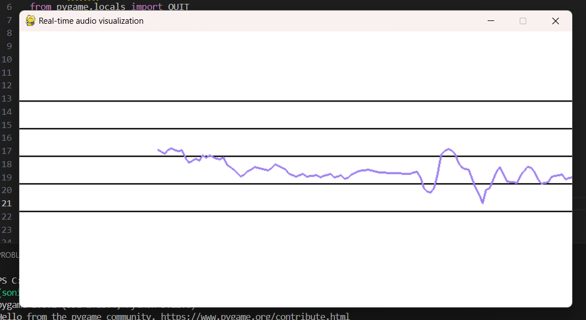

## Future work

In the future, the application will be enhanced with several additional features. User accounts will be introduced which then allows visualizations to be saved, progress to be tracked and lessons to be shared and thus creating a collaborative community. A significant focus will be placed on incorporating AI to improve the detection and identification of musical instruments, which can then provide more detailed and accurate visualizations that could help in the educational process. Additionally, visualization capabilities will be enhanced with more sophisticated representations of audio data and the application's performance will be optimized for better scalability and efficiency. These improvements will make the application more interactive, insightful and user-friendly.