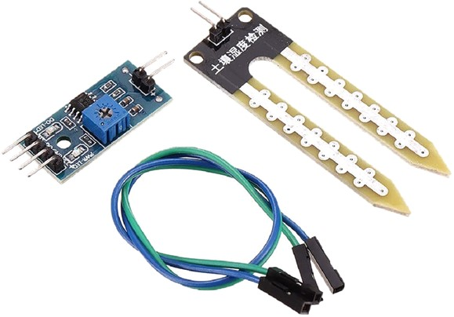

# **PROJECT OVERVIEW** 
# **InteligentnyKvetinac: Samozavlažovací a samonasvecovací kvetináč**
*Autor: Katarína Beňovská*

**Cieľ projektu:**

Preskúmať existujúce projekty venujúce sa inteligentnému pestovanie a na ich základe navrhnúť inteligetný kvetináč spoločne s algoritmami na jeho fungovanie.
Vytvoriť náhradu za rastlinu, ak používateľ nie je schopný zabezpečiť životnosť rastliny ani pomocou inteligetného kvetináča.

**Výstupy projektu:**

- Návrh inteligetného kvetináča: Podrobný opis súčastok a model ich zapojenia spoločne s modelom algoritmov softvéru kvetináča.
- Nacenenie produktu: Sumár nákladov materiálu na výrobu kvetináča. 
- Prototyp umelej rastliny: 3D model kvetiny slúžiaci ako náhrada za živé rastliny

**Vlastnosti:**

- Automatické meranie pôdnej vlhkosti a intenzity dopadajúceho svetla.
- Možnosť nastavenia optimálnej úrovne dopadajúceho svetla a pôdnej vlhkosti.
- Automatické zavlažovanie rastliny podľa aktuálnej vlhkosti pôdy a nastavenej úrovne vlhkosti.
- Automatické nasvetcovanie rastliny podľa úrovne intenzity dopadajúceho svetla a nastavenej optimálnej úrovne dopadajúceho svetla.

**Prínos projektu:**

Inteligentné riešenie uľahčuje starostlivosť o rastliny, pretože odbremeňuje
používateľa od sledovania stavu rastliny a zabezpečuje automatizované vyživovanie rastliny.
Keďže každá rastlina má svoje osobitné nároky na starostlivosť, pri väčšom množstve druhov
rastlín môže byť pestovanie najmä pre laika náročné. Zároveň rastliny, ako živé organizmy
potrebujú pre svoj správny rast pravidelnú starostlivosť, čo môže byť problémom v prípade,
že potrebujeme na dlhšiu dobu opustiť našu domácnosť.
V neposlednom rade platí, že zodpovedné zalievanie a správe svetlo sú
dôležité nielen pre rastlinu ako takú, ale takisto zefektívňujú využívanie vodných zdrojov a
svetelnej energie. Čo vedie k ekologickejšej starostlivosti o rastliny.

**Cieľová skupina:**

- Laici v pestovatelia rastlín
- Pestovatelia rastlín s náročnou starostlivosťou
- Pestovatelia, ktorý potrebujú na dlhšiu dobu opúšťať svoje rastliny
- Ľudia, ktorý nie sú schopný zabezpečiť starostlivosť o rastliny

# **Analýza existujúcich riešení**

Rastliny sú neodmysliteľnou súčasťou mnohých domácností. Spríjemňujú vzhľad
interiéru, čistia vzduch, dokonca bývajú pestované na priamu konzumáciu. Preto nie je
prekvapujúce, že témou inteligentného pestovania v domácnostiach sa zaoberalo už mnoho
prác. Moje smerovanie v tomto projekte najviac ovplyvnili práce Design of
Intelligent Flower Watering System Based on STC89C52 SCM a Design of Indoor
Environment Monitoring System Based on WiFi.

Zang a Ou vo svojej práci o inteligentnom zavlažovaní navrhli zavlažovací systém,
ktorého modul zachytávania pôdnej vlhkosti odmeria odpor pôdy a túto hodnotu odošle na
ADC čip. Tento čip z odporu pôdy vypočíta, aká je jej vlhkosť. Hodnota sa porovná s
optimálnou hodnotou vlhkosti. Ak je vlhkosť nižšia, ako optimálna systém spustí vodnú
pumpu, ktorá zavlaží rastlinu. A tento cyklus opakuje pokým pôda nenadobudne optimálnu
vlhkosť. [1]

Podľa ich návrhu musí používateľ tento proces manuálne spustiť stlačením gombíka.
Avšak my berieme do úvahy možnosť, že majiteľ musí opustiť svoju domácnosť, a preto
v našom návrhu testovanie vlhkosti prebieha automaticky.

Druhá zo spomínaných prác sa venuje nielen zavlažovaniu, ale aj nasvecovaniu.
V tejto práci autori navrhujú systém, ktorého riadiacou jednotkou je Arduino UNO, do
ktorého je pripojený senzor teploty a vlhkosti DHT11 a senzor intenzity svetla GY-30. Údaje
z týchto senzorov sú následne vyhodnotené a bezdrôtovým modulom ESP8266 sú informácie
o stave mikroprostredia odosielané do aplikácie, ktorú má používateľ vo svojom mobilnom
telefóne [2].

Tento systém je však určený iba na sledovanie stavu prostredia a neposkytuje žiadnu
automatizovanú starostlivosť.

1 ZHANG, Junyu and OU, Liangjjie. Design of Intelligent Flower Watering System Based on
STC89C52 SCM. In Proceedings of the 2021 International Conference on Control and
Intelligent Robotics (ICCIR 2021) [online]. ACM, 2021, 126-130 [cit. 2024-11-04]. DOI:
10.1145/3473714.3473736. Dostupné na: https://dl.acm.org/doi/10.1145/3473714.3473736

2 Y. LI and J. HE. Design of Indoor Environment Monitoring System Based on WiFi. In: 2018
2nd IEEE Advanced Information Management,Communicates, Electronic and Automation
Control Conference (IMCEC) [online]. IEEE, 2018, 1-1845 [cit. 2024-11-04]. DOI:
10.1109/IMCEC.2018.8469580. Dostupné na: https://ieeexplore.ieee.org/document/8469580

# **Komponenty:**

**Senzor pôdnej vlhkosti**: Senzor pôdnej vlhkosti
zaznamenáva jej hodnotu podľa
odporu pôdy. Čím je pôda vlhkejšia
tým sa stáva vodivejšou. Súčasťou
senzora je aj komparátor, ktorý slúži
na digitalizáciu analógového signálu
vychádzajúceho zo snímača. Jeho
ďalšou veľmi dôležitou
funkcionalitou je nastavenie
prahovej hodnoty. Keď vlhkosť
prekročí prahovú hodnotu modul vie signalizovať High alebo Low. Túto vlastnosť vieme
neskôr využiť, pretože bude signalizovať, kedy je potrebné spustiť vodné čerpadlo. Na
pripojenie sú potrebné 4 piny. VCC na zdroj energie, GND na pripojenie k uzemňovaciemu
pinu arduina, Digital output pin a Analog output pin.

**Senzor intenzity svetla**: Za vhodný smo zvolila senzor Iduino 1485310. Odpor tohto fotorezistora klesá pokiaľ sa
zvyšuje intenzita svetla, a tak je možné určiťhodnotu intenzity. Na jeho pripojenie sú potrebné 3 piny: napájanie, uzemnenie a analógový outputpin. 

 

**Vodné čerpadlo**: Rozhodla som sa pre 12 voltové
čerpadlo. Toto malé výkonné čerpadielko
dokáže vytvoriť prietok až 4l za minútu,
čo je pre naše potreby viac než
postačujúce a zároveň je cenovo
dostupným. Keďže súčasťou balenia nie
je kompatibilná hadička. Musíme dokúpiť
aj tú. Pôjde konkrétne o 1 meter
silikónovej hadičky s vnútorným priemerom 8mm, keďže vonkajší priemer otvorov na čerpadle je práve 8mm

 

**LED semafor**: V tomto projekte využijem dva
LED semafory, a to na zobrazenie stupňa
nastavenej intenzity svetla a vlhkosti. Pre
jednoduchosť som zvolila trojstupňovú
škálu, kde zelená znamená najnižšiu
intenzitu a červená najvyššiu. Toto riešenie
je aj cenovo dostupným, a to nie len
z dôvodu, že klasické displeje sú viac než päťnásobne drahšie, no nepotrebujeme ani externé
napájanie a relé modul na ovládanie zobrazovacieho zariadenia.

**LED Spectrum žiarovka pre pestovanie rastlín E27**: Žiarovka LED spektra je nielen
vhodná na podporu rastu rastlín, pretože
obsahuje červené a modré svetlo, no
zároveň je udržateľnou. Rovako tak je
bezpečnou, pretože nedochádza k jej
prehrievaniu, a tak môže byť využívaná aj
v uzavretých priestoroch.

**Objímka**: Keďže Arduino nie je schopné
poskytnúť dostatočný výkon na to, aby mohol
napájať žiarovku potrebujeme ju pripojiť do
siete. Pre tento účel je jednou z potrebných
súčastí Sada osvetlenia E27, ktorá je
kompatibilná s veľkosťou vybranej
žiarovky.

**Dvojkanálové relé**: Na to, aby sme boli schopní ovládať žiarovku
a vodné čerpadlo je potrebné relé, keďže Arduino
neposkytuje dostatočný prúd na poháňanie týchto
zariadení, a tak nie je možné ich k nemu priamo
pripojiť. Rozhodli sme sa pre dvojkanálové relé. Toto
5V relé je dostatočným pre pripojenie aj žiarovky, aj
pumpy. 

**Adaptér**: Ďalej budeme potrebovať dva adaptéry na
napájanie samotného Arduina a taktiež vodnej pumpy.
Vybrali sme 12V adaptér s konektorom DC005, ktorý
je kompatibilný s konektorom Arduina

**Arduino Mega**: Náš kvetináč bude riadený Arduinom
Mega vo verzii CH340G precízny klon. Tento
model sme zvolili kvôli tomu, že je viac než
o polovicu lacnejší než originál, no je s ním
úplne totožný. Pre model Mega sme sa
rozhodli z dôvodu veľkého množstva
zariadení, ktoré k nemu chceme pripojiť,
pretože poskytuje až 54 digitálnych a 16
analógových pinov, ktoré pokryjú naše
požiadavky a poskytnú možnosť
potenciálneho pridávania ďalších zariadení v budúcnosti.

**Arduino Mega protype shield**: Tento kryt uľahčuje pripájanie káblikov
k vývojovým doskám Arduino Mega a poskytuje
možnosť napájkovania prídavných zariadení,
Tento set taktiež obsahuje 170 bodové nepájivé
pole, do ktorého možno jednoducho osadiť naše
signalizačné LED diódy a infračervený prijímač.

**Set prepojovacích káblov**: Na záver budeme ešte potrebovať set
káblikov na prispájkovania príslušenstva
k samotnému Arduinu.

**Cenník komponentov:**

| Produkt                       | Cena  | Zdroj |
|-------------------------------|-------|-------|
| Senzor pôdnej vlhkosti        | 2.00€ |[Predajca](https://techfun.sk/produkt/senzor-vlhkosti-pody/?currency=EUR&gclid=Cj0KCQiA9YugBhCZARIsAACXxeJ0BiOXXBjKyBS0kayiiQnNUyC8vlyAIS_ijU6szE0YamGuROCyII4aAmXFEALw_wcB)|
| Senzor intenzity svetla       |  2.79€     | [Predajca](https://www.conrad.sk/sk/p/iduino-1485310-fotoodpor-vhodny-pre-vyvojovy-pocitac-arduino-1-ks-1485310.html?vat=true&gclid=CjwKCAiAmJGgBhAZEiwA1JZoluFZq8my9Soh-hcpwt1lCbJxsZMpMOJcAENrvV24B_wDLBF8n0GbjRoCZswQAvD_BwE)     |
| Vodné čerpadlo                | 6.48€    | [Predajca](https://diolut.sk/erpadlo-vodn-erpadlo-kvapalina-240l-h-12v-arduino-p-18245.html?gclid=Cj0KCQiAx6ugBhCcARIsAGNmMbhsljrjldCzTZOqW5rAScCwWjOGAuNKLvcaZBC25lTQdbytCefmoOgaAsWOEALw_wcB)     |
| Hadička                       |  1.35€     | [Predajca](https://www.drotik-elektro.sk/arduino-platforma/122979-silikonova-hadicka-8-x-10-mm-1-meter.html?mena=2&gad_source=1&gclid=CjwKCAiA0rW6BhAcEiwAQH28Iij6adatFu01BH3hdDNXo9oCFK31KIqd9Q3rHogde-a4t5hIfE__khoCN80QAvD_BwE)    |
| Ovládač s prijímačom          | 1.30€      | [Predajca](https://www.tipa.sk/sk/univerzalny-dialkovy-ovladac-s-prijimacom-hx1838-pre-arduino/d-251525/?gclid=Cj0KCQiAx6ugBhCcARIsAGNmMbgPhhP2GqZWdx92AxduilMr-zYYcn8c400hU2A2f3IFRMRm-SBHVPsaAnASEALw_wcB#parameters-block)    |
| LED semafor                   |  2 x 0.90€     |[Predajca](https://techfun.sk/produkt/led-semafor/)     |
| LED spektrum žiarovka         |  3.50€     |[Predajca](https://www.toptop.sk/elektro/led-spectrum-ziarovka-pre-pestovanie-rastlin-e27-postovne-zadarmo/)     |
| Objímka 27V                   |  8.99€     |[Predajca](https://www.obi.sk/instalacia-svietidiel/suprava-osvetlenia-e27-biela/p/1565183?wt_mc=gs.pla.Technika.Elektroinstalacia.Instalaciasvietidiel&wt_cc1=18403263520&wt_cc4=c&wt_cc9=&gclid=Cj0KCQjw2cWgBhDYARIsALggUhqTSNh80Tdfg0QUAPXDVQXQNI5JibRD69sSDQTNBNAPkDvt46t9ZdUaAl6sEALw_wcB)     |
| Dvojkanálové relé             |   2.10€    |[Predajca](https://techfun.sk/produkt/2-kanalovy-rele-modul-5v/)     |
| Adaptér                       |  2 x 4.90€     |[Predajca](https://techfun.sk/produkt/adapter-12v-konektor-dc005/)     |
| Arduino Mega                  |  18.95€     |[Predajca](https://techfun.sk/produkt/arduino-mega-ch340g/)     |
| Arduino Mega prototype shield | 3.30€      |[Predajca](https://techfun.sk/produkt/arduino-mega-prototype-shield/)     |
| Set prepojovacích káblov      | 2.90€ |[Predajca](https://techfun.sk/produkt/balenie-prepojok-140-kusov/)     |

|**Cena SPOLU** |**65.26€**|
| :-: | :-: |

# **Vysokoúrovňový diagram prepojenia technológií**

 

# **Softvér**

Arduino ponúka open-sorce programovacie prostredie, ktoré umožňuje vyvíjať
softvér určený pre mikropočítače a taktiež ponúka možnosť ho jednoducho nahrať na
základnú dosku. Čo znamená, že nie je potrebné zakupovať žiadne softvérové licencie.
Arduino disponuje aj voľne dostupnými knižnicami, ktoré je uľahčujú prácu
s konkrétnymi prídavnými zariadeniami. V našom projekte by som využila knižnicu
IRemote.h, ktorá je určená na dekódovanie infračervených signálov z diaľkového ovládača.
Na spracovanie vstupov ostatných zariadení, ako aj ich ovládanie nie sú potrebné žiadne
externé knižnice.

### **Návrh algoritmu**

Na začiatku programu si do premenných priradíme piny do premenných a nastavíme
či ide o vstupy alebo výstupy. Následne v nekonečnom cykle čakáme na to či senzor
infračerveného svetla zachytáva signál. V pravidelných časových intervaloch kontrolujeme aj
hodnoty zo senzora vlhkosti a intenzity svetla

**Nastavenie úrovne intenzity a vlhkosti**

Ak používateľ zadá ovládačom hodnotu 1 systém rozsvieti semafor reprezentujúci
stupeň intenzity svetla, aby signalizoval aká hodnota je nastavená. Zelená dióda signalizuje
najnižšiu intenzitu dopadajúceho svetla a červená najvyššiu. Kontrolka ostane svietiť po dobu
19
30 sekúnd, počas ktorej bude možné meniť prahovú hodnotu vhodnej intenzity svetla
pomocou šípky nahor a nadol.
Ak používateľ zadá hodnotu 2 rozsvieti sa semafor reprezentujúci stupeň vhodnej
vlhkosti vody a následne bude funkcionalita obdobná, ako pri zmene hodnoty intenzity svetla.

**Automatické nasvecovanie**

Ak senzor svietivosti zaznamená, že intenzita svetla v miestnosti sa nachádza pod
prahovou hodnotou Arduino vyšle signál, ktorý spustí LED lampu. Ak sa intenzita svetla
v miestnosti zvýši nad optimálnu, lampa bude vypnutá. Z dôvodu korektného
zaznamenávania hodnoty intenzity svetla bude potrebné, aby sa senzor nachádzal mimo
dosahu svetla lampy.

 

**Automatické zavlažovanie**

Senzor vlhkosti pôdy zaznamená, jej úroveň a v pravidelných intervaloch tieto dáta
zasiela do komparátoru, ktorému je pomocou Arduina stanovená prahová hodnota. Ak je
zaznamenaná vlhkosť nižšia než prahová hodnota komparátor vyšle do Arduina signál high.
Arduino na základe toho spustí vodnú pumpu, aby rastlinu zavlažil.

