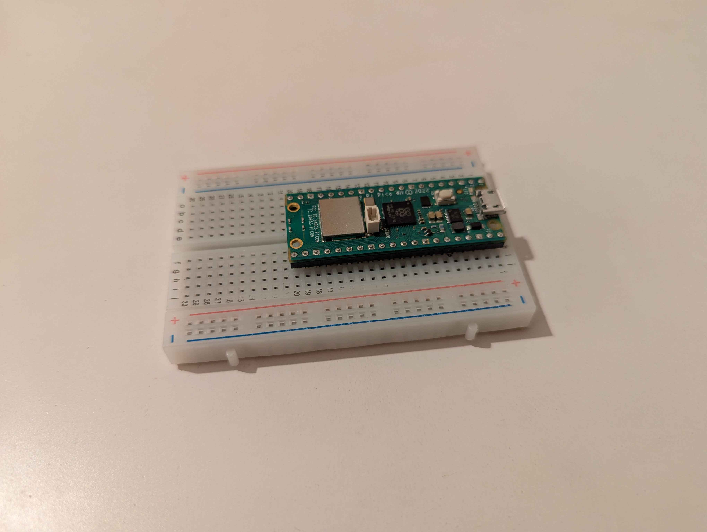

# SMVIT-AuroVision-Labs

---

This is a **preview** of our documentation. The full version is [available here](documentation/README.md).

#### **Authors**

- Bc. Peter Slovák
- Bc. Tibor Vanek
- Bc. Pavol Hradský

We are a group of three enthusiastic students working together on an exciting project: **measuring the temperature of coffee or tea using a Raspberry Pi Pico**.

This is our first project which we decided to do together and we are all committed to contributing our skills and ideas to achieve great results. We will continue with project from previous years [Automated Tea Infuser | Overview | Wikifactory](https://wikifactory.com/+fablabbratislava/automated-tea-infuser) where students created an automated tea infuser.

---

### Key Improvements

- 📱 **Interactive web app**: Real-time notifications and customizable temperature thresholds.
- 📊 **View measurement history**: Easily track and review past temperature measurements for better insights.
- 🔍 **Enhanced accuracy**: Improved sensor placement for precise measurements directly in the drink.
- 🌐 **Mobile-Friendly**: Full functionality on desktops and mobile devices.

---

## **Thermo-measure**

### **Description**

Our project involves creating a **temperature measurement system** for beverages using a Raspberry Pi Pico. The system will monitor the drink's temperature in **real-time** placed directly on the cup, and users can access measured data via a web application on their devices.

### **Motivation**

We share a love for coffee and tea and know the struggle of sipping a too-hot beverage. Our solution aims to help users enjoy their drinks safely at the perfect temperature and will be for everyone, but especially for home usage.

#### Prototype Sketch

#### Temperature measurement methods

There are several methods to measure the temperature of a beverage, and each has its own advantages and drawbacks. Below are a few common alternatives to using a Raspberry Pi Pico-based system for measuring temperature, along with a discussion of why we chose our approach.

1. **Thermal strips (Color-changing thermometers)** 9,91€:

   * **How it works** : These strips change color when exposed to heat. They are typically placed on the surface of a cup. The color change corresponds to different temperature ranges.
   * **Why we didn't choose this method** : While thermal strips are inexpensive and simple, they don't offer the precision, real-time monitoring or convenience of a digital system. The accuracy limitations and the lack of integration with a modern monitoring system like a smartphone app were significant drawbacks for our needs.
2. **Laser thermometers (Infrared thermometers)**  37,99 €:

   * **How it works** : These devices use infrared radiation to measure the temperature of a surface from a distance without making physical contact. The thermometer detects the infrared radiation emitted by the object and calculates its temperature.
   * **Why we didn't choose this method** : Although laser thermometers offer non-contact measurements, we found them to be impractical for continuous real-time monitoring of a drink's temperature, especially when it's placed on a table or cup holder. Additionally, the cost and reliance on manual measurements made it less suitable for our goal of providing seamless, automatic, and remote temperature tracking.
3. **Contact Thermometers** :

   * **How it works** : These are traditional thermometers that use a metal probe to measure the temperature by physically contacting the liquid.
   * **Why we chose this method** : We deemed this method to be the most fitting for our particular project, as it is not meant for commercial use, only as a personal tool.

---

### Main Use Cases

1. **Safe Drinking Temperature Monitoring:** Users can check the temperature of their drinks before sipping, ensuring they don’t burn their mouths. This feature gives real-time updates on the temperature of coffee or tea, helping users avoid discomfort.
2. **Safe Drinking Temperature Notification:** Users get notification when coffee or tea has a desired temperature. This ensures that users can enjoy their beverages at the perfect temperature without having to constantly check. There will be set tresholds for notifying.
3. **Remote Monitoring for Multiple Drinks:** With the web application, users can monitor the temperature of multiple cups simultaneously, making it useful for gatherings or family settings.

    

### **EA Modeling**

Our technology stack includes:

- **Raspberry Pi Pico** - a low-cost microcontroller, making it accessible for hobbyists and learners.
- **DS18B20 waterproof temperature sensor** - accurate temperature readings in liquids, and the integration with a web application.
- **Web application** - user-friendly interface with using MicroPython for programming the Pico.

_Note: more models are available to be viewed in the full version of the documentation._

---

### Preparation of HW

For this project, we needed to gather and prepare several essential components to ensure the temperature measurement system works correctly with the Raspberry Pi Pico. Below is a list of the hardware we purchased and prepared:

* **Metalized Resistor 4K7 - 0.125W:** This resistor is used as a pull-up resistor to stabilize the data line between the temperature sensor and the microcontroller.
* **Waterproof Temperature Sensor for Single-Board Computers (DS18B20):** The DS18B20 sensor is responsible for measuring the temperature of the liquid (coffee or tea) and can be easily interfaced with the Raspberry Pi Pico. Its waterproof feature makes it ideal for measuring the temperature of beverages.
* **Raspberry Pi Pico:** The Raspberry Pi Pico is the microcontroller at the heart of our system. It reads data from the DS18B20 sensor and sends it to the web app.
* **Breadboard:** The breadboard is used to connect the components (sensor, resistor, and Raspberry Pi Pico) without soldering, allowing for easy prototyping and testing.

We followed the detailed instructions provided by [Random Nerd Tutorials](https://randomnerdtutorials.com/raspberry-pi-pico-ds18b20-micropython/) to set up the Raspberry Pi Pico with the DS18B20 temperature sensor. This guide helped us with wiring the components, installing the necessary libraries, and writing the MicroPython code to read temperature data from the sensor.

Some components we had at home:

1. Raspberry Pi Pico + Breadboard
2. Powerbank to power our system

    
    

Some components needed to be bought, and here are the links to where we purchased them:

1. Thermometer sensor: [Arduino teploměr vodotěsný DS18B20 | drotik-elektro.sk](https://www.drotik-elektro.sk/arduino-platforma/848-vodeodolny-teplomer-pre-jednodoskove-pocitace-ds18b20-1-meter.html)
2. Resistor: [Metalizovaný rezistor 4k7 0.125 W 1% | drotik-elektro.sk](https://www.drotik-elektro.sk/arduino-platforma/7663-metalizovany-rezistor-4k7-0-125w-1.html)

    
    

3. 3D printed model of box for storing our product

    
    

---

### Programming &amp; Deployment

**Raspberry**:

- raspberry is connected to Wi-Fi
- every 2 seconds the temperature is measured and a POST request is sent to server

**Server**:

- the server is in Python, an app using FastAPI
- has (POST) endpoint which, every 2 seconds, receives output from rpi about actual temperature
- temperature is written to global variables
- has (GET) endpoint which services this temperature

**Frontend**:

- simple frontend app (vanilla js + tailwind css)
- every 2 seconds a GET request is sent to the server, and the updated temperature is shown on frontend

    
    

#### Deployment of the Web App

Using Hetzner VPS (https://console.hetzner.cloud/) on IP 49.12.65.96 you can easily see our result:

Video about deploying web app on hetzner vps is recorded on the following link: https://youtu.be/vCuRECcbWYA

---

### **Testing**

Testing is a crucial part of our project:

1. **Functional testing** : Ensuring all components work together correctly, including the sensor, microcontroller, and web application.
2. **Temperature accuracy** : Comparing the readings from our system with a reliable thermometer to verify accuracy.
3. **User experience testing** : Gathering feedback from users on the web application’s interface and overall functionality.
4. **Durability testing** : Checking how the system performs over extended use and under varying conditions, such as different drink types and ambient temperatures.

Video about testing web app and our thermometer is recorded on the following link: https://youtu.be/J3pNO6BmosM

---

### **Outcome**

---

### Documentation and Videos

> [!TIP]
> If you appreciate our efforts and would like to support our projects to the future, consider visiting us on social media listed below. Your support helps us acquire better equipment, fund new projects, and continue sharing our journey with the community 😊. Thank you for your support!

> [!NOTE]
> All steps in our project are documented and videos are uploaded to our YouTube channel, featuring an unlisted playlist. This playlist shows our progress, tutorials, and the challenges we faced. We hope this content inspires others to explore similar projects and learn alongside us!
>
> [Youtube][youtube-url]
>
> [LinkedIN][LinkedIN-url]
>
> [Patreon][patreon-url]

[youtube]: https://img.shields.io/badge/YouTube-FF0000?style=for-the-badge&logo=youtube&logoColor=white
[youtube-url]: https://www.youtube.com/@AuroVisionLabs
[linkedin]: https://img.shields.io/badge/LinkedIn-0077B5?style=for-the-badge&logo=linkedin&logoColor=white
[LinkedIN-url]: https://www.linkedin.com/in/aurovision-labs
[patreon]: https://img.shields.io/badge/patreon-F96854?style=for-the-badge&logo=patreon&logoColor=white
[patreon-url]: https://www.patreon.com/AuroVisionLabs
