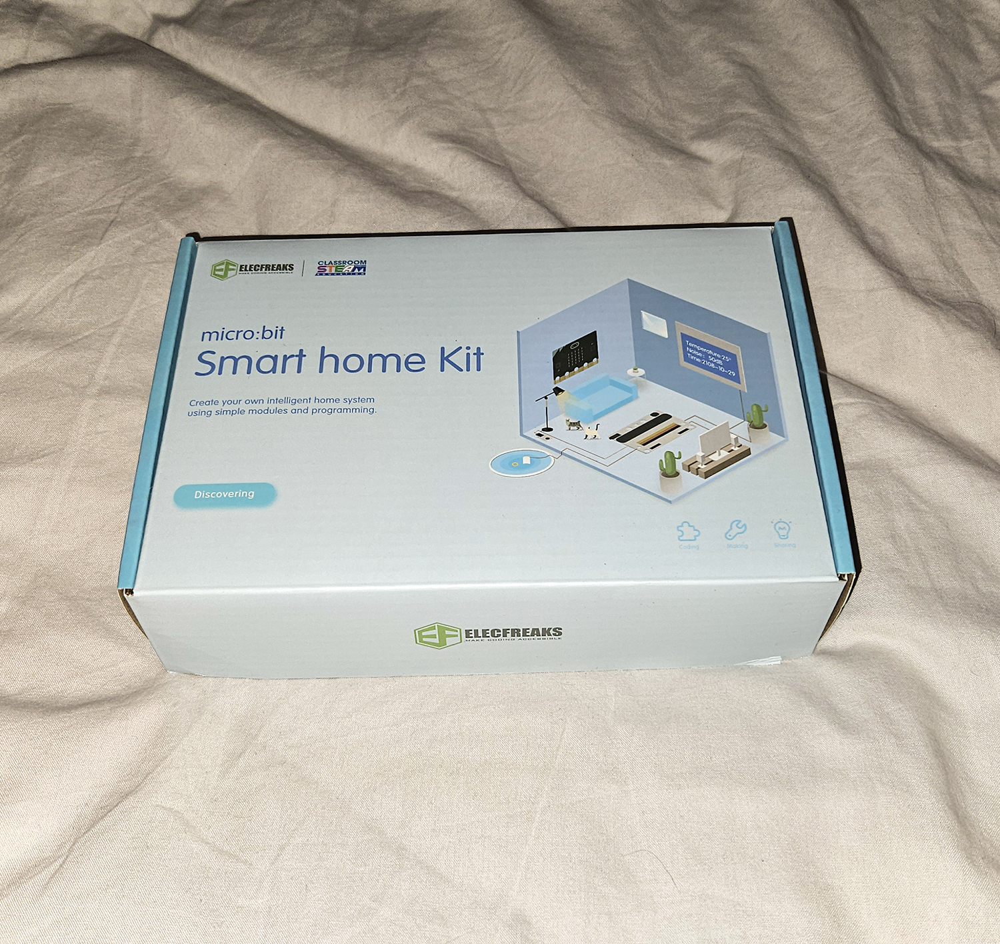
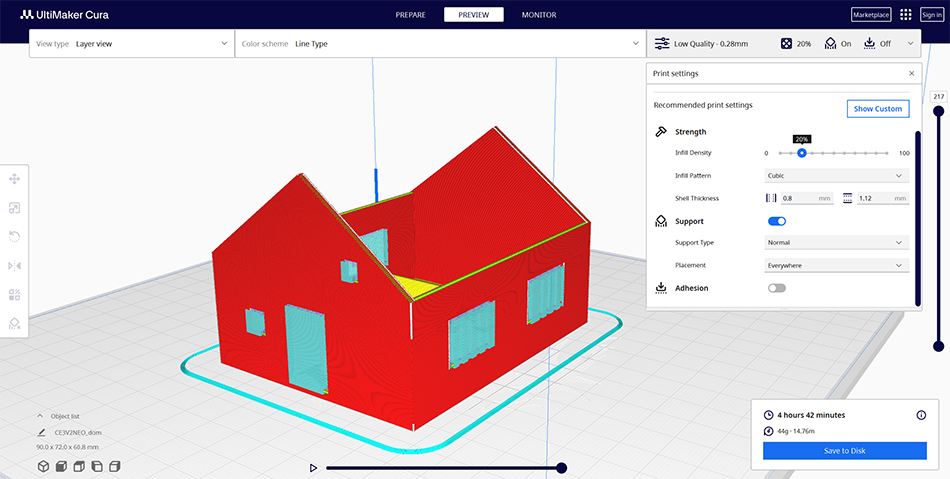
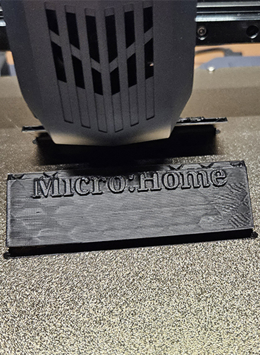

# Micro:Home
Toto je dokumentácia k projektu **Micro:Home** v rámci predmetu SMVIT - Systémové myslenie v IT.

**Autor:** 

* Bc. Patrik Eliaš

## Obsah
1. [Zhrnutie projektu](#Zhrnutie projektu (Project Summary))
	- 1.1 [Popis](#Popis)
2. [Projekt Micro:Home](#Projekt Micro:Home)
	- 2.1 [Business vrstva](#Business vrstva)
		- 2.1.1 [Motivácia](#Motivácia)
		- 2.1.2 [Prínosy](#ciele-projektu)
		- 2.1.3 [Stakeholderi](#stakeholderi)
		- 2.1.4 [Prínosy](#prinosy)
		- 2.1.5 [Komponenty](#Komponenty)
		- 2.1.6 [Prípady použitia](#Prípady použitia)
		- 2.1.7 [Diagram aktivít](#diagram-aktivit)
	- 2.2 [Systémová vrstva](#Systémová vrstva)
		- 2.2.1 [Programovanie Micro:bitov](#Programovanie Micro:bitov)
		- 2.2.2 [Sekvenčné diagramy](#sekvencne-diagramy)
	- 2.3 [Technologická vrstva](#Technologicka-vrstva)
		- 2.3.1 [Schéma zapojenia](#schema-zapojenia)
		- 2.3.2 [Diagram komponentov](#diagram-komponentov)
		- 2.3.3 [Modelovanie](#modelovanie)
		- 2.3.4 [Príprava na 3D tlač](#priprava-na-3d-tlac)
		- 2.3.5 [3D tlač](#3d-tlac)
3. [Finálny produkt](#Finálny-produkt)
4. [Verziovanie a paralelné modelovanie](#Verziovanie-a-paralelné-modelovanie)
5. [Získané skúsenosti](#Získané-skúsenosti)

## 1. Zhrnutie projektu (Project Summary)

## 1.1 Popis
Cieľom projektu Micro:Home je vytvoriť model domu, vytlačený na 3D tlačiarni, ktorý obsahuje programovateľné Micro:bit moduly na ovládanie rôznych funkcií (napr. svetlo, dvere, alarm). Tento projekt umožní stredoškolským študentom prakticky sa oboznámiť s 3D tlačou a základmi programovania pomocou Micro:bitov, čím sa podporí rozvoj technických zručností a kreativity.

Na nasledovných linkoch si môžete pozrieť zhrnutie Project Summary zo šablóny v Enterprise Architect v HTML: [Project Summary HTML](ProjectSummary/projectSummary.html), Markdown: [Project Summary MD](ProjectSummary/projectSummary.md)

## 2. Projekt Micro:Home
V tejto časti sa zameriame na samotnú dokumentáciu k projektu. Rozdelili sme ju na tri hlavné časti, a to: Business vrstvu, Systémovú vrstvu a Technologickú vsrtvu.

## 2.1 Business vrstva
Business vrstva sa zameriava na definovanie cieľov projektu Micro:home, jeho hodnotu pre používateľov a celkový prínos. Rieši otázky, z akých komponentov sa projekt skladá a aké sú prípady použitia.

### 2.1.1 Motivácia
Moderné technológie, ako je 3D tlač a programovanie malých zariadení (Micro:bit), zohrávajú čoraz väčšiu rolu v priemysle aj v každodennom živote. Napriek tomu má mnoho študentov obmedzené príležitosti, ako sa tieto zručnosti naučiť priamo a prakticky. Projekt Micro:Home vznikol ako odpoveď na potrebu aktívneho a zábavného spôsobu, ako zapojiť mladých ľudí do učenia informatiky.

### 2.1.2 Ciele projektu
- **Vzdelávanie**: Poskytnúť praktické učenie základov programovania, 3D modelovania a elektroniky.
- **Inovácia**: Ukázať, ako je možné použiť moderné digitálne technológie na riešenie reálnych problémov.
- **Dostupnosť**: Vytvoriť projekt, ktorý je finančne dostupný a jednoducho replikovateľný pre školy a hobby komunity.

### 2.1.3 Stakeholderi
- **Školy a vzdelávacie inštitúcie**: Projekt ponúka vzdelávacie moduly pre študentov.
- **Hobby komunita**: Makeri a nadšenci si môžu projekt prispôsobiť na ďalšie aplikácie.

### 2.1.4 Prínosy
- Zvýšenie digitálnej gramotnosti.
- Popularizácia IoT technológií.

### 2.1.5 Komponenty
Systém pozostáva z nasledovných komponentov:

|  |  |  |
| :-------------------------------------------: | :-------------------------------------: | :-----------------------------------: |
|                 Smart Home Kit                |               Sada Micro:bitov (4ks)         |           Vytlačený 3D dom            |

Predpokladané náklady:

- Smart Home Kit - 71.25€ (https://ruzovka.cz/sk/micro-bit/20663-bbc-mikro-bit-smart-home-kit-suprava-inteligentneho-domova-bez-micro-bit.html?gad_source=1)
- Sada Micro:Bitov (4ks) - 36.53€ (1ks) (https://www.elecom.sk/original-box-bbc-micro-bit-v2-2-go-kit/?gad_source=1)
- Vytlačený 3D dom - 5.00€

K programovaniu Micro:bitov je potrebný počítač alebo notebook. Celkové náklady dosahujú cca: 225.00€

### 2.1.6 Prípady použitia
- **Podpora učenia sa programovania:** Študenti si pomocou Micro:Bitov osvojujú základy programovania, logického myslenia a práce s kódom.
- **Zlepšenie zručností v 3D modelovaní a tlači:** Študenti používajú a tlačia navrhnué modely domov v 3D softvéri, čím rozvíjajú priestorové myslenie a technické zručnosti.
- **Podpora tímovej spolupráce:** Študenti pracujú v tímoch na rôznych častiach projektu (3D tlač, programovanie, testovanie).
- **Motivácia k záujmu o technológie:** Interaktívny a kreatívny projekt vzbudzuje u študentov záujem o technické odbory.
- **Prepojenie teórie s praxou:** Projekt umožňuje študentom aplikovať teoretické poznatky z informatiky, fyziky alebo matematiky na praktické úlohy.
- **Rozvoj kreatívneho a inovatívneho myslenia:** Študenti si môžu navrhnúť vlastné riešenia alebo rozšírenia modelu, napríklad pridanie nových funkcií.

### 2.1.7 Diagram aktivít
Diagram aktivít znázorňuje hlavné aktivity používateľa v rámci projektu Micro:home. Používateľ môže využívať funkcie smart home systému, ako je automatické osvetlenie, zvonček na dverách a regulácia teploty. Každá aktivita je vykonávaná nezávisle.

## 2.2 Systémová vrstva
Systémová vrstva sa zameriava na samotné programovanie a technickú implementáciu projektu. Zahŕňa kódovanie funkcií, komunikáciu medzi Micro:bitmi, senzormi a ďalšími zariadeniami, ako aj logiku, ktorá umožňuje správne fungovanie systému. Táto vrstva zabezpečuje prepojenie medzi hardvérom a softvérom.

### 2.2.1 Programovanie Micro:bitov
V tejto sekcii predstavíme, ako sme využili štyri micro:bity na realizáciu rôznych funkcií projektu Micro:home. Každý Micro:bit bol naprogramovaný na špecifickú úlohu. Ukážeme konkrétne kódy a vysvetlíme ich funkcie v systéme.

### Zapnutie svetla počas tmy
Vytvorený program slúži na ovládanie LED svetla pomocou micro:bitu a NeoPixel svetelného pásu. Program monitoruje úroveň osvetlenia v prostredí a podľa nameranej hodnoty zapína alebo vypína LED svetlo.

1. Inicializácia svetelného pásu:
	* Počas spustenia micro:bitu je svetelný pás (NeoPixel) inicializovaný na pine P0 s jednou LED diódou v RGB formáte.

2. Logika zapínania a vypínania svetla:
	* Program beží nepretržite a sleduje aktuálnu hodnotu úrovne osvetlenia.
	* Ak je úroveň osvetlenia vyššia ako 100 (hodnota reprezentujúca dostatočné denné svetlo), svetelný pás sa vypne.
	* Ak je úroveň osvetlenia nižšia alebo rovná 100 (čo indikuje tmu alebo slabé osvetlenie), svetelný pás sa rozsvieti na žlto.

3. Zabezpečenie zobrazenia:
	* Príkaz strip.show() sa používa na aktualizáciu stavu svetelného pásu, aby zodpovedal aktuálnym podmienkam.

**Ukážka kódu:**

|  |  |
| :-------------------------------------------: | :-------------------------------------: |
|                 Blokový kód              |               Python kód         |

**Zobrazenie fungovania:**

|  |  |
| :-------------------------------------------: | :-------------------------------------: |
|                 Nedostatok svetla              |               Dostatok svetla         |

### Zvonček dverí

Tento program využíva Micro:bit na prehrávanie zvukového signálu po stlačení tlačidla. Je vhodný na implementáciu jednoduchého zvončeka.

1. Inicializácia hlasitosti:
	* Pri spustení micro:bitu sa hlasitosť nastaví na maximálnu hodnotu (255), aby bol zvuk dostatočne hlasný.

2. Prehrávanie zvuku:
	* Keď používateľ stlačí tlačidlo B, micro:bit prehrá predvolený zvukový signál.
	* Zvuk sa prehrá celý až do konca (v režime "until done"), čo znamená, že micro:bit zabezpečí kompletné prehranie pred ďalším spracovaním.

**Ukážka kódu:**

|  |  |
| :-------------------------------------------: | :-------------------------------------: |
|                 Blokový kód              |               Python kód         |

### Aktuálna teplota a ventilácia

Ďalší program slúži na monitorovanie teploty a ovládanie digitálneho výstupu (spúšťanie ventilácie) na základe nameranej teploty.

1. Inicializácia OLED displeja:
	* Na začiatku programu sa inicializuje OLED displej s určitými rozmermi. Tento displej bude slúžiť na zobrazovanie aktuálnej teploty.

2. Neustále meranie teploty:
	* Program vstupuje do nekonečnej slučky, kde neustále číta hodnotu teploty zo vstupu P2.
	* Vymaže obsah OLED displeja.
	* Zobrazí text "Teplota:" a nameranú hodnotu teploty na displeji.

3. Podmienené ovládanie výstupu:
	* Ak je nameraná teplota vyššia ako 23°C, program nastaví digitálny výstup na pine P1 do stavu 1 (zapnutý). To znamená, že zariadenie pripojené k tomuto výstupu bude aktivované (zapne sa ventilátor).
	* Ak je nameraná teplota nižšia alebo rovná 23°C, program nastaví digitálny výstup na pine P1 do stavu 0 (vypnutý). Tým sa zariadenie pripojené k tomuto výstupu vypne (vypne sa ventilátor).

**Ukážka kódu:**

|  |  |
| :-------------------------------------------: | :-------------------------------------: |
|                 Blokový kód              |               Python kód         |

**Zobrazenie fungovania:**

|  |  |
| :-------------------------------------------: | :-------------------------------------: |
|                Teplota pod 23 stupňov             |               Teplota nad 23 stupňov         |

### 2.2.2 Sekvenčné diagramy

Sekvenčné diagramy zobrazujú komunikáciu medzi jednotlivými komponentmi systému pre všetky hlavné funkcie projektu Micro:home. Diagramy ukazujú, ako používateľ alebo prostredie iniciuje akcie, senzory zhromažďujú údaje a riadiace moduly vykonávajú rozhodnutia na základe aktuálneho stavu. Každá funkcia, ako je automatické osvetlenie, zvonček a regulácia teploty, je znázornená samostatne. Diagramy ilustrujú jednotlivé kroky a správy v logickom poradí.

|  |  |  |
| :-------------------------------------------: | :-------------------------------------: | :-------------------------------------: |
|                Sequence Diagram - zapnutie svetla počas tmy             |               Sequence Diagram - zvonček dverí         |               Sequence Diagram - aktuálna teplota a ventilácia         |

## 2.3 Technologická vrstva

Technologická vrstva popisuje technické riešenie projektu, vrátane hardvérových a softvérových komponentov a ich vzájomnej interakcie

### 2.3.1 Schéma zapojenia

Schéma zapojenia Micro:bitu ukazuje, ako je tento programovateľný mikrokontrolér prepojený s rôznymi zariadeniami a senzormi na vytvorenie funkčného systému. V našom projekte sme použili Smart Home Kit, ktorý obsahuje rôzne hardvérové komponenty prispôsobené na jednoduché pripojenie k micro:bitu. Tento kit umožňuje zostaviť inteligentné domáce systémy, ako sú automatické osvetlenie, regulácia teploty alebo zvukové upozornenia.

Schéma zapojenia ukazuje:

* Napájanie a uzemnenie: Zariadenia sú napojené na piny 3V (napájanie) a GND (uzemnenie), aby zabezpečili stabilné fungovanie.
* Prepojenie pinov: Micro:bit má viacero pinov (napr. P0, P1, P2), ktoré sa využívajú na prenos signálov medzi senzormi, aktuátormi (ako servomotory) a LED modulmi.

### 2.3.2 Diagram komponentov

Na diagrame sme zobrazili hlavne komponenty projektu.

### 2.3.3 Modelovanie

Pre návrh 3D modelu domčeka sa použil softvér Tinkercad, ktorý je jednoduchý na použitie a ideálny pre začiatočníkov.

* Základné kroky:
	* Vytvorenie základného tvaru domčeka pomocou geometrických objektov.
	* Pridanie okien, dverí a iných detailov.
	* Vloženie textového prvku „MicroHome“ na strechu.
	* Export modelu do formátu STL (Standard Tessellation Language) pre ďalšie spracovanie.

### 2.3.4 Príprava na 3D tlač

STL súbor bol spracovaný v programe Ultimaker Cura, ktorý slúži na rozdelenie modelu na vrstvy (sliceovanie) pre 3D tlač.

* Nastavenia sliceovania:
	* Infill density (hustota výplne): 20 % – poskytuje pevnosť pri úspore materiálu.	
	* Quality (kvalita): 0,28 mm – pre rýchlejšiu tlač pri zachovaní primeranej kvality.
	* Supports (podpery): Aktivované len pre previsy, aby sa zaistila správna tlač strechy a okenných rámov.

### 2.3.5 3D tlač

Telo a strechu domu sme tlačili zvlášť. Pre rýchlejšie tlačenie sme použili dve tlačiarne. Telo domu sme tlačili na tlačiarni **Creality Ender 3 V2 Neo**. Na strechu sme použili **Creality CR-10 SE**.

* Postup tlače:
	* Príprava tlačovej podložky a kontrola jej vyrovnanosti.
	* Nahratie súboru G-code na SD kartu a spustenie tlače.
	* Po ukončení tlače bol model odstránený z podložky a očistený od podpôr.

|  |  |
| :-------------------------------------------: | :-------------------------------------: |

|  |  |
| :-------------------------------------------: | :-------------------------------------: |

## 3. Finálny produkt

Na nasledovnom obrázku je zobrazený finálny domček po vytlačení a spojení tela so strechou.

Finálny produkt projektu Micro:home predstavuje programovateľný a 3D tlačený model inteligentného domu, ktorý obsahuje tri hlavné funkcie: automatické osvetlenie, zvonček a reguláciu teploty s ventiláciou. Tento model je skonštruovaný s použitím Micro:bitu a senzora teploty a ďalších komponentov zo Smart Home Kit-u. Domček má LED osvetlenie, ktoré reaguje na svetelné podmienky, tlačidlo zvončeka s audiovýstupom a ventilátor, ktorý sa aktivuje pri prekročení nastavenej teploty. Jednotlivé Micro:bity a senzory je možné zakomponovať do modelu pomocou lepiacich žuvačiek, čo umožňuje jednoduché upevnenie a flexibilitu pri ich umiestňovaní. Na obrázkoch môžeme vidieť detailné zapojenie Micro:bitov a 3D tlačený model domčeka. Tento projekt demonštruje praktické prepojenie hardvéru, programovania a dizajnu na vytvorenie prototypu pre inteligentnú domácnosť.

## 4. Verziovanie a paralelné modelovanie 

### Enterprise Architect

Dodržiavanie metodiky 7Ds. Tento štruktúrovaný prístup zabezpečuje dôsledný a systematický pracovný postup počas celého životného cyklu projektu.

* Modely v Enterprise Architect:

	* **Sekvenčné diagramy:** Sekvenčné diagramy zobrazujú interakciu medzi komponentmi, pričom detailne implementujú prípad použitia pre systém Micro:Home.
	* **Diagram komponentov:** Zachytávajú fyzickú architektúru a zdôrazňujú modulárnu povahu projektu.
	* **Use Case diagram:** Zobrazujú základné prípady použitia systému a interakciu medzi aktérmi a systémom.
	* **Diagram aktivít:** Detailne popisujú postupnosť krokov a tok procesov v rôznych častiach systému.

### Verzovanie pomocou Git

Na riadenie iteratívneho a kolaboratívneho vývoja projektu sa používa Git. Repozitár sleduje zmeny, udržiava históriu modifikácií a uľahčuje tímovú spoluprácu.

* Funkcie:

	* **Správa vetiev:** Používajú sa vývojové a funkčné vetvy na oddelenie rôznych funkcionalít.
	* **Sledovanie zmien:** Zobrazenie rozdielov v Git umožňuje porovnanie modifikácií, ako je demonštrované na obrázku nižšie:

### Paralelné modelovanie pomocou LemonTree

Paralelné modelovanie pomocou LemonTree umožňuje súčasné aktualizácie modelu v Enterprise Architect rôznymi členmi tímu. Toto je obzvlášť užitočné pre komplexné projekty, ktoré vyžadujú kolaboratívny vstup bez konfliktov.

* Funkcie:

	* **Detekcia konfliktov:** LemonTree zvýrazňuje nekonzistencie medzi rôznymi verziami modelu.
	* **Porovnávanie diagramov:** Vizualizácia zmien v diagramoch a iných komponentoch pre lepšie zosúladenie.
	* **Možnosti zlúčenia:** Bezpečné integrovanie zmien do hlavného modelu.

## 5. Získané skúsenosti
Projekt Micro:Home nám poskytol mnoho cenných skúseností v oblasti 3D tlače, programovania a digitálneho vzdelávania. Pri práci sme zistili, že 3D tlač je výkonný nástroj, no vyžaduje precízne nastavenie modelov, aby sa minimalizovali chyby. Tento proces nás naučil dôležitosti efektívneho dizajnu a plánovania. Programovanie pomocou micro:bitov sa ukázalo ako prístupné a flexibilné riešenie na integráciu senzorov a automatizácie. Projekt zdôraznil význam dokumentácie a iteratívneho prístupu – od prototypovania až po finálny produkt. Každý krok nás nielen posunul bližšie k cieľu, ale aj obohatil o nové vedomosti, ktoré môžeme využiť v budúcich projektoch.

Budúca práca môže zahŕňať optimalizáciu 3D modelov na zníženie spotreby materiálu a času tlače, rozšírenie možností programovania micro:bitov o pokročilejšie funkcie a pridanie ďalších senzorov na zvýšenie funkčnosti. Tiež je možné vytvoriť ucelený vzdelávací balíček, ktorý by tento projekt sprístupnil širšiemu publiku, najmä školám a začiatočníkom v oblasti digitálnej fabrikácie.