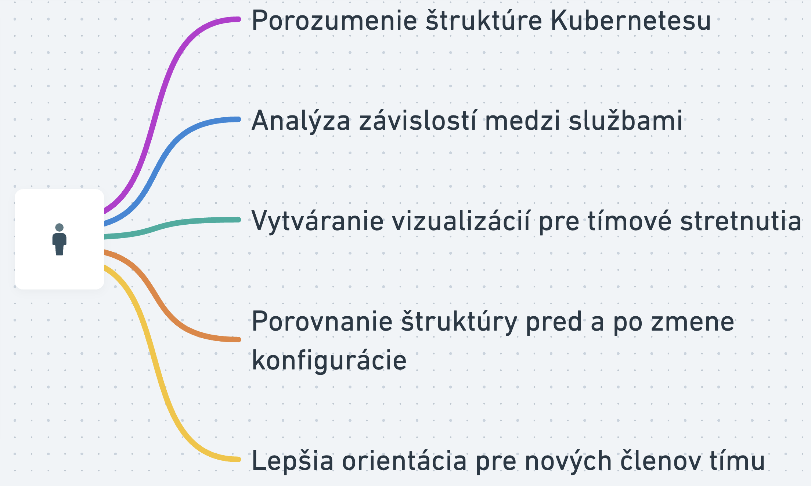
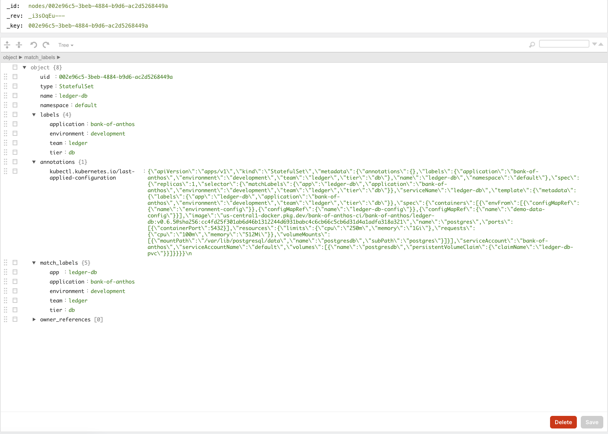

# Kubeglimpse


## 1. Popis projektu

KubeGlimpse je 3D vizualizačná aplikácia, určená na interaktívne prehliadanie a analýzu Kubernetes klastrov. Aplikácia využíva technológie **Python**, **Django**, **Quasar**, **Three.js** a **ArangoDB**, čím poskytuje dynamickú a prehľadnú reprezentáciu komplexných Kubernetes infraštruktúr. Cieľom projektu je umožniť používateľom efektívnu správu, diagnostiku a analýzu klastrov prostredníctvom vizuálne prívetivého a modulárneho rozhrania.


### **Ako KubeGlimpse funguje?**

**1. Získavanie dát z Kubernetes API**  
   Aplikácia napísaná v **Pythone** pravidelne pristupuje k Kubernetes API a získava potrebné informácie o klastroch, vrátane nodov, podov, služieb, namespaces, ConfigMap a Secret objektov.

**2. Ukladanie dát do ArangoDB**  
   Zozbierané dáta sú ukladané do **ArangoDB**, multi-model databázy kombinujúcej dokumentový a grafový prístup. Tento prístup umožňuje efektívne modelovanie a spracovanie vzťahov medzi komponentmi klastra bez potreby komplexných transformácií dát.

**3. Transformácia dát do JSON**  
   Dáta sú transformované do JSON formátu, čo uľahčuje ich načítanie a manipuláciu v 3D grafickom prostredí.

**4. 3D Vizualizácia pomocou Three.js (3D-Forced-Graph)**  
   Vizualizácia využíva Three.js spolu s knižnicou 3D-Force-Graph na zobrazenie vzťahov medzi komponentmi klastra. Uzly reprezentujú jednotlivé komponenty (nody, pody, služby) a hrany zobrazujú ich vzájomné vzťahy.

**5. Interaktívne funkcie vizualizácie**  
   Používatelia môžu interagovať s 3D modelom klastra – približovať, otáčať a kliknúť na jednotlivé uzly pre zobrazenie detailných informácií o daných komponentoch, ako je stav podu, alokované zdroje či metadáta.

**6. Škáľovateľnosť a výkonnosť**  
   KubeGlimpse je navrhnutý tak, aby zvládal vizualizáciu malých aj veľkých klastrov. Vďaka efektívnemu spracovaniu dát v ArangoDB a optimalizovanému vykresľovaniu v Three.js aplikácia plynule funguje aj pri komplexných infraštruktúrach.

  
(Zobrazenie architektúry)


## **2. Motivácia**

Kubernetes sa stal jednou z najpopulárnejších platforiem na správu kontajnerizovaných aplikácií v moderných IT infraštruktúrach, najmä pre veľké a dynamické prostredia. Jeho schopnosť automatizovať nasadzovanie a škálovanie aplikácií je zásadná, avšak čím je klaster väčší a zložitejší, tým je pre správcov náročnejšie získať prehľad o tom, ako jednotlivé komponenty, ako sú nody, pody a služby, medzi sebou interagujú. Textové alebo tabuľkové výstupy z bežných nástrojov často neposkytujú dostatočne intuitívny pohľad na celý systém, čo môže skomplikovať riešenie problémov a optimalizáciu klastrov.

Existujúce vizualizačné nástroje pre Kubernetes klastre sú často nepresné, ťažko ovládateľné alebo ponúkajú len základné informácie. **KubeGlimpse** rieši túto medzeru tým, že poskytuje interaktívnu 3D vizualizáciu, ktorá zobrazuje presné vzťahy medzi jednotlivými komponentmi klastrov. Tento nástroj umožňuje používateľom efektívne prehliadať klastre, rýchlo identifikovať problémy a lepšie porozumieť dynamike a štruktúre infraštruktúry, čím zjednodušuje správu aj veľmi komplexných systémov.

## **3. Prípady použitia**



### **1. Porozumenie štruktúre Kubernetesu**
Pre správu veľkých Kubernetes klastrov je kľúčové mať jasný prehľad o tom, ako jednotlivé komponenty (nody, pody, služby) spolu interagujú. KubeGlimpse poskytuje interaktívnu 3D vizualizáciu, ktorá umožňuje správcovi lepšie pochopiť vzťahy medzi komponentmi a rýchlo identifikovať neefektívne usporiadanie alebo nezrovnalosti v štruktúre klastra.

### **2. Analýza závislostí medzi podmi a službami**
KubeGlimpse umožňuje používateľom vizuálne skúmať, ako sú pody prepojené so službami a inými komponentmi v rámci klastra. Táto vizualizácia umožňuje rýchlo pochopiť zložité závislosti medzi aplikáciami a infraštruktúrou, čo je mimoriadne užitočné pri diagnostikovaní problémov alebo pri plánovaní zmien.

### **3. Vytváranie vizualizácií pre tímové stretnutia**
KubeGlimpse môže slúžiť ako nástroj na prezentovanie štruktúry klastra počas tímových stretnutí. Vizualizácie môžu pomôcť rôznym členom tímu, vrátane tých, ktorí nemajú technické zázemie, ľahšie pochopiť fungovanie Kubernetes a ako jednotlivé komponenty spolu interagujú, čím uľahčujú komunikáciu medzi rôznymi oddeleniami.

### **4. Porovnanie štruktúry v čase**
Pri aktualizáciách alebo zmenách v konfigurácii Kubernetes klastrov je často náročné pochopiť, ako sa štruktúra klastra zmenila. KubeGlimpse môže vytvárať vizualizácie, ktoré umožňujú porovnávať stav klastra pred a po zmene, čo pomáha pri overovaní správnosti nasadenia zmien a pri znižovaní rizika chýb.

### **5. Lepšia orientácia pre nových členov tímu**
Pre nových členov tímu, ktorí ešte nemajú skúsenosti so správou Kubernetes klastrov, môže byť pochopenie infraštruktúry náročné. KubeGlimpse poskytuje vizuálny nástroj, ktorý uľahčuje orientáciu v štruktúre klastra a pomáha im rýchlejšie sa zorientovať a pochopiť fungovanie jednotlivých komponentov a ich vzťahov.

## **4. Biznis pohľad KubeGlimpse**

**KubeGlimpse** ponúka jedinečný spôsob vizualizácie Kubernetes klastrov, čo prináša jasné výhody nielen pre technických odborníkov, ale aj pre manažérske a biznisové tímy. KubeGlimpse umožňuje prístup k vizualizáciám, ktorá sú ľahko pochopiteľná a umožňuje efektivnejšie pochopenie infraštruktúry, čo v dôsledku zlepšuje komunikáciu naprieč rôznymi tímami.

### **Použitie KubeGlimpse v praxi:**

1. **Podpora rozhodovania v IT oddeleniach**
   Pre manažérov a vedúcich IT oddelení je kľúčové mať prehľad o infraštruktúre, na ktorej závisí prevádzka aplikácií a služieb. KubeGlimpse poskytuje jednoduchý a prehľadný pohľad na celý Kubernetes klaster, čím umožňuje rýchlo zhodnotiť stav infraštruktúry a efektívnosť jej využívania. Vizualizácia môže slúžiť ako podklad pre rozhodovanie o škálovaní, nasadzovaní nových služieb alebo optimalizácii infraštruktúry.

2. **Zlepšenie medziodborovej komunikácie**
   Pre tímy mimo IT oddelení, ako sú produktoví manažéri, marketingové tímy či projektoví vedúci, môže byť zložité pochopiť technické detaily aplikácie. KubeGlimpse umožňuje ne-technickým tímom rýchlo pochopiť štruktúru systému, čo podporuje lepšiu koordináciu medzi technickými a obchodnými jednotkami v organizácii.

3. **Nasadzovanie v DevOps a SRE prostredí**
   DevOps tímy a SRE (Site Reliability Engineering) zvyčajne spravujú rozsiahle klastre, kde je neustála potreba vizuálne sledovať vzťahy medzi komponentmi a ich stav. KubeGlimpse môže byť kľúčovým nástrojom pri analýze výkonnosti, sledovaní preťaženia nodov alebo pri vizualizácii zmien v infraštruktúre počas nasadzovania nových verzií aplikácií.

4. **Podpora pri plánovaní a škálovaní infraštruktúry**
   Organizácie, ktoré neustále rastú a škálujú svoje Kubernetes klastre, môžu využívať KubeGlimpse na vizualizáciu budúcich zmien v infraštruktúre. Používanie vizualizácie pri plánovaní rozšírení pomáha pri optimalizácii zdrojov a zabraňuje vzniku preťažených alebo neefektívne využívaných nodov.

## **Trhové príležitosti a finančný potenciál**

Podľa najnovších analýz bol trh s Kubernetes v roku 2019 ocenený na **1,46 miliardy USD**, pričom sa očakáva, že do roku 2031 dosiahne hodnotu **9,69 miliardy USD** s ročným rastom (CAGR) **23,4 %** v období rokov 2024 – 2031. Kubernetes je najrýchlejšie rastúcim projektom v histórii open-source softvéru po Linuxe, a jeho adopcia sa stáva štandardom pre správu kontajnerizovaných aplikácií.

### **Firmy investujú do Kubernetes technológií kvôli:**

<ul>
  <li><b>Automatizácii:</b> Kubernetes umožňuje automatickú správu a škálovanie prostredí.</li>
  <li><b>Efektivite:</b> Znižovanie prevádzkových nákladov a optimalizácia využívania zdrojov.</li>
  <li><b>Multicloud a hybridné možnosti:</b> Kubernetes umožňuje nasadenie v multicloudových a hybridných prostrediach, čo firmám poskytuje väčšiu flexibilitu.</li>
  <li><b>Zlepšenej produktivite vývojárov:</b> Vďaka jednoduchšiemu nasadzovaniu aplikácií a lepšej správe infraštruktúry.</li>
</ul>

Rast Kubernetes trhu je poháňaný jeho širokým využitím v IT a telekomunikáciách, zdravotníctve, financiách a ďalších odvetviach. Najväčší trhový podiel má momentálne **Severná Amerika**, ale najrýchlejšie rastúcim regiónom je **Ázia-Pacifik**, kde je vysoký dopyt po modernizácii IT infraštruktúr.


### **Rast Kubernetes trhu podľa regiónov (v miliardách USD)**

| **Rok** | **Severná Amerika** | **Ázia-Pacifik** | **Európa** | **Latinská Amerika** | **Blízky východ a Afrika** |
|---------|---------------------|------------------|------------|---------------------|---------------------------|
| 2023    | 0.54                | 0.49             | 0.44       | 0.40                | 0.35                      |
| 2024    | 0.66                | 0.60             | 0.55       | 0.49                | 0.44                      |
| 2025    | 0.80                | 0.74             | 0.68       | 0.62                | 0.55                      |
| 2026    | 0.97                | 0.91             | 0.84       | 0.77                | 0.70                      |
| 2027    | 1.19                | 1.11             | 1.03       | 0.95                | 0.87                      |
| 2028    | 1.45                | 1.36             | 1.27       | 1.18                | 1.09                      |
| 2029    | 1.78                | 1.67             | 1.57       | 1.47                | 1.36                      |
| 2030    | 2.18                | 2.06             | 1.94       | 1.82                | 1.70                      |


**KubeGlimpse** má potenciál stať sa zaujímavým pre tento trh tým, že rieši existujúci problém s vizualizáciou zložitých infraštruktúr. Vizualizačné nástroje pre Kubernetes klastre sú nevyhnutné pre udržanie vysokej úrovne výkonu a spoľahlivosti systémov, čo zvyšuje dopyt po takýchto riešeniach. **KubeGlimpse** je schopný uspokojiť potreby malých startupov, ako aj veľkých korporácií spravujúcich tisíce nodov a podov.


## **5. Návrh dizajnu**


(Návrh ako by vyzerala vizualizácia)

  
(Návrh architektúry)

  
**(Schéma ORM prístupu k modelovaniu Kubernetes zdrojov. Tento prístup si vyžadoval pevné definície tried pre každý typ zdroja, čo obmedzilo flexibilitu a rozšíriteľnosť systému, a preto sme prešli na data-driven prístup.)**

## **6. Technologická vrstva**

V tejto sekcii sa pozrieme na technológie, ktoré boli použité pri vývoji KubeGlimpse, a rozdelíme ich na dve časti: **teoretickú** a **praktickú**. Najskôr si vysvetlíme jednotlivé komponenty, z ktorých sa projekt skladá, a prečo sme sa rozhodli použiť práve tieto technológie. V praktickej časti následne uvedieme konkrétne príklady toho, ako boli tieto technológie implementované v našom kóde, aby bolo jasné, ako celý systém funguje.

### **6.1 Teoretický pohľad na použité technológie**

**Frontend: Quasar Framework & Three.js**

Quasar je framework postavený na Vue.js, ktorý umožňuje efektívny vývoj moderných a responzívnych webových aplikácií. V kombinácii s Three.js a knižnicou 3D-Force-Graph poskytuje robustné nástroje na tvorbu interaktívnych 3D vizualizácií priamo v prehliadači.

**Načo sa používa:**

<ul> 
<li><b>3D modelovanie:</b> Three.js umožňuje vytváranie komplexných 3D scén a objektov, ktoré sú vizualizované pomocou WebGL.</li>
<li><b>Interaktívnosť:</b> Quasar a Three.js podporujú interakciu používateľov s vizualizáciou, ako je zoom, otáčanie a kliknutie na objekty pre zobrazenie detailov.</li>
<li><b>Responzívny dizajn:</b> Quasar zabezpečuje, že aplikácia je prístupná a použiteľná na rôznych zariadeniach a obrazovkách.</li></ul>

**Príklad základnej scény s 3D objektami:**


[Video ako táto základna scéna vyzerá](https://youtu.be/8r4LcAXUNDY)


**Backend: Python a Kubernetes API**

Backend **KubeGlimpse** je postavený na frameworku Django, ktorý poskytuje robustnú základňu pre správu aplikačnej logiky, komunikáciu s databázou a API. Kombinácia Django a Kubernetes API umožňuje efektívne získavanie a spracovávanie dát o Kubernetes klastroch.

<ul> 
<li><b>Správa dát:</b> Django poskytuje nástroje na správu a manipuláciu s dátami získanými z Kubernetes API.</li>
<li><b>API komunikácia:</b> Umožňuje komunikáciu medzi frontendom a databázou prostredníctvom REST API.</li> 
<li><b>Automatizácia:</b> Django skripty zabezpečujú pravidelnú synchronizáciu dát a monitorovanie stavu klastra.</li> </ul>

**Databáza: ArangoDB**

ArangoDB je multi-model databáza, ktorá kombinuje dokumentový a grafový prístup, čo je ideálne pre modelovanie komplexných vzťahov v Kubernetes klastroch.

<ul>
<li><b>Flexibilné ukladanie dát:</b> Neo4j ukladá nody, pody a služby ako uzly, a vzťahy medzi nimi ako hrany, čím umožňuje modelovať zložité prepojenia v Kubernetes.</li> 
<li><b>Efektívne dotazovanie:</b> Databáza umožňuje efektívne vyhľadávať a získavať informácie o vzťahoch medzi rôznymi komponentmi klastra.</li>
<li><b>Škálovateľnosť:</b> Vhodná pre veľké a dynamické dátové sady, čo je nevyhnutné pre komplexné Kubernetes infraštruktúry.</li>
 </ul>


### **6.2 Prakticky pohľad na použité technológie**

**Backend implementácia s Django a ArangoDB**

Backend aplikácie KubeGlimpse je implementovaný pomocou Django frameworku, ktorý zabezpečuje komunikáciu s Kubernetes API a ukladanie dát do ArangoDB.

**Hlavné funkcie backendu:**

**1. Získavanie dát z Kubernetes API:** Používa sa knižnica `kubernetes` pre Python, ktorá umožňuje jednoduchý prístup k rôznym API Kubernetes a získavanie informácií o nodoch, podoch, službách a ďalších objektoch.
```
from kubernetes import client, config

config.load_kube_config()
v1 = client.CoreV1Api()
apps_v1 = client.AppsV1Api()

pods = v1.list_pod_for_all_namespaces(watch=False).items
services = v1.list_service_for_all_namespaces(watch=False).items
deployments = apps_v1.list_deployment_for_all_namespaces(watch=False).items
nodes = v1.list_node(watch=False).items
```
**2. Ukladanie dát do ArangoDB:** Kubernetes objekty sú ukladané ako JSON dokumenty do kolekcie `nodes` a ich vzťahy do kolekcie `edges`.
```
from arango import ArangoClient

client = ArangoClient()
db = client.db('kubeglimpse', username='root', password='password')

for pod in pods:
    document = {
        "_key": f"Pod_{pod.metadata.namespace}_{pod.metadata.name}",
        "type": "Pod",
        "name": pod.metadata.name,
        "namespace": pod.metadata.namespace,
        "labels": pod.metadata.labels,
        "node_name": pod.spec.node_name
    }
    db.collection("nodes").upsert(document["_key"], document)
```
  
(Kolekcia `nodes` v ramci datábazy)
  
(Vlastnosti `node`)
  
(Kolekcia `edges` v ramci datábazy)
  
(Vlastnosti `edge`)


**3. Vytváranie vzťahov medzi uzlami:** Vzťahy medzi objektmi sú definované v kolekcii edges pomocou AQL dotazov.
```
query = """
FOR pod IN nodes
    FILTER pod.type == "Pod" AND pod.node_name != null
    LET node = FIRST(FOR n IN nodes FILTER n.name == pod.node_name AND n.type == "Node" RETURN n)
    INSERT { _from: node._id, _to: pod._id, relation: "HOSTS" } INTO edges
"""
db.aql.execute(query)
```

  
(Kubernetes cluster v rámci grafovej datábazy)
  
(Zobrazenie kolekcie `edges` a `nodes` ako graf s prepojenými vzťahm.)
  
(Zobrazenie jenotlivých vlastností)
  
(Zobrazenie jenotlivých vlastností`)

**Frontend implementácia s Quasar a Three.js**

Frontend aplikácie KubeGlimpse je vyvinutý pomocou Quasar frameworku a využíva Three.js spolu s 3D-Force-Graph pre 3D vizualizáciu Kubernetes klastrov.

**Načítanie dát z backendu:**
```
fetch('/graph-data/')
  .then(response => response.json())
  .then(data => {
    const scaleFactor = 1.5;
    data.nodes.forEach(node => {
      node.x = (Math.random() - 0.5) * scaleFactor;
      node.y = (Math.random() - 0.5) * scaleFactor;
      node.z = (Math.random() - 0.5) * scaleFactor;
    });
    Graph.graphData(data);
  });
```
**Vizualizácia grafu:**
```
import ForceGraph3D from '3d-force-graph';

const Graph = ForceGraph3D()(document.getElementById('3d-graph'))
  .nodeLabel(node => `${node.type}: ${node.name}`)
  .nodeColor(node => labelColors[node.type] || 'lightgray')
  .linkLabel(link => link.type)
  .linkColor(link => linkColors[link.type] || 'lightgray')
  .backgroundColor('#000000');
```

  
(Samotná vizualizácia)

  
(Zobrazenie jednotlivého bodu)

  
(Možnosť pohybovať s grafom/jednotlivými bodmi)