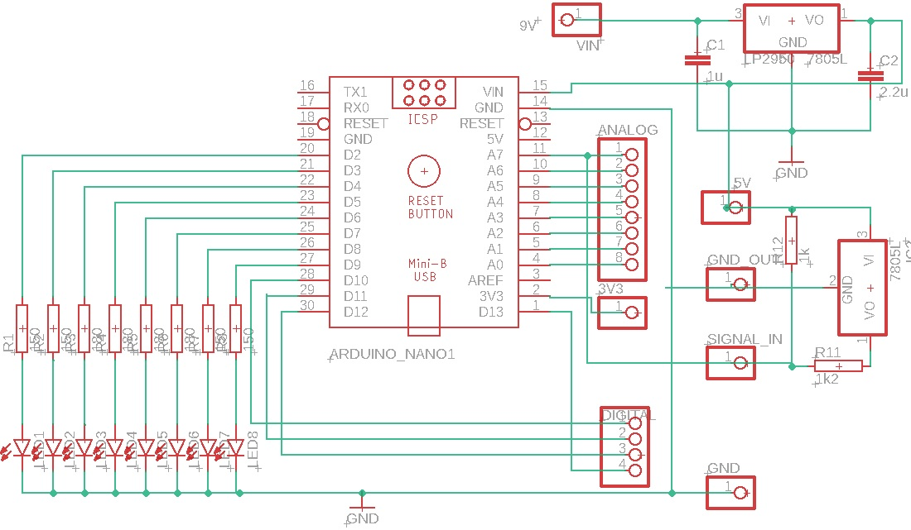

# B-Light | Spolu pre bezpečnejšie cesty

**Autori:** Adam Tomčala - 2024_ST42, Lukáš Rucek - 2024_ST38

## Naše sociálne siete
- **Patreon:** [Blight IoT](https://www.patreon.com/c/BlightIoT)
- **YouTube:** [Blight](https://www.youtube.com/@Blight-x1u)

---

## Definovanie problému

S rastúcim počtom motorových a nemotorových vozidiel na cestách sa každoročne zvyšuje riziko dopravných nehôd. Bezpečnosť účastníkov cestnej premávky, najmä cyklistov, je preto čoraz naliehavejšou otázkou. Jedným z kľúčových faktorov vedúcich k týmto nehodám je **nedostatočná viditeľnosť cyklistov**, spôsobená zastaraným a neefektívnym osvetlením. Mnohé z aktuálne dostupných svetelných systémov pre bicykle nevyužívajú najnovšie technologické možnosti, ako napríklad **hlasové ovládanie** alebo **dynamické prispôsobenie osvetlenia** aktuálnym podmienkam.

Týmto spôsobom sú cyklisti často neviditeľní pre ostatných účastníkov premávky, najmä za zhoršených svetelných a poveternostných podmienok. Nedostatok moderných riešení môže viesť k zvýšenému riziku nehôd, ktoré sú spôsobené neprimeranou svetelnou signalizáciou.

---

## Motivácia a naše PREČO

Z tohto dôvodu sme sa rozhodli vyvinúť inovatívne riešenie, ktoré zlepší bezpečnosť cyklistov na cestách. Naša vízia je vytvoriť **inteligentný IoT systém osvetlenia**, ktorý:

- **Zvýši viditeľnosť cyklistov:** Naše zariadenie poskytne inteligentné brzdové a smerové svetlá, ktoré výrazne zlepšia viditeľnosť cyklistu, čím sa zníži riziko nehôd spôsobených nedostatočnou signalizáciou.
- **Poskytne intuitívne ovládanie:** Pomocou hlasového ovládania cyklisti môžu bezpečne meniť osvetlenie bez toho, aby museli zložiť ruky z riadidiel, čo im umožní sústrediť sa plne na cestu.
- **Jednoduché pripojenie a použitie:** Zariadenie bude navrhnuté tak, aby ho bolo jednoduché pripevniť na bicykel, s dôrazom na maximálnu používateľskú prívetivosť. Jednoduchá inštalácia a konfigurácia zabezpečia, že cyklisti môžu rýchlo a efektívne zariadenie nasadiť a začať používať.
- **Využitie moderných technológií:** Systém bude vybavený senzormi, ktoré umožnia dynamické prispôsobenie osvetlenia aktuálnym podmienkam jazdy, napríklad pri brzdení alebo zmene smeru.
- **Bezproblémové prepojenie s mobilnou aplikáciou:** Cez Bluetooth spojenie bude možné zariadenie jednoducho prepojiť s mobilnou aplikáciou, ktorá umožní cyklistom mať plnú kontrolu nad osvetlením počas jazdy. Aplikácia bude navrhnutá pre intuitívne a rýchle ovládanie.

Týmto spôsobom sa snažíme vytvoriť riešenie, ktoré nielenže zníži riziko nehôd, ale tiež umožní cyklistom jazdiť s väčšou dôverou, bezpečnosťou a pohodlím.

---

## Definovanie cieľa a Prípady použitia

Cieľom nášho projektu **B-Light** je vytvoriť inovatívny IoT systém osvetlenia pre bicykle, ktorý zvýši bezpečnosť cyklistov na cestách a poskytne moderné, intuitívne riešenie pre osvetlenie počas jazdy. Tento systém bude zahŕňať niekoľko kľúčových prvkov, ktoré priamo prispievajú k zvýšeniu viditeľnosti a komfortu pri jazde, čím sa zníži riziko nehôd.

### Definovanie cieľa

- **Zahŕňať brzdové a smerové svetlá s hlasovým ovládaním:**  
  Pomocou hlasových príkazov ako "left" a "right" môžu cyklisti jednoducho aktivovať smerové svetlá, čo im umožňuje meniť smer bez potreby skladať ruky z riadidiel. Brzdové svetlá sa aktivujú automaticky pri brzdení, pričom systém dynamicky prispôsobuje intenzitu osvetlenia podľa typu brzdenia.

- **Tréning modelov na základe dát zo senzorov:**  
  Použitie Hallovho senzora na zber dát o intenzite brzdenia (slabé, stredné, silné) bolo kľúčové pre vytvorenie modelu, ktorý dokáže správne detegovať brzdenie a prispôsobiť osvetlenie v reálnom čase. Tento model umožňuje systému automaticky klasifikovať brzdenie a aktivovať správnu intenzitu brzdových svetiel.

- **Dynamické prispôsobenie osvetlenia podľa podmienok:**  
  Na základe údajov zo senzorov, ako je akcelerometer a gyroskop, systém analyzuje jazdu a prispôsobuje osvetlenie podľa aktuálnych podmienok. Tento systém nielen zvyšuje bezpečnosť cyklistov, ale zároveň umožňuje zlepšenie energetickej účinnosti tým, že osvetlenie je optimalizované v reálnom čase.

- **Mobilná aplikácia na riadenie osvetlenia:**  
  Prostredníctvom mobilnej aplikácie prepojenej cez Bluetooth môžu používatelia sledovať dáta o svojej jazde, ovládať osvetlenie a ukladať dáta o jazdných návykoch. Aplikácia umožňuje rýchly a intuitívny prístup k nastaveniam osvetlenia a poskytuje analýzu nazbieraných dát, čo môže pomôcť pri ďalšom tréningu a zlepšení jazdných techník.

### Prípady použitia (Use Cases)

1. **Monitorovanie intenzity brzdenia:**  
   Systém B-Light rozpoznáva rôzne úrovne brzdenia cyklistu (slabé, stredné, silné) a automaticky upravuje intenzitu brzdových svetiel. Tým sa zabezpečí, že cyklista bude vždy dostatočne viditeľný pre ostatných účastníkov cestnej premávky, čím sa zníži riziko nehôd. Tento proces je podporovaný strojovým modelom vyškoleným na základe dát zozbieraných počas rannej fázy vývoja, kde bol použitý Hallov senzor na sledovanie intenzity brzdenia.

2. **Hlasové ovládanie smerových svetiel:**  
   Cyklista môže jednoducho aktivovať smerové svetlá pomocou hlasových príkazov, ako napríklad "left" alebo "right". Táto funkcia eliminuje potrebu manuálneho ovládania svetiel, čo umožňuje cyklistovi udržať ruky na riadidlách a sústrediť sa na bezpečnú jazdu.

3. **Dynamické prispôsobenie osvetlenia podľa podmienok:**  
   Systém automaticky upravuje intenzitu a režim osvetlenia na základe údajov zo senzorov (akcelerometer, gyroskop). Tým zabezpečuje optimálnu viditeľnosť cyklistu pri rôznych jazdných podmienkach, ako sú náhle brzdenie, zmena smeru alebo jazda v zhoršených svetelných podmienkach (hmla, noc).

4. **Zber dát v rannej fáze vývoja:**  
   Počas rannej fázy vývoja systému B-Light bol použitý Hallov senzor na zhromažďovanie dát o intenzite brzdenia. Tieto údaje slúžili na vytvorenie modelu strojového učenia, ktorý teraz umožňuje systému presne identifikovať a klasifikovať úrovne brzdenia, čím sa dosiahne lepšia reakcia na rôzne jazdné podmienky.

5. **Tréning modelu pre rozpoznávanie brzdenia:**  
   Na základe dát zozbieraných z rannej fázy vývoja bol vytvorený a vytrenovaný model, ktorý dokáže presne rozlišovať medzi slabým, stredným a silným brzdením. Tento model sa pravidelne aktualizuje, aby zabezpečil presnú a efektívnu reakciu na zmeny v jazdných podmienkach, čo zlepšuje bezpečnosť cyklistu na cestách.

6. **Prepojenie s mobilnou aplikáciou a správa dát:**  
   Mobilná aplikácia umožňuje používateľom monitorovať stav zariadenia, ovládať svetlá a analyzovať údaje o jazde. Aplikácia poskytuje prehľadné štatistiky a upozornenia, čím umožňuje používateľovi lepšie prispôsobiť osvetlenie podľa svojich preferencií. Cez Bluetooth spojenie sa zabezpečí jednoduché a spoľahlivé prepojenie so zariadením.

7. **Bezpečnostné upozornenia:**  
   Systém B-Light deteguje neobvyklé správanie, ako sú prudké brzdenie, náhle zmeny smeru alebo problémy so svetlami, a okamžite odošle upozornenie do mobilnej aplikácie cyklistu. Tieto upozornenia zvyšujú povedomie cyklistu o možných nebezpečenstvách a umožňujú rýchlu reakciu na neočakávané situácie.

---

## Biznisový pohľad - Analýza trhu

### Primárna cieľová skupina

#### Demografia:
- Ľudia vo veku 18-50 rokov, ktorí sú aktívni cyklisti, rekreační jazdci alebo používajú bicykel ako dopravný prostriedok.
- Osoby, ktoré pravidelne dochádzajú na bicykli do práce, školy alebo na kratšie výlety.

#### Behaviorálne charakteristiky:
- Cyklisti, ktorí chcú zvýšiť svoju bezpečnosť, najmä tí, ktorí jazdia za zníženej viditeľnosti.
- Ľudia, ktorí preferujú jednoduchosť a používateľskú prívetivosť pri ovládaní osvetlenia.
- Záujemcovia o nové technológie a inteligentné riešenia pre zvýšenie komfortu a bezpečnosti.
- Cyklisti, ktorí často jazdia po cestách so zvýšenou premávkou.

#### Ideálny zákazník:
Ideálnym zákazníkom pre **B-Light** je aktívny cyklista, ktorý hľadá riešenie na zlepšenie viditeľnosti a bezpečnosti pri jazde. Tento zákazník preferuje jednoduché, intuitívne a efektívne technológie, ktoré mu umožnia sústrediť sa na jazdu bez zbytočného nastavovania zariadení. Zároveň ocení produkty, ktoré sú energeticky úsporné a ľahko použiteľné.

### Identifikácia konkurencie

1. **Garmin Varia Radar Lights**  
   **Popis:** Kombinácia zadného osvetlenia a radaru, ktorý deteguje vozidlá približujúce sa zozadu.
   - **Silné stránky:**
     - Integrácia radaru na upozornenie o blížiacich sa vozidlách.
     - Automatické prispôsobenie osvetlenia podľa situácie.
   - **Slabé stránky:**
     - Vyššia cena, nutnosť používať kompatibilné zariadenia.
     - Chýbajú inteligentné smerové svetlá.

2. **Lumos Helmet**  
   **Popis:** Inteligentná prilba s integrovaným predným a zadným osvetlením, vrátane smerových svetiel ovládaných gestami.
   - **Silné stránky:**
     - Zvýšená viditeľnosť vďaka vyššie umiestnenému osvetleniu.
     - Moderný dizajn a mobilná aplikácia.
   - **Slabé stránky:**
     - Vyššia cena a obmedzenie len na prilbu ako formu osvetlenia.

### Trhová analýza

1. **Európsky trh:**
   - Očakáva sa, že trh s bicyklami v Európe narastie z hodnoty 25,08 miliardy USD v roku 2023 na 39,8 miliardy USD do roku 2028. Tento rast bude poháňaný najmä zvýšeným dopytom po e-bicykloch, predovšetkým v krajinách ako Francúzsko, Nemecko a Holandsko, ktoré kladú dôraz na ekologickú dopravu.  
   [Zdroj: Mordor Intelligence - European Bicycle Market](https://www.mordorintelligence.com/industry-reports/europe-bicycle-market)

2. **Slovenský trh:**
   - Dovoz bicyklov na Slovensko sa má do roku 2026 zvýšiť na 124,700 kusov, pričom export dosiahne 316,150 kusov. Slovensko sa postupne zaraďuje medzi významných európskych exportérov bicyklov.  
   [Zdroj: ReportLinker - Slovak Bicycle Market](https://www.reportlinker.com/clp/country/9134/726390)
   
---

## Technický pohľad

### Základný návrh zariadenia

V rámci počiatočného návrhu sme vytvorili koncept zariadenia, ktoré bude jednoducho pripevniteľné k bicyklu. Tento základný návrh bol ručne nakreslený na papieri a obsahuje hlavné komponenty, ktoré sú nevyhnutné pre funkčnosť systému.

- **Krabičku na zariadenie**, ktorá bude umiestnená pod sedlom bicykla a bude obsahovať potrebnú elektroniku pre ovládanie osvetlenia a senzorov.
- **Držiak**, ktorý bezpečne upevní zariadenie pod sedlo, aby bolo stabilné aj pri náročnej jazde.
- **Senzory a pripojenie k ďalším komponentom**, ktoré zabezpečia správne fungovanie osvetľovacieho systému a komunikáciu s mobilnou aplikáciou.

Tento základný návrh poskytuje vizuálnu predstavu o tom, ako bude zariadenie vyzerať a ako bude fungovať na bicykli. V ďalších krokoch sa budeme venovať detailnejšiemu návrhu a implementácii jednotlivých častí.

---

## Návrh komponentov a vzťahy v systéme

Pre správne fungovanie celého systému inteligentného osvetlenia je potrebné navrhnúť jeho architektúru a starostlivo zvoliť jednotlivé komponenty. Riešenie pozostáva z troch hlavných prvkov, ktoré spolupracujú na zabezpečení požadovanej funkčnosti:

1. **Vývojová doska:**
   - Základná zložka systému, ktorá umožňuje zber dát z pohybových senzorov, ako sú akcelerometer a gyroskop, počas jazdy.
   - Obsahuje komunikačný modul (Bluetooth Low Energy), ktorý zabezpečuje prenos dát na mobilné zariadenie.
   - Riadi osvetľovacie zariadenie, vrátane brzdových a smerových LED svetiel.
   - Súčasťou dosky je systém na napájanie a pripojenie externých komponentov, ako sú LED svetlá, ktoré budú reagovať na pohyb cyklistu (napr. brzdenie alebo zmena smeru).

2. **Mobilná aplikácia:**
   - Slúži ako hlavné používateľské rozhranie, ktoré zabezpečuje ovládanie osvetľovacích funkcií pomocou integrovaných modelov.
   - Aplikácia prijíma a spracováva dáta zo senzorov cez Bluetooth a ukladá ich do lokálnej databázy pre ďalšiu analýzu a použitie.
   - Komunikácia medzi mobilnou aplikáciou a osvetľovacím zariadením prebieha prostredníctvom technológie BLE (Bluetooth Low Energy), čím sa zabezpečí spoľahlivý prenos dát.

3. **Periférny Hallov senzor:**
   - Dôležitý komponent, ktorý počas zberu dát poskytuje informácie o brzdení cyklistu. Tento senzor bude pripojený k vývojovej doske a bude generovať analógové hodnoty pre označenie jednotlivých časových radov dát, ktoré sa zbierajú z pohybových senzorov.

---

## Návrh osvetľovacieho zariadenia

V tejto časti priblížime hardvérové komponenty potrebné pre zostrojenie inteligentného osvetlenia bicykla. Systém pozostáva z vývojovej dosky, Hallovho senzora, osvetlenia a napájania.

### Vývojová doska

Zvolili sme vývojovú dosku **Arduino Nano 33 BLE** z týchto dôvodov:
- Integrovaný BLE modul Nina-B306 pre komunikáciu s mobilnou aplikáciou.
- Integrovaná 9-osová IMU LSM9DS1 pre zaznamenávanie pohybu.
- Kompaktný rozmer (45mm x 18mm) a nízka spotreba energie.

### Hallov senzor

**S49E Hallov senzor** bude umiestnený na riadidlách a bude detegovať intenzitu brzdenia prostredníctvom magnetu umiestneného na brzdovej páčke. Senzor poskytne analógové výstupné napätie podľa intenzity magnetického poľa, čo umožní predikovať brzdenie cyklistu.

### Osvetlenie

Systém bude obsahovať **8 externých LED svetiel**:
- 2 pre smerovacie svetlá (2 pre každu stranu - dokopy 4).
- 4 pre brzdové svetlo.

LED svetlá budú napájané digitálnymi pinmi vývojovej dosky a chránené rezistormi (150Ω pre smerovacie a 180Ω pre brzdové svetlá).

### Napájanie

Napájanie bude zabezpečené **9V batériou**. Na redukciu napätia na potrebných 5V pre Hallov senzor bude použitý **regulátor LP2950ACZ-5.0/NOPB**, doplnený kondenzátormi pre stabilizáciu napätia.

### Návrh hardvéru

Nasledujúca schéma znázorňuje kompletný návrh osvetľovacieho zariadenia a jeho komponentov. **Arduino Nano 33 BLE** je ústredným prvkom, ku ktorému sú pripojené LED svietidlá cez digitálne piny D2 až D9 spolu s ochrannými rezistormi. Na analógový pin A7 je pripojený **S49E Hallov senzor**, ktorý deteguje intenzitu brzdenia. Napájanie celého systému zabezpečuje 9V batéria, pričom regulátor napätia **LP2950ACZ-5.0/NOPB** konvertuje napätie na 5V pre potreby Hallovho senzora.

---

## Návrh mobilnej aplikácie

Mobilná aplikácia **B-Light** slúži ako hlavné používateľské rozhranie na ovládanie osvetlenia a spracovanie dát zo senzorov pripojených k bicyklu. Používateľ môže po spustení aplikácie jednoducho skenovať dostupné BLE zariadenia a pripojiť sa k osvetľovaciemu zariadeniu, ak je dostupné.

### Funkcie aplikácie:

- **Riadenie osvetlenia:**  
  Po pripojení zariadenia sa inicializujú modely rozpoznávania brzdenia a hlasových povelov. Model brzdenia je trénovaný na základe zozbieraných dát, zatiaľ čo hlasové povely sú rozpoznávané knižnicou **VOSK** v offline režime. Používateľ môže ovládať smerovacie svetlá hlasovými príkazmi "left" a "right" alebo manuálne pomocou tlačidiel v aplikácii.

- **Prijímanie dát:**  
  Aplikácia bude priebežne prijímať dáta z pohybových senzorov na vývojovej doske Arduino a analógové hodnoty z Hallovho senzora. Tieto dáta budú slúžiť na určenie intenzity brzdenia, pričom hlasové povely budú zasielané naspäť na IoT zariadenie.

- **Ukladanie dát a ich filtrovanie:**  
  Aplikácia spracováva dáta pomocou **SMA filtra (Simple Moving Average)**, ktorý minimalizuje šum. Tieto dáta sa ukladajú do lokálnej databázy **SQLite** v mobilnom zariadení, čo umožňuje analýzu správania bicykla počas rôznych situácií, ako je silné alebo slabé brzdenie.

---

## Návrh komunikácie

---

## Návrh fungovania brzdového svetla

Tento aktivity diagram ilustruje princíp fungovania brzdového svetla v systéme **B-Light**. Senzory IoT zariadenia namontované na bicykli priebežne zaznamenávajú pohybové údaje, ktoré sú spracovávané v mobilnej aplikácii. Na elimináciu šumu sa používa **SMA filter**, a dáta sú ďalej vyhodnocované pomocou **LSTM modelu**, ktorý klasifikuje intenzitu brzdenia. Na základe tejto klasifikácie sa automaticky aktivujú brzdové svetlá.

---

## Návrh fungovania smerových svetiel

Návrh smerových svetiel v systéme **B-Light** umožňuje používateľom ovládať smerovky hlasovými príkazmi. Systém je navrhnutý tak, aby rozpoznával príkazy ako **"left"** a **"right"** a následne aktivoval príslušné svetlá na bicykli. Svetlá blikajú po dobu 10 sekúnd, pričom cyklista má možnosť počas tohto intervalu meniť povely.

---

## Prvé testovacie zapojenie bez plošného spoja

Naše prvé testovanie systému **B-Light** prebehlo bez použitia plošného spoja. Zapojili sme jednotlivé komponenty, vrátane **Arduino Nano 33 BLE**, LED diód a rezistorov, aby sme overili základnú funkčnosť osvetlenia a komunikácie cez Bluetooth. Tento test nám umožnil rýchlo zistiť, či svetlá správne reagujú na vstupy z mobilnej aplikácie, a preveriť správnosť celého konceptu.

Toto zapojenie bude základom pre finálnu verziu s plošným spojom, na ktorom budú všetky komponenty pripojené trvalo.

---

## Zber dát z Hallovho senzora pre tréning modelu

Pre účely zlepšenia automatického ovládania brzdového svetla sme realizovali zber dát pomocou **Hallovho senzora**. Senzor bol pripevnený na brzdovú páčku, zatiaľ čo magnet sa nachádzal na druhej strane riadidiel. Interakcia medzi nimi umožňovala zaznamenávať dáta o intenzite brzdenia.

Systém bol dočasne umiestnený v provizórnej boxe, aby sme zabezpečili stabilitu celého zapojenia počas testov. Tieto dáta sme následne použili na trénovanie modelu, ktorý bude rozlišovať medzi rôznymi úrovňami brzdenia a automaticky zapínať brzdové svetlo podľa potreby.

---

## Používateľské rozhranie mobilnej aplikácie B-Light

---

## Testovanie a overenie riešenia

Po implementácii jednotlivých častí systému B-Light bolo nevyhnutné vykonať testovanie najdôležitejších operácií, ktoré systém poskytuje. Testovanie jednotlivých funkcionalít prebiehalo počas fázy ich implementovania, pričom sme testovali:
- odosielanie dát medzi zariadeniami,
- ukladanie dát do lokálnej databázy,
- testovanie VOSK modelu pre rozpoznávanie hlasových príkazov,
- testovanie modelu detekujúceho intenzitu brzdenia.

Prvá funkcionalita bola overená úspešným prenosom dát z IoT zariadenia na mobilné zariadenie, kde boli dáta uložené do lokálnej databázy. Na druhej strane sme overili aj spätné odosielanie povelov, kedy osvetľovacie zariadenie vykonalo príslušné akcie.

### Testovanie modelu brzdenia

Testovanie modelu detekcie brzdenia prebehlo počas reálnej testovacej jazdy, pri ktorej sme simulovali všetky možné scenáre brzdenia. Na zázname z Hallovho senzora sme porovnávali predikovanú hodnotu modelu s reálnymi analógovými dátami zo senzora. Testovacia jazda bola vykonaná na inej trase než tá, kde prebiehal zber dát, aby sme zabezpečili čo najobjektívnejšie výsledky.

### Slabé brzdenie:
- Model úspešne detegoval 13 z 15 prípadov slabého brzdenia. V dvoch prípadoch model krátkodobo nesprávne vyhodnotil brzdenie ako silné.

### Silné brzdenie:
- Model správne detegoval silné brzdenie, až na jednu výnimku, kde bolo nesprávne vyhodnotené ako slabé brzdenie.

### Prechod medzi intenzitami brzdenia:
- Model úspešne zachytil prechod medzi slabým a silným brzdením, s oneskorením približne 500 ms, čo sme zaznamenali už pri tréningu modelu.

### Výsledky a matica zmätenia:
- Matica zmätenia znázorňuje presnosť modelu pri jednotlivých kategóriách brzdenia. Najväčšie odchýlky sme zaznamenali pri prechode z nižšej intenzity brzdenia do vyššej.

