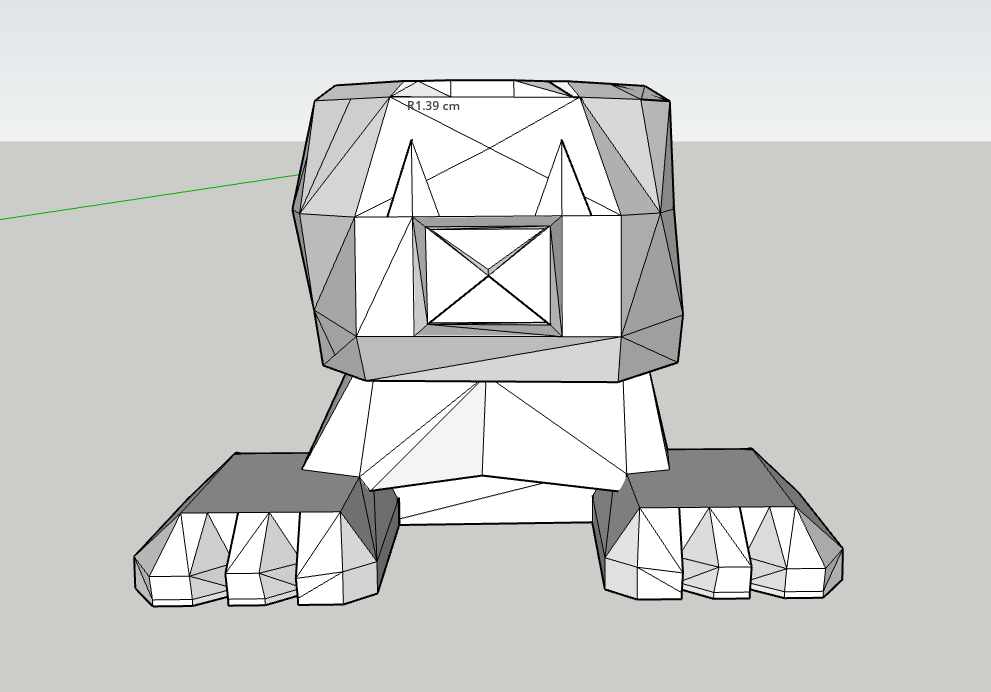
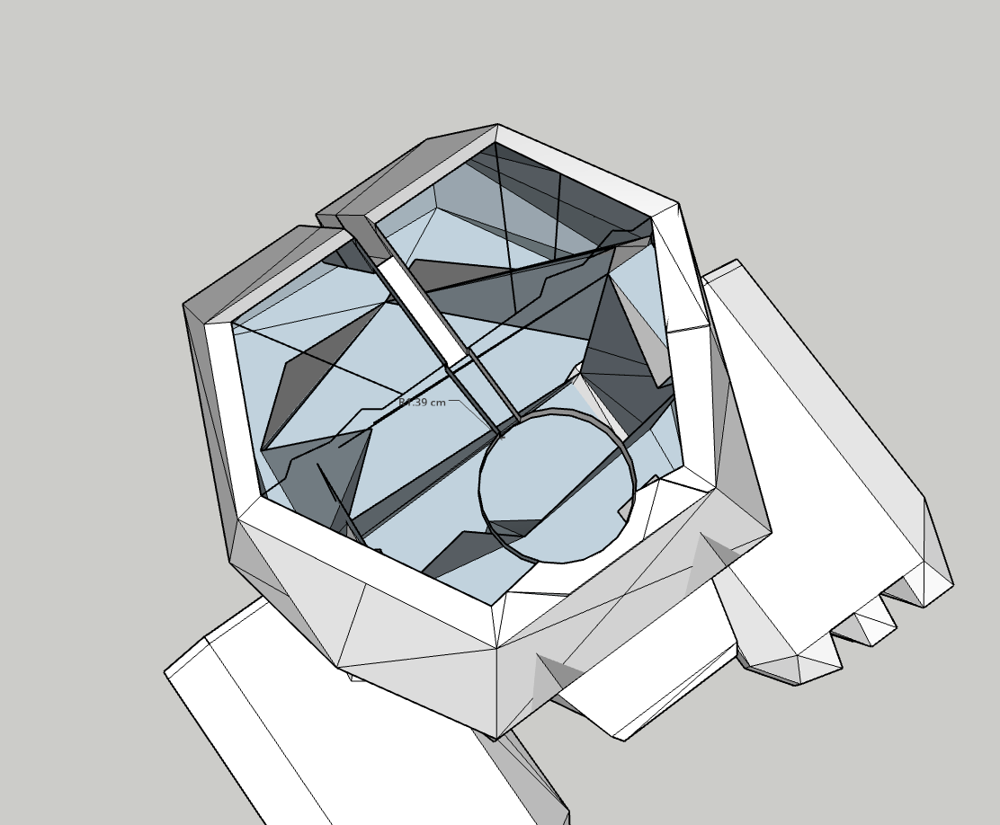
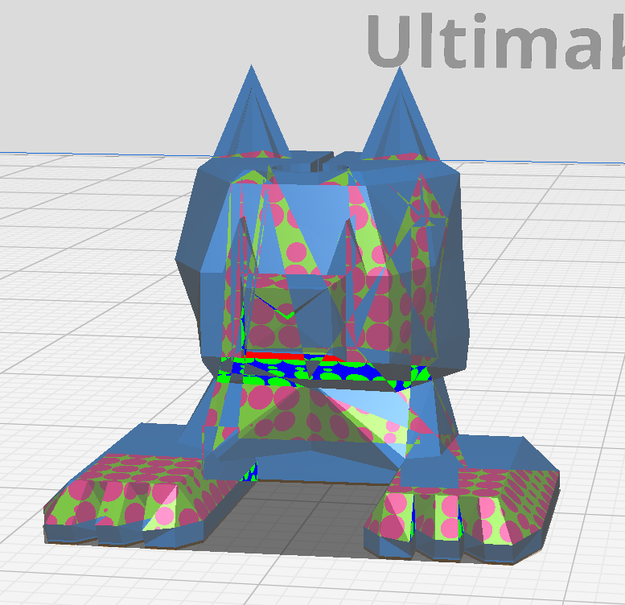
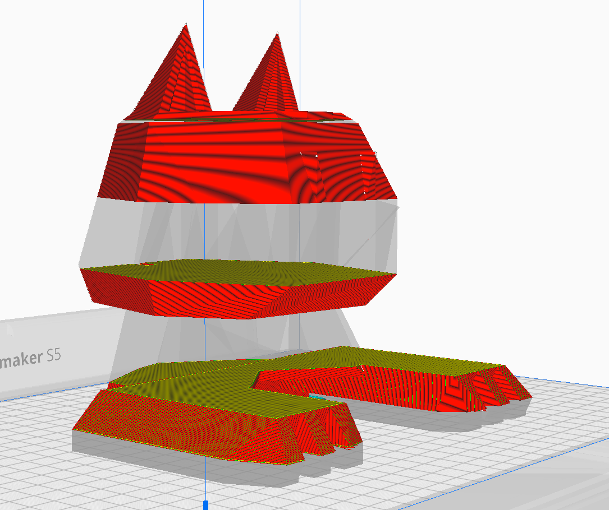
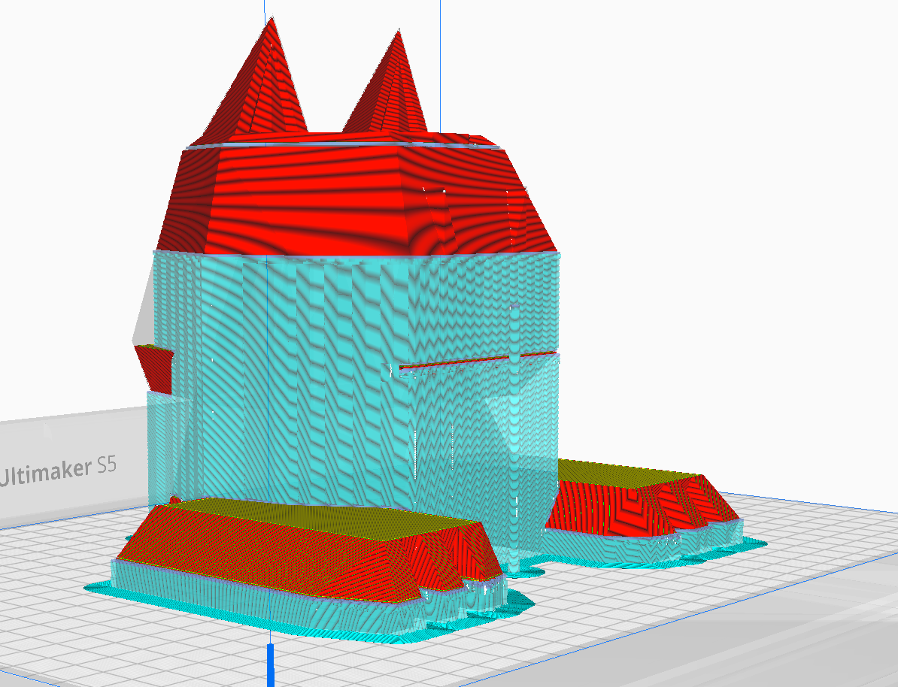
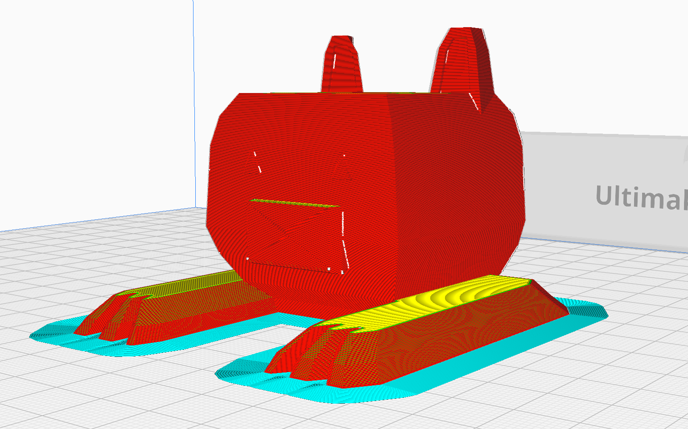

# Tvorba 3D modelu

import {StlViewer} from "react-stl-viewer";
import useBaseUrl from '@docusaurus/useBaseUrl';

## Použitý nástroj

Samotná tvorba 3D modelov prebiehala v nástroji [SketchUp](https://app.sketchup.com). Tento nástroj je dostupný zadarmo vo webovej verzii a je jednoduchý na používanie. Návod na to, ako to nerobiť sme spísali [nižšie](#prv%C3%BD-pokus).

Následná kontrola, či je model spôsobilý na 3D tlač prebiehala v nástroji [Ultimaker Cura](https://ultimaker.com/software/ultimaker-cura).

## Prvý pokus

Nakoľko sa jednalo o náš prvý pokus vytvoriť 3D model, prvý prototyp sa ani nedostal do tlače, nakoľko bol nevyhovujúci. Dôvodom bola neznalosť spôsobu modelovania modelov pre 3D tlač.

Dôvod, prečo tento model nie je možné vytlačiť je, že obsahuje príliš veľa polygonov vo vnútri modelu, viď foto nižšie.

:::warning

Pri modelovaní v nástroji SketchUp je potrebné dbať na to, aby bol model zvnútra dutý.

:::

Model taktiež nesmie obsahovať polygony, ktoré su v nástroji SketchUp zobrazené bledomodrou farbou, nakoľko sa jedná o diery v modeli, a teda model nie je uzavretý.

|  |  |
|:------------------------:|:---------------------------:|
| Farba signalizujúca dieru v modeli                    | Korektná farba polygonu                     |

:::note

Modré polygony z vnútornej strany modelu sú v poriadku. Modré polygony na vonkajšej strane modelu signalizujú dieru v modeli a je potrebné ich mitigovať.

:::

:::tip

V prípade, že model obsahuje polygony vnútri, v niektorých prípadoch je možné ich odstrániť pomocou nástroja `Outer Shell` v nástroji SketchUp.

:::

### Výsledný model

Nižšie je zobrazený výsledný model, ktorý nebolo možné vytlačiť. Model je možné [stiahnuť tu](/models/bad-cat.stl).

:::tip
Pridali sme modul zobrazenia 3D modelu, ktorý je možné vidieť nižšie. Skús pohnúť s modelom 😁. Ak si zobrazenie dostatočne priblížiš, uvidíš polygony vnútri modelu.
:::

<StlViewer
    url={useBaseUrl("/models/bad-cat.stl")}
    rotate={true}
    orbitControls={true}
    cameraControls={true}
    style={{height: "500px", width: "100%", backgroundColor: "rgba(0, 0, 0, 0.2)", borderRadius: "20px"}}
    shadows={true}
    modelProps={
        {
            color: "#DD3E28",

        }
    }
    cameraProps={
        {
            initialPosition: {
                distance: 1.4,
                latitude: 0,
                longitude: 0,
            }
        }
    }
    />

### Kontrola pred tlačou

Ako sme už spomenuli, tento model nebol vhodný na tlač. Zistili sme to však až pri kontrole v nástroji Ultimaker Cura. Tento nástroj je schopný zobraziť model v reálnom čase a teda je možné zistiť, či je model tlačiteľný.

Tento nástroj poskytuje zobrazenie častí modelu, ktoré sú chybné (červené kruhy na zelenom pozadí)

Následne je možné zobraziť aj postup tlačenia modelu, ktorý je v tomto prípade nepoužiteľný.

:::tip
Je možné zobraziť aj podporu, ktorá by bola potrebná pre tlač modelu, v tomto prípade by tvorila väčšinu modelu.
:::

## Druhý pokus

Pri druhom pokuse sme využili poznatky z modelovania prvého modelu a vytvorili sme model, ktorý je tlačiteľný.

### Výsledný model

Nižšie je zobrazený výsledný model, ktorý v budeme tlačiť. V ďaľšej kapitole tak nájdeš dokumentáciu k tomu, ako sme model tlačili. Model je možné [stiahnuť tu](/models/cat.stl).

:::tip
Pridali sme modul zobrazenia 3D modelu, ktorý je možné vidieť nižšie. Skús pohnúť s modelom 😁.
:::

<StlViewer
    url={useBaseUrl("/models/cat.stl")}
    rotate={true}
    orbitControls={true}
    cameraControls={true}
    style={{height: "500px", width: "100%", backgroundColor: "rgba(0, 0, 0, 0.2)", borderRadius: "20px"}}
    shadows={true}
    modelProps={
        {
            color: "#DD3E28",

        }
    }
    cameraProps={
        {
            initialPosition: {
                distance: 1.4,
                latitude: 0,
                longitude: 0,
            }
        }
    }
    />

### Kontrola pred tlačou

Druhý model bol úspešne tlačiteľný, nakoľko neobsahoval vnútorné polygony a bol uzavretý.

Následne je možné zobraziť aj postup tlačenia modelu, ktorý je v tomto prípade nepoužiteľný.

