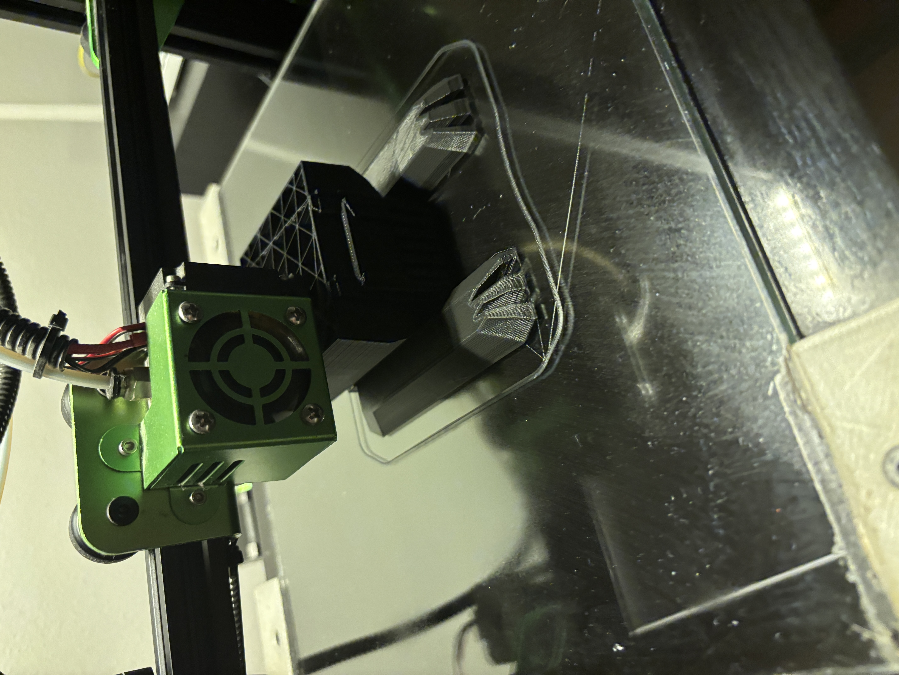
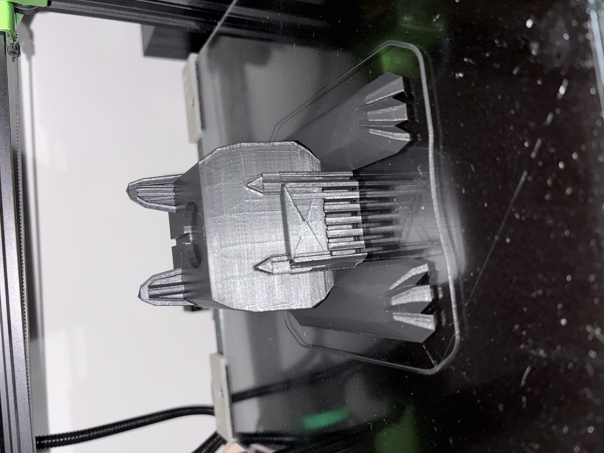
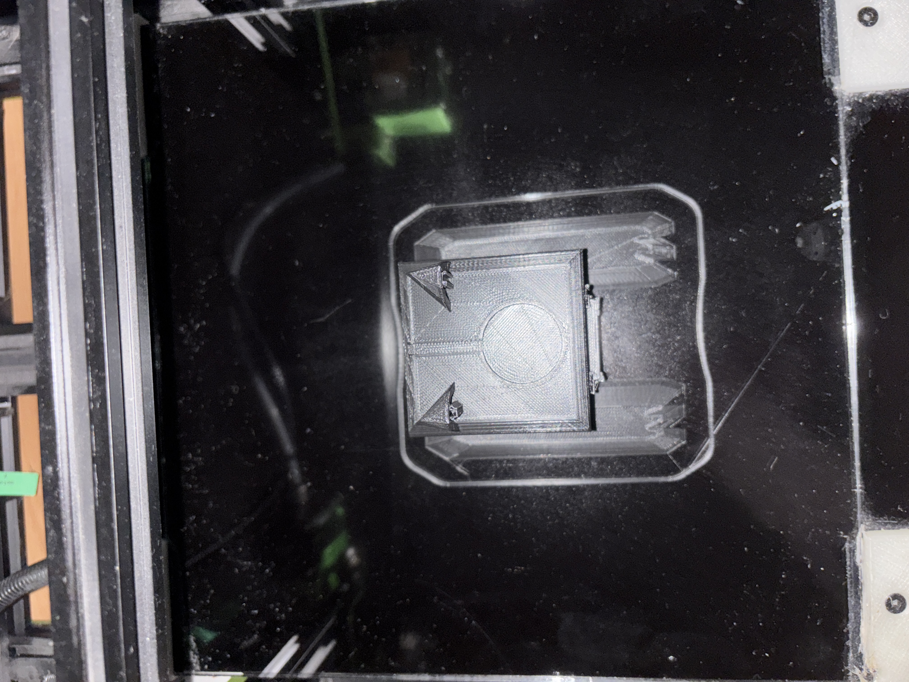

import {StlViewer} from "react-stl-viewer";
import useBaseUrl from '@docusaurus/useBaseUrl';

# Priebeh tlače

Naším cieľom bolo vytvoriť stojan na apple watch nabíjačku. Pre tento typ modelu nebolo nutné použiť veľkú hustostu výplne, pretože stojan bude slúžiť len na držanie nabíjačky a nie na ukladanie ťažkých predmetov. Rovnako tak stojan pevne drží na stole a nemusí byť príliš robustný.

**Teplota tlačovej dosky**: 60 °C

**Teplota trysky**: 200 °C

**Hrúbka vrstvy**: 0.15 mm

**Rýchlosť tlače**: 60 mm/s

**Hustota výplne modelu**: 30 %

**Typ výplne modelu**: Grid

**Typ podporných štruktúr**: Podporné štruktúry obdĺžníkového tvaru

    |  |
    |:---:|
    | Proces tlače modelu |

    |  |
    |:---:|
    | Proces tlače modelu |

    |  |
    |:---:|
    | Proces tlače modelu |

    |  |
    |:---:|
    | Dokončená tlač |

    |  |
    |:---:|
    | Dokončená tlač |

# Prototyp vytlačeného stojanu

Po úspešnom vytlačení modelu sme sa pustili do jeho otestovania. Stojan bol použiteľný a nabíjačka sa do neho pekne vošla.

<br/>

# Finálny produkt

Po dokončení tlače sme model vyčistili a odstránili podporné štruktúry. Hodinky môžu byť pohodlne umiestnené na stojane obojsmerme.

    |  |
    |:---:|
    | Finálny produkt |

    |  |
    |:---:|
    | Finálny produkt |

    |  |
    |:---:|
    | Finálny produkt |

    |  |
    |:---:|
    | Finálny produkt |

    |  |
    |:---:|
    | Finálny produkt |

# Záver

Vytlačený stojan na apple watch nabíjačku bol úspešný a plne funkčný. Vďaka tomuto projektu sme sa naučili pracovať s 3D tlačou a vytvárať vlastné modely.
```
