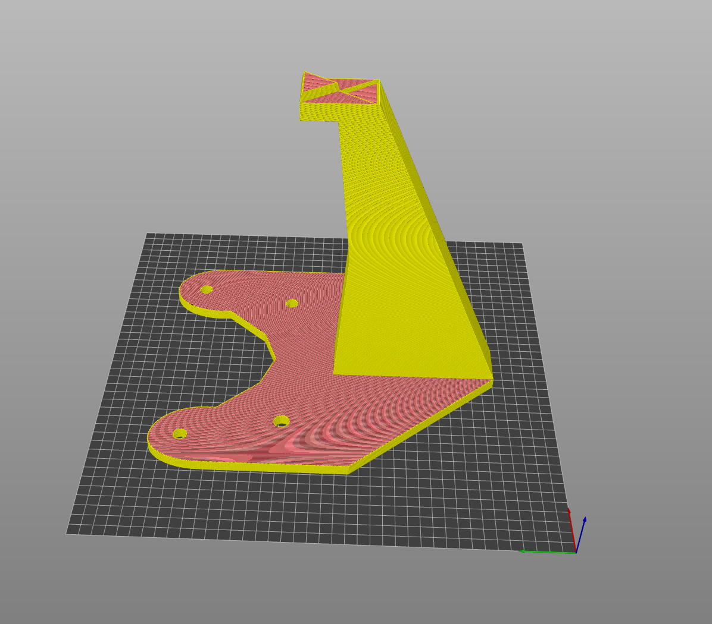
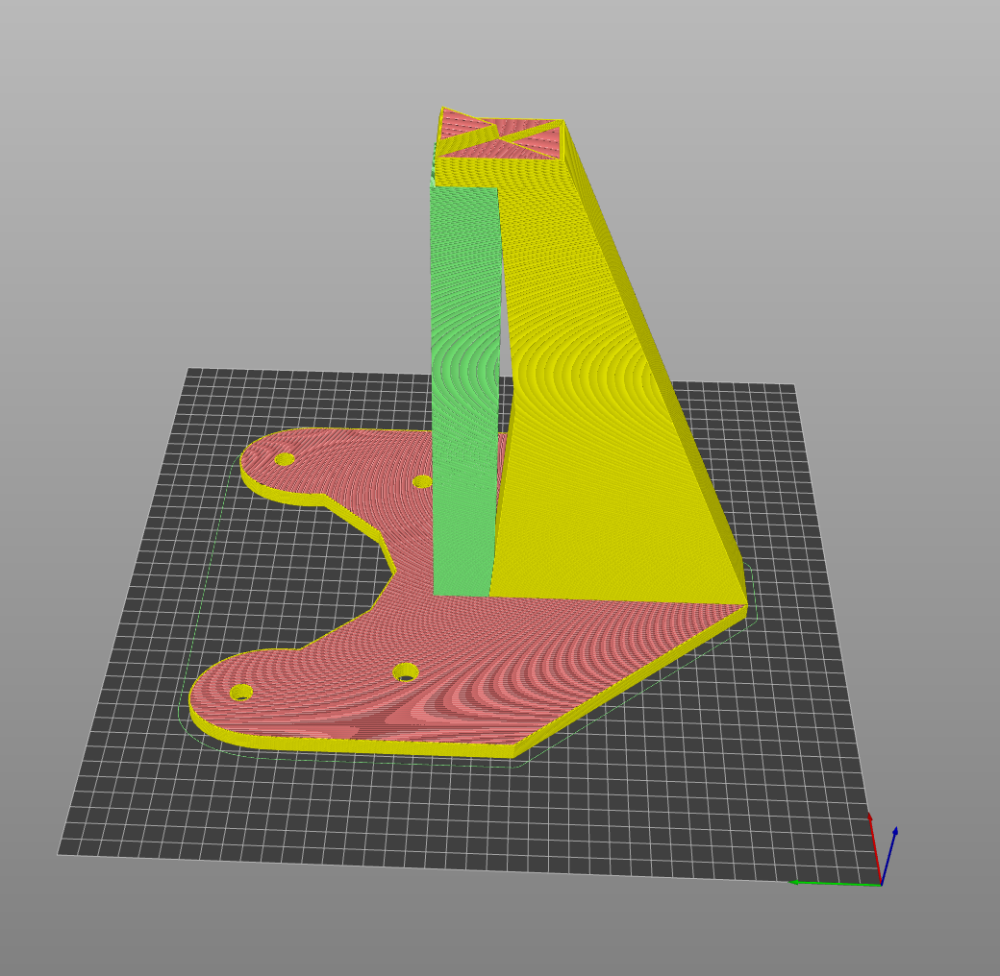

# Tvorba 3D modelu

import {StlViewer} from "react-stl-viewer";
import useBaseUrl from '@docusaurus/useBaseUrl';

## Použitý nástroj

Samotná tvorba 3D modelov prebiehala v nástroji [SketchUp](https://app.sketchup.com). Tento nástroj je dostupný zadarmo vo webovej verzii a je jednoduchý na používanie.

Kontrolu tlačiteľnosti tohoto modelu sme vykonávali v nástroji [PrusaSlicer](https://www.prusa3d.com/prusaslicer/), ktorý je dostupný zadarmo na stiahnutie. Chceli sme vyskúšať aj iný nástroj ako pri predchádzajúcom produkte, aby sme experimentovali s rôznymi nástrojmi.

## Model

Nakoľko išlo o jednoduchší model, nebolo potrebné vytvárať žiadne zložité geometrické tvary. Model bol vytvorený základnými nástrojmi, ktoré nástroj SketchUp ponúka. V podstate vo svojej prvotnej verzii model neobsahoval žiadne chyby, ktoré by bránili v tlači.

:::tip
Pridali sme modul zobrazenia 3D modelu, ktorý je možné vidieť nižšie. Skús pohnúť s modelom 😁.
:::

<StlViewer
    url={useBaseUrl("/models/headphone-stand.stl")}
    rotate={true}
    orbitControls={true}
    cameraControls={true}
    style={{height: "500px", width: "100%", backgroundColor: "rgba(0, 0, 0, 0.2)", borderRadius: "20px"}}
    shadows={true}
    modelProps={
        {
            color: "#DD3E28",

        }
    }
    cameraProps={
        {
            initialPosition: {
                distance: 1.4,
                latitude: 0,
                longitude: 0,
            }
        }
    }
    />

### Kontrola pred tlačou

Pre tento model sme využili vyššie spomenutý nástroj PrusaSlicer, ktorý nám poskytol informácie o tlačiteľnosti modelu. Tento nástroj funguje veľmi podobne ako nástroj Ultimaker Cura, ktorý sme použili pri predchádzajúcom produkte.

Následne je možné zobraziť aj postup tlačenia modelu, ktorý bol v tomto prípade v poriadku.

### Náhľad modelu pred tlačou

Na model bolo v podstate nutné pridať len podporu pre model, ktorý bol tlačiteľný bez ďalších úprav. Koniec držiaka, ktorý zachytáva slúchadlá, bol tlačiteľný len s podporou, nakoľko išlo o viac ako 45° sklon a teda by sa model nemohol tlačiť bez podpory.

:::note
Na obrázku je zobrazený náhľad modelu s pridanou podporou, ktorá bola nutná pre tlač modelu. Podpora je označená zelenou farbou.
:::

## Záver

Tvorba 3D modelu pre stojan na slúchadlá prebehla bez problémov. Model bol vytvorený v nástroji SketchUp a následne bol skontrolovaný v nástroji PrusaSlicer. Model bol tlačiteľný bez ďalších úprav, čo nám umožnilo priamo prejsť k tlači prvého prototypu. Samotný model bude tlačený minimálne so 70% výplňou, aby bol dostatočne pevný a stabilný a nezlomil sa pri používaní.
