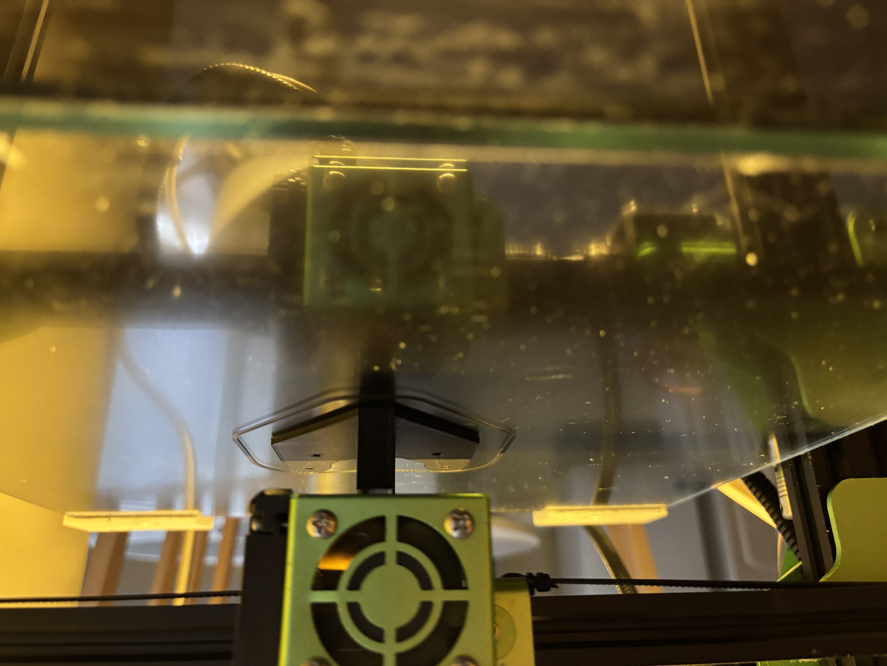
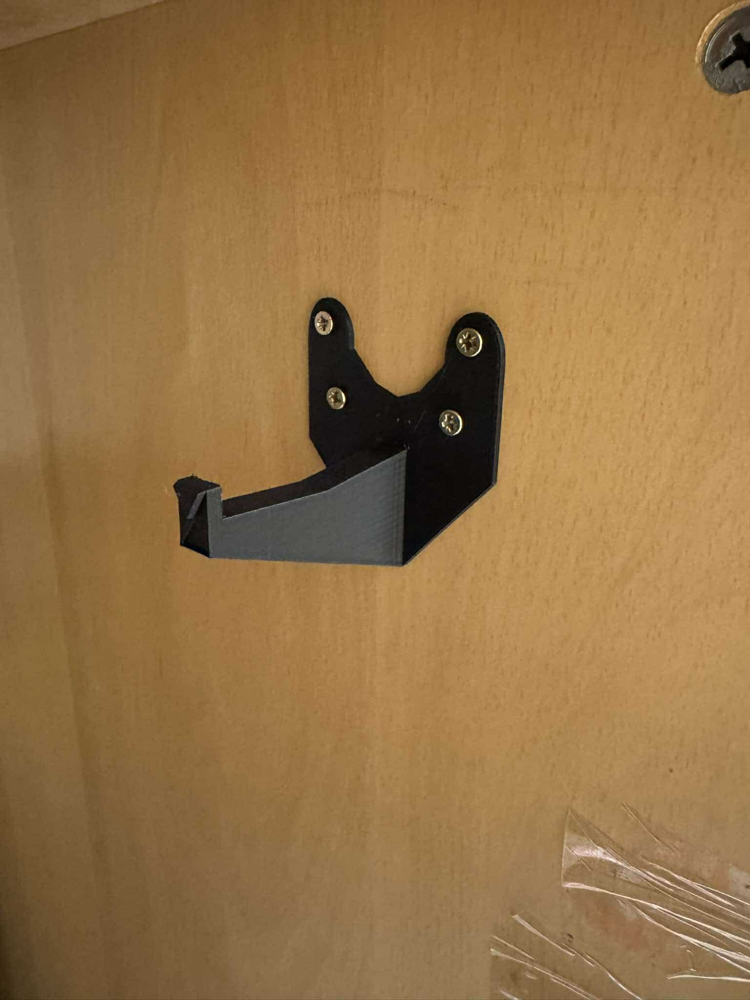
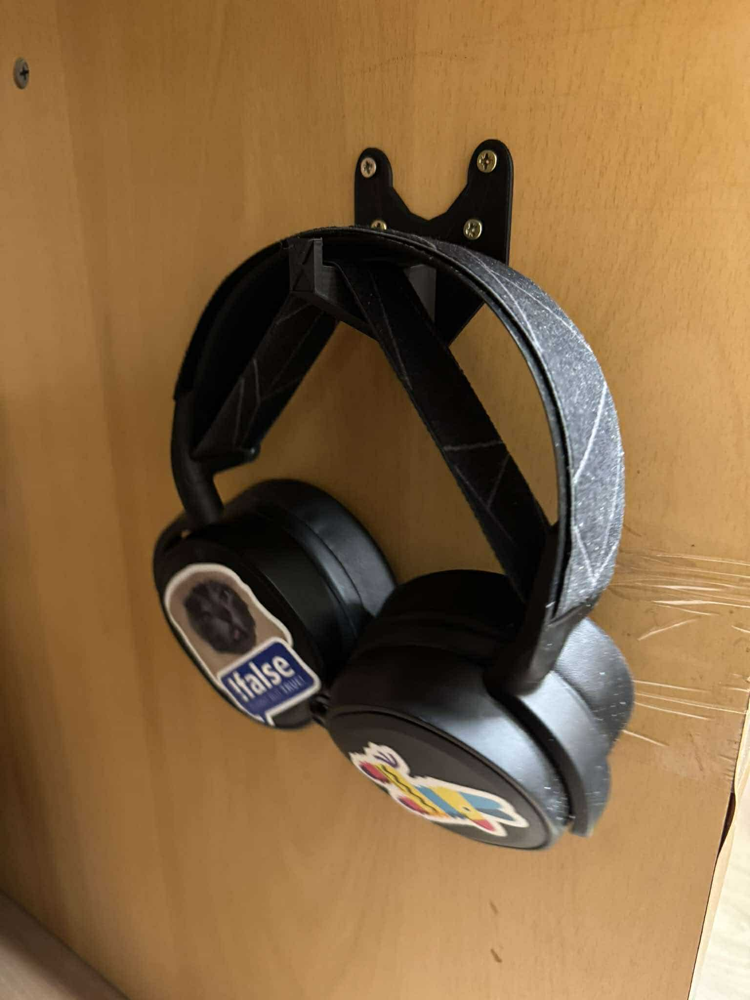
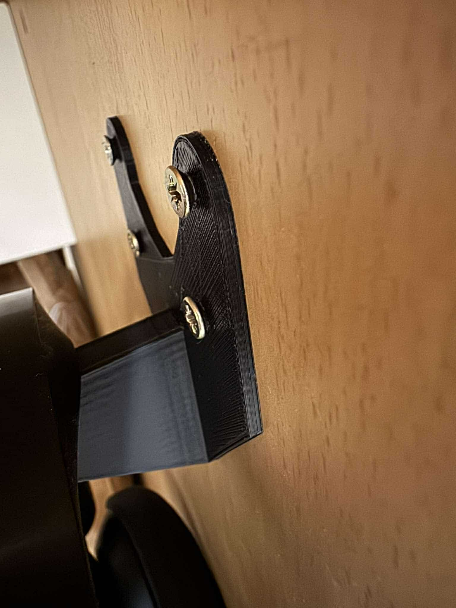

import {StlViewer} from "react-stl-viewer";
import useBaseUrl from '@docusaurus/useBaseUrl';

# Priebeh tlače

Po vytvorení modelu sme sa pustili do tlače. Tlač sme vykonali na 3D tlačiarni Tevo Tornado. Tlačili sme z materiálu PLA v čiernej farbe, ktorý je dostatočne pevný a odolný. Tlač sme vykonali s nasledujúcimi parametrami:

**Teplota tlačovej dosky**: 60 °C

**Teplota trysky**: 200 °C

**Hrúbka vrstvy**: 0.15 mm

**Rýchlosť tlače**: 60 mm/s

**Hustota výplne modelu**: 100 %

**Typ výplne modelu**: Grid

**Typ podporných štruktúr**: Podporné štruktúry obdĺžníkového tvaru

    |  |
    |:---:|
    | Prvé vrstvy modelu |

    |  |
    |:---:|
    | Prvé vrstvy modelu |

    |  |
    |:---:|
    | Tlač v pokročilom štádiu |

    |  |
    |:---:|
    | Dokončená tlač prvého stojanu |

# Prototyp vytlačeného stojanu

Po vytlačení stojanu sme ho otestovali počas troch týždňov. Počas tohto obdobia sme sledovali, či je stojan dostatočne stabilný a robustný. Používali sme ho na uloženie relatívne ťažkých bezdrôtových slúchadiel.


    |  |  |
    |:---:|:---:|
    | Stojan bez slúchadiel | Stojan so slúchadlami |

Pri montáži sme zistili, že spôsob uchopenia pomocou skrutiek je dostatočne pevný a stojan sa nám nepohyboval. Taktiež sme však zistili, že skrutky trčia a vizuálne nie je takéto riešenie dokonalé.

    |  |
    |:---:|
    | Trčiace skrutky |

Rozhodli sme sa teda vykonať úpravu modelu a skrutky zakomponovať do dizajnu stojanu, respektíve ich zapustiť. Model je možné vidieť nižšie.

Model je možné [stiahnuť tu](/models/headphone-stand-v2.stl).

:::tip
Pridali sme modul zobrazenia 3D modelu, ktorý je možné vidieť nižšie. Skús pohnúť s modelom 😁.
:::

<StlViewer
    url={useBaseUrl("/models/headphone-stand-v2.stl")}
    rotate={true}
    orbitControls={true}
    cameraControls={true}
    style={{height: "500px", width: "100%", backgroundColor: "rgba(0, 0, 0, 0.2)", borderRadius: "20px"}}
    shadows={true}
    modelProps={
        {
            color: "#DD3E28",

        }
    }
    cameraProps={
        {
            initialPosition: {
                distance: 1.4,
                latitude: 0,
                longitude: 0,
            }
        }
    }
    />

<br/>

# Priebeh tlače stojanu verzie 2

Po úprave modelu sme sa pustili do tlače. Tlač sme vykonali s nasledujúcimi parametrami:

**Teplota tlačovej dosky**: 60 °C

**Teplota trysky**: 200 °C

**Hrúbka vrstvy**: 0.1 mm

**Rýchlosť tlače**: 60 mm/s

**Hustota výplne modelu**: 60 %

**Typ výplne modelu**: Grid

**Typ podporných štruktúr**: Podporné štruktúry obdĺžníkového tvaru

Oproti predchádzajúcej verzii sme znížili hustotu výplne modelu, pretože sme zistili, že je zbytočne veľká a stojan je dostatočne pevný aj s nižšou hustotou. Navyše sme zvýšili kvalitu tlače a zvačšili sme model, aby bol stojan stabilnejší.

    |  |
    |:---:|
    | Dokončená tlač druhého modelu |

    |  |
    |:---:|
    | Dokončená tlač druhého modelu |

    |  |
    |:---:|
    | Finálny produkt stojanu |

    |  |
    |:---:|
    | Finálny produkt stojanu |

# Záver

Po troch týždňoch testovania môžeme povedať, že stojan je dostatočne stabilný a robustný. Vďaka úprave modelu je tiež vizuálne príťažlivý a skrutky sú zakomponované do dizajnu. Stojan je vhodný na uloženie slúchadiel a zároveň je aj pekným doplnkom k pracovnému stolu.
```
