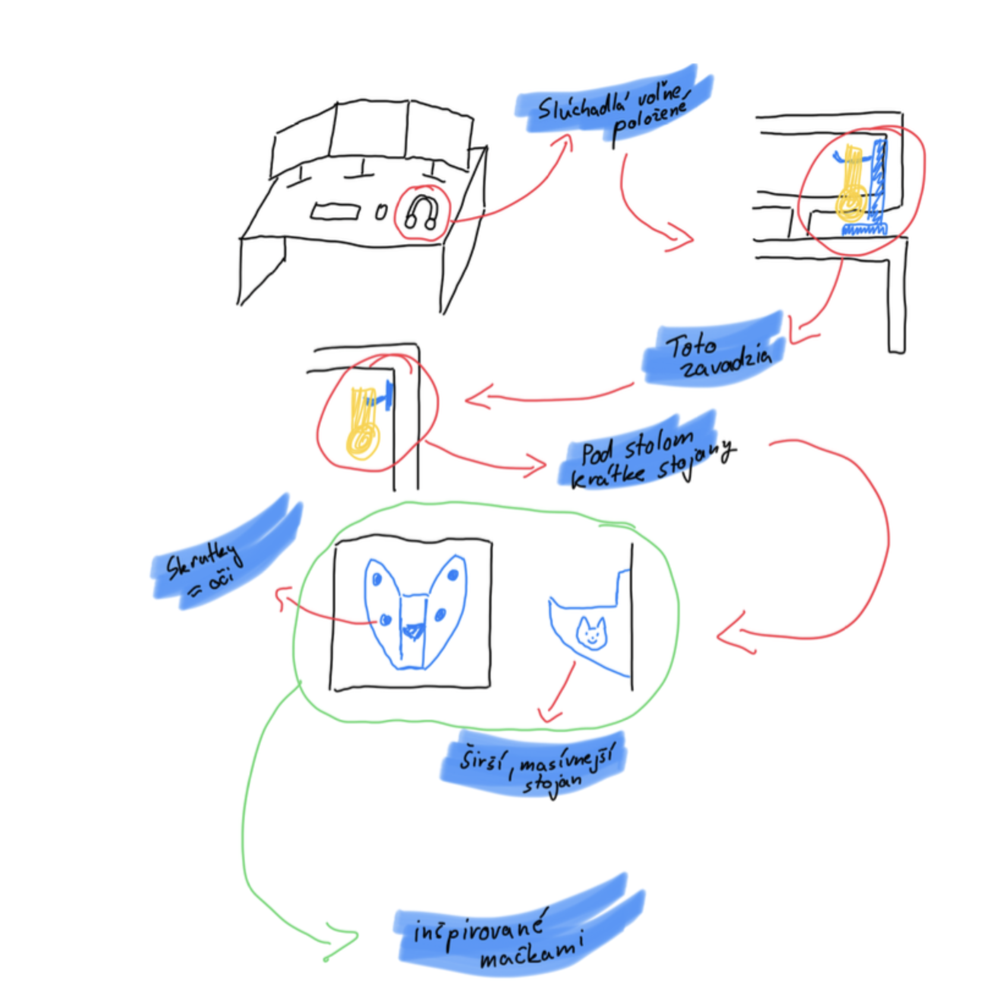

# Sketch

Prvotný nákres prototypu stojana na sluchátka s úchytom v tvare mačacej hlavy.

# Riešenie problému s organizáciou slúchadiel

Slúchadlá bývajú často voľne položené na stole, čo nielenže narúša poriadok na pracovnej ploche, ale môže tiež spôsobiť ich opotrebovanie či poškodenie. Voľné umiestnenie navyše často zavadzia, čo môže byť nepraktické, najmä na menších pracovných plochách.

## Návrh riešenia

- **Inšpirácia mačkami:** Navrhovaný stojan je inšpirovaný motívom mačky. Tvarová inšpirácia pochádza z mačacej hlavy, pričom skrutky, ktoré zabezpečujú upevnenie stojana na stolovú dosku, sú šikovne integrované a pripomínajú oči mačky.
- **Širší a masívnejší dizajn:** Stojan je navrhnutý tak, aby bol dostatočne stabilný a umožnil bezpečné uloženie slúchadiel.
- **Umiestnenie pod stolom:** Stojan je navrhnutý na upevnenie pod dosku stola. Toto umiestnenie zabraňuje tomu, aby slúchadlá zavadzali na pracovnej ploche, a zároveň ich udržiava na dosah ruky.
- **Kombinácia funkčnosti a estetiky:** Hlavná časť stojana esteticky pripomína mačaciu hlavu, čím spája funkčnosť s vizuálnou príťažlivosťou.

Tento koncept kombinuje efektívne využitie priestoru s jedinečným dizajnom, pričom sa zohľadňuje pohodlie používateľa a ochrana uložených slúchadiel.
