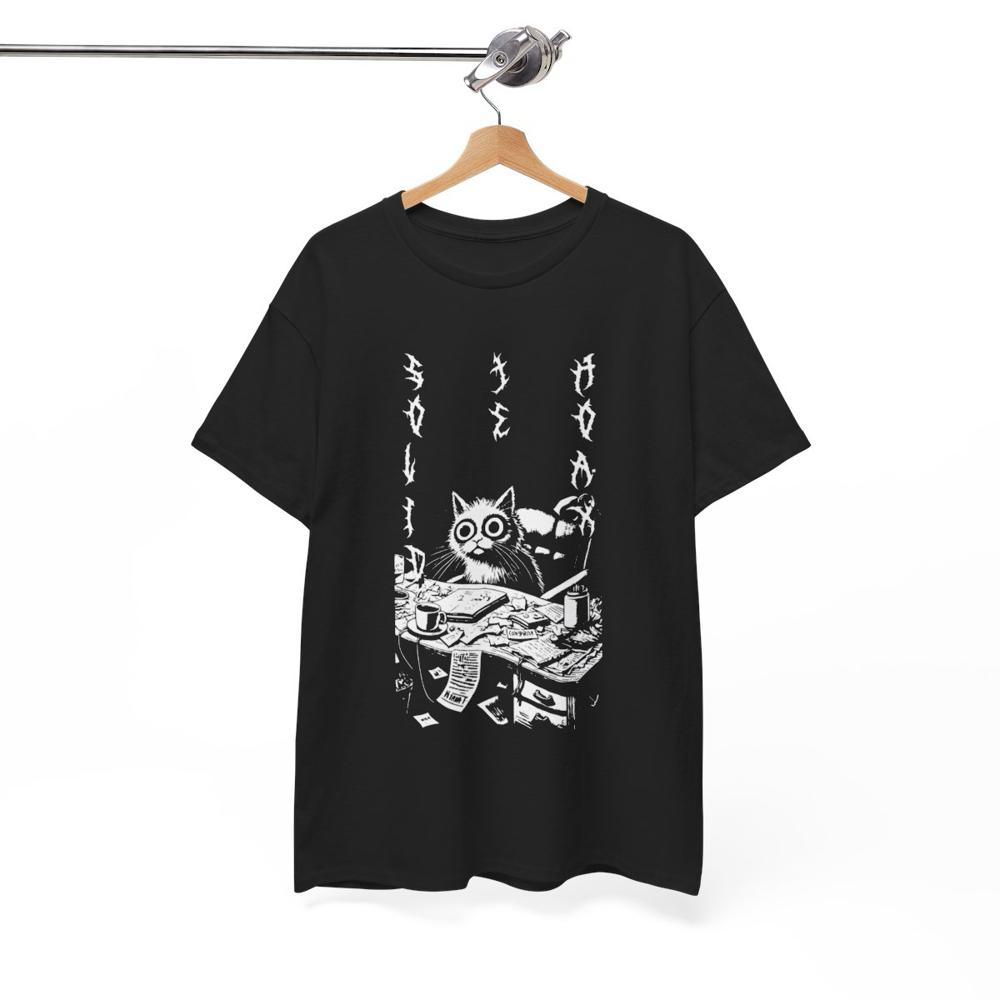

import { StlViewer } from "react-stl-viewer";
import useBaseUrl from "@docusaurus/useBaseUrl";

# Intro projektu

V tejto časti nájdete základné informácie o projekte a jeho cieľoch.

## Kto spolupracuje na projekte?

Tím MeowCraft sa skladá z nasledovných členov:

- Bc. Bruno Hanus
- Bc. Ján Herceg
- Bc. Roman Matúš
- Bc. Patrik Serzodi

## Naše "socials"

- [Youtube](https://www.youtube.com/@MeowCraft-Company)
- [LinkedIn](https://www.linkedin.com/company/meowcraft/)
- [Patreon](https://www.patreon.com/profile?u=145741883)

## Čo sme spravili?

### Videá z exkurzií

#### Exkurzia v LabCafé

<iframe
  width="100%"
  height="500"
  src="https://www.youtube.com/embed/LEws6UwPSik?si=GtWLkysiOCX3Idxn"
  title="YouTube video player"
  frameborder="0"
  allow="accelerometer; autoplay; clipboard-write; encrypted-media; gyroscope; picture-in-picture; web-share"
  referrerpolicy="strict-origin-when-cross-origin"
  allowfullscreen
></iframe>

#### Exkurzia v Laboratóriu vnorených systémov

<iframe
  width="100%"
  height="500"
  src="https://www.youtube.com/embed/K9J3rwezU3Q?si=0teu2AaNkyHAR02G"
  title="YouTube video player"
  frameborder="0"
  allow="accelerometer; autoplay; clipboard-write; encrypted-media; gyroscope; picture-in-picture; web-share"
  referrerpolicy="strict-origin-when-cross-origin"
  allowfullscreen
></iframe>

### [Stojan v tvare mačacej hlavy](/docs/head-stand)

Stojan v tvare mačacej hlavy je produkt, ktorý slúži na nabíjanie Apple Watch, alebo Apple Airpods so štýlom. Veď predsa každý programátor chce mať na stole hlavu mačky! 🐱

<StlViewer
  url={useBaseUrl("/models/cat.stl")}
  rotate={true}
  orbitControls={true}
  cameraControls={true}
  style={{
    height: "500px",
    width: "100%",
    backgroundColor: "rgba(0, 0, 0, 0.2)",
    borderRadius: "20px",
  }}
  shadows={true}
  modelProps={{
    color: "#DD3E28",
  }}
  cameraProps={{
    initialPosition: {
      distance: 1.4,
      latitude: 0,
      longitude: 0,
    },
  }}
/>

### [Stojan na slúchadlá](/docs/headphone-holder)

Stojan na slúchadlá je produkt, ktorý slúži na zlepšenie organizácie pracovného priestoru a predíde poškodeniu slúchadiel. Stojan je navrhnutý tak, aby sa dal jednoducho priskrutkovať na bočnú stranu stola. Hlavná časť, ktorá slúži na upevnenie stojana k stolu, je tvarovaná ako hlava mačky, čo mu dodáva estetický a originálny vzhľad. Samotné rameno stojana je dostatočne pevné a priestranné na pohodlné zavesenie slúchadiel, pričom zaisťuje ich bezpečné uloženie a jednoduchý prístup. Tento dizajn spája praktickosť a jedinečný vzhľad, čím sa stáva ideálnym doplnkom pre akýkoľvek pracovný stôl.

<StlViewer
    url={useBaseUrl("/models/headphone-stand.stl")}
    rotate={true}
    orbitControls={true}
    cameraControls={true}
    style={{height: "500px", width: "100%", backgroundColor: "rgba(0, 0, 0, 0.2)", borderRadius: "20px"}}
    shadows={true}
    modelProps={
        {
            color: "#DD3E28",

        }
    }
    cameraProps={
        {
            initialPosition: {
                distance: 1.4,
                latitude: 0,
                longitude: 0,
            }
        }
    }
    />

### [Multifunkčný stojan na Apple produkty](/docs/multi-stand)

Tento stojan je multifunkčný a ponúka možnosť umiestniť naň viacero Apple produktov naraz. Stojan je vhodný pre Apple Watch, Airpods a iPhone akebo ktorékolvek iné zariadenie ktoré podporuje bezdrôtové nabíjanie. Tak aby sme vyčistili náš stôl od káblov a mali všetko na jednom mieste. 📱🎧⌚🧹❤️

<StlViewer
  url={useBaseUrl("/models/multistand.stl")}
  rotate={true}
  orbitControls={true}
  cameraControls={true}
  style={{
    height: "500px",
    width: "100%",
    backgroundColor: "rgba(0, 0, 0, 0.5)",
    borderRadius: "20px",
  }}
  shadows={false}
  modelProps={{
    color: "#00000",
    rotationZ: -1.55,
  }}
  cameraProps={{
    initialPosition: {
      distance: 1.5,
      latitude: 0,
      longitude: 0,
    },
  }}
/>

### [Mačacie tričká](/docs/t-shirts)

Vtipne pojaté tričká z prostredia IT, každé tričko je inšpirované rockovými tričkami z 90. rokov a na tričkách sú vždy mačky s nejakým programátorsky tematickým nadpisom v deathmetalovom fonte.

