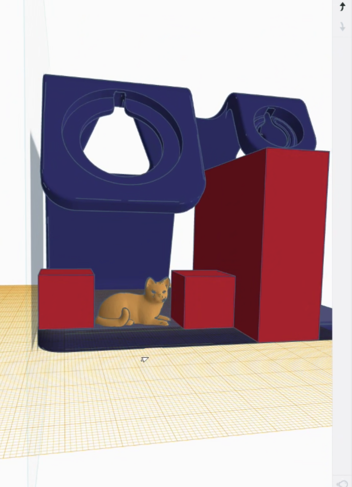
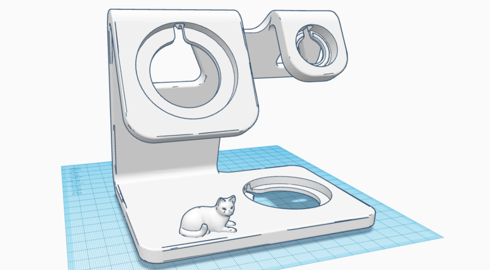
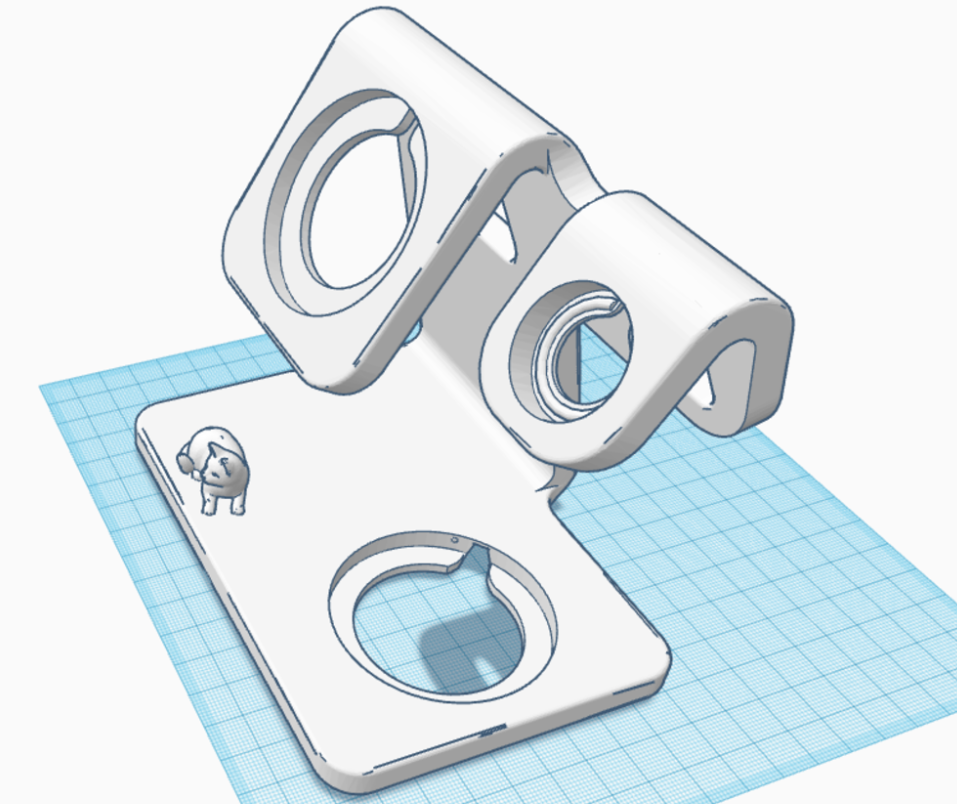

# Tvorba 3D modelu

import { StlViewer } from "react-stl-viewer";
import useBaseUrl from "@docusaurus/useBaseUrl";

Tento dokument obsahuje užitočné odkazy a informácie pre tvoju inšpiráciu, ktoré pomôžu pri vývoji a výrobe stojanu pre organizáciu elektronických zariadení na pracovnom stole.

---

## Research

### Design Guidelines

Oficiálne príručky pre návrh príslušenstva a nabíjacích zariadení nájdete na nasledujúcom odkaze:
[Accessory Design Guidelines](https://developer.apple.com/accessories/Accessory-Design-Guidelines.pdf#page=568&zoom=100,713,21)
_Popis: Táto príručka poskytuje technické a dizajnové odporúčania pre vytváranie kompatibilného príslušenstva pre produkty Apple._

### Model stojanu

Na Thingiverse je dostupný model stojanu, ktorý môžete použiť ako základ pre výrobu.
[Model stojanu na Thingiverse](https://www.thingiverse.com/thing:5234060)
_Popis: Tento 3D model ponúka praktický a funkčný dizajn pre umiestnenie elektronických zariadení, ako sú mobilné telefóny, slúchadlá a hodinky._

### Model mačky

Dekoratívny model mačky, ktorý je možné pridať k stojanu alebo použiť ako samostatnú súčasť:
[Model mačky na Printables](https://www.printables.com/model/712286-cat/files)
_Popis: Tento model dodá stojanu hravý vzhľad alebo môže byť použitý na zdobenie pracovného priestoru._

---

## Použitý nástroj na 3D modely

Keďže sme absolútni nováčikovia v tvorbe 3D modelov a dizajnu, rozhodli sme sa využiť existujúce riešenia, ktoré sme našli online. Vybrané modely a návrhy sme si prispôsobili tak, aby vyhovovali našim konkrétnym potrebám a požiadavkám. Tento prístup nám umožnil rýchlejšie sa naučiť procesy 3D modelovania a zároveň vytvoriť praktické a funkčné riešenie.

Použitý nástroj:
[Tinkercad](https://www.tinkercad.com/)
_Popis: Tinkercad je celkom jednoduchý, intuitívny nástroj na navrhovanie 3D modelov, ideálny pre začiatočníkov aj pokročilých._

(tiež som ho používal prvý krát 😂)

---

## Proces tvorenia

---

## Výsledný 3D model

Nižšie je zobrazený výsledný model. Model je možné [stiahnuť tu](/models/multistand.stl).

:::tip
Pridali sme modul na zobrazenie 3D modelu. Skús s modelom pohnúť 😁.
:::

<StlViewer
  url={useBaseUrl("/models/multistand.stl")}
  rotate={true}
  orbitControls={true}
  cameraControls={true}
  style={{
    height: "500px",
    width: "100%",
    backgroundColor: "rgba(0, 0, 0, 0.5)",
    borderRadius: "20px",
  }}
  shadows={false}
  modelProps={{
    color: "#00000",
    rotationZ: -1.55,
  }}
  cameraProps={{
    initialPosition: {
      distance: 1.5,
      latitude: 0,
      longitude: 0,
    },
  }}
/>

:::note
Tento model sme poslali kolegovi Patrikovi na zhodnotenie, či je možné ho vytlačiť. Momentálne čakáme na vytlačenie. 🙂
:::
