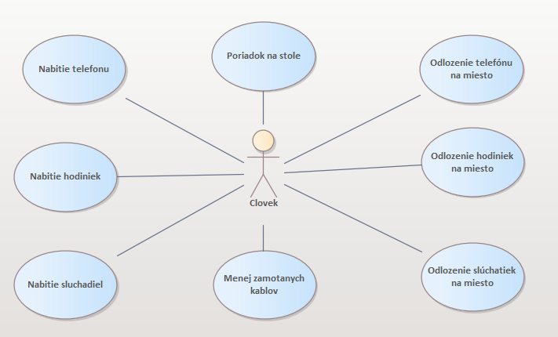
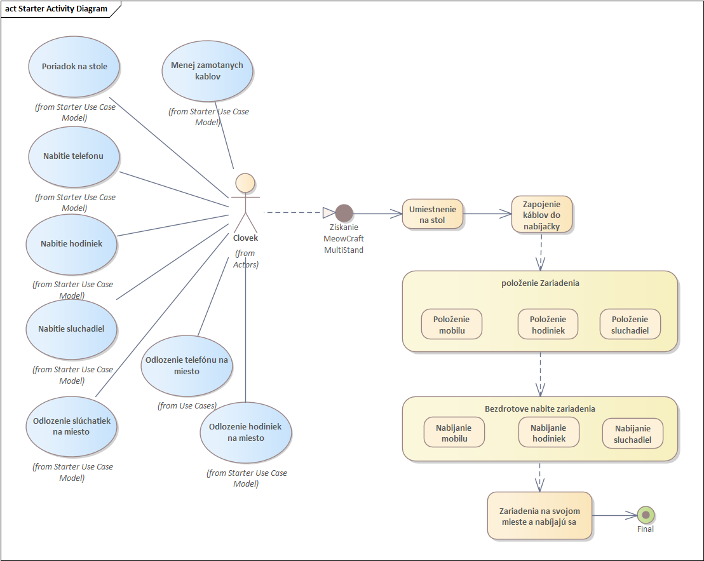

# Diagramy

V tejto časti nájdete diagramy, ktoré vizualizujú aktivity a use case pre náš multistand.

## Use Case Diagram

- **Poriadok na stole** – Hlavný cieľ, ktorého dosiahnutie je podporované rôznymi akciami.
- **Nabitie telefónu** – Akcia súvisiaca s udržiavaním poriadku na stole a starostlivosťou o zariadenie.
- **Nabitie hodiniek** – Podobná akcia ako nabíjanie telefónu, orientovaná na hodinky.
- **Nabitie slúchadiel** – Akcia zameraná na slúchadlá.
- **Odloženie telefónu na miesto** – Akcia spojená s udržiavaním poriadku na stole.
- **Odloženie hodiniek na miesto** – Podobná akcia ako odkladanie telefónu, orientovaná na hodinky.
- **Odloženie slúchadiel na miesto** – Akcia súvisiaca so slúchadlami.
- **Menej zamotaných káblov** – Vedľajší cieľ priamo súvisiaci s udržiavaním poriadku.

Týmto diagramom ilustrujeme interakciu medzi používateľom a týmito činnosťami s cieľom dosiahnuť lepšiu organizáciu a efektívnosť.

---

## Diagram toku dát

- **Poriadok na stole** a **Menej zamotaných káblov** (z Use Case Modelu).
- **Nabitie telefónu, hodiniek a slúchadiel.**
- **Odloženie telefónu, hodiniek a slúchadiel na miesto.**

### Proces:

1. Používateľ získa **MeowCraft MultiStand**.
2. Umiestni **MultiStand** na stôl.
3. Pripojí nabíjacie káble do zariadenia.
4. Položí jednotlivé zariadenia (mobil, hodinky, slúchadlá) na určené miesta v MultiStand.
5. Zariadenia sa bezdrôtovo nabíjajú na svojich miestach.
6. **Výsledný stav:** Zariadenia sú na svojich miestach a nabíjajú sa, pričom stôl zostáva uprataný.

Týmnto diagramomv ukazujeme spôsob organizácie zariadení a redukcie neporiadku na stole pomocou MultiStand.
