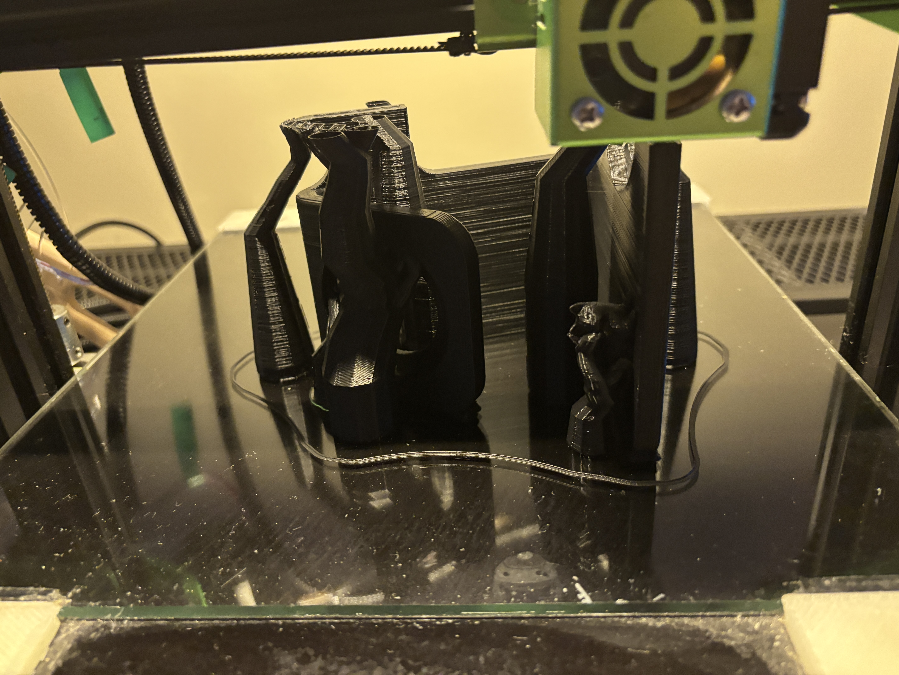
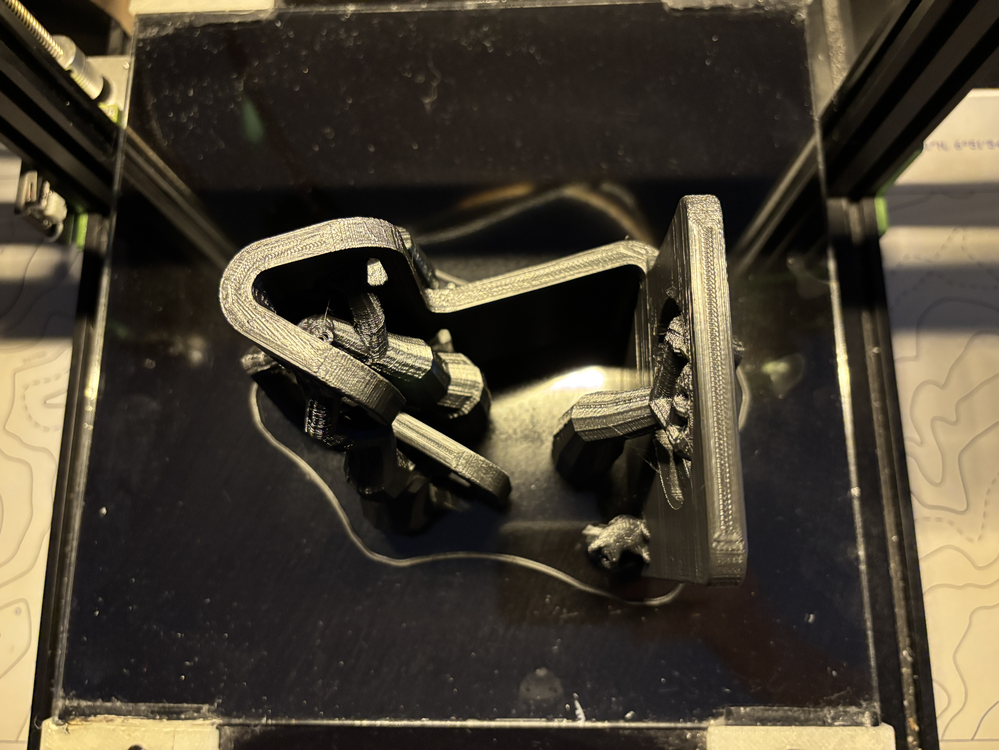

import {StlViewer} from "react-stl-viewer";
import useBaseUrl from '@docusaurus/useBaseUrl';

# Priebeh tlače prototypu

Aby sme vylepšili pracovný stôl a zároveň vytvorili praktický a pekný doplnok, rozhodli sme sa vytlačiť multifunkčný stojan na nabíjanie iphonu, apple watch a airpodov. Aby sme zachovali tematiku mačiek, rozhodli sme sa do stojanu pridať mačku sediacu na stojane.

**Teplota tlačovej dosky**: 60 °C

**Teplota trysky**: 200 °C

**Hrúbka vrstvy**: 0.2 mm

**Rýchlosť tlače**: 60 mm/s

**Hustota výplne modelu**: 20 % / 40 %

**Typ výplne modelu**: Grid/Tree

**Typ podporných štruktúr**: Podporné štruktúry obdĺžníkového tvaru

    |  |
    |:---:|
    | Proces tlače modelu |

    |  |
    |:---:|
    | Proces tlače modelu |

    |  |
    |:---:|
    | Proces tlače modelu |

    |  |
    |:---:|
    | Proces tlače modelu |

    |  |
    |:---:|
    | Dokončená tlač |

    |  |
    |:---:|
    | Dokončená tlač |

    |  |
    |:---:|
    | Dokončená tlač |


# Videá z tlače

<iframe width="560" height="315" src="https://www.youtube.com/embed/evFr4zqay3w?si=9oF75RcPwAGd7jUV" title="YouTube video player" frameborder="0" allow="accelerometer; autoplay; clipboard-write; encrypted-media; gyroscope; picture-in-picture; web-share" referrerpolicy="strict-origin-when-cross-origin" allowfullscreen></iframe>

<iframe width="560" height="315" src="https://www.youtube.com/embed/k0g31pWWS94?si=I-uuFN4aQMyMgRKo" title="YouTube video player" frameborder="0" allow="accelerometer; autoplay; clipboard-write; encrypted-media; gyroscope; picture-in-picture; web-share" referrerpolicy="strict-origin-when-cross-origin" allowfullscreen></iframe>

<br/><br/>

# Prototyp vytlačeného stojanu

Prvý vytlačený prototyp bol v horšej kvalite, nakoľko sme zle odhladli použitie podporných štruktúr.
Finálny bol vytlačený pomocou stromových štruktúr, ktoré sa dajú ľahko odstrániť. Z klasických obdĺžnikových štruktúr sme prešli na stromové.
Po úspešnom vytlačení modelu sme sa pustili do jeho otestovania. Stojan bol použiteľný a nabíjačky sa do neho vošli. Finálny produkt bol tiež tlačený s vyššou hustotou výplne pre lepšiu stabilitu a odolnosť.

# Finálny produkt

Po dokončení tlače sme model vyčistili a odstránili podporné štruktúry.

    |  |
    |:---:|
    | Finálny produkt |

    |  |
    |:---:|
    | Finálny produkt |

# Záver

Vytlačený stojan na nabíjanie je praktický a pekný doplnok k pracovnému stolu. Vďaka jeho dizajnu sa hodí do každého interiéru a zároveň je praktickým pomocníkom pri nabíjaní zariadení.
```
