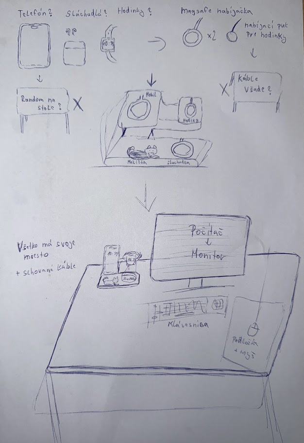

# Nápad a jeho Sketch

Prvotný návrh a myšlienkový pochod.

### Zariadenia na začiatku

Na skici sú znázornené tri základné zariadenia:

- **Telefón**
- **Slúchadlá**
- **Hodinky**

Pri hodinkách je naznačené použitie nabíjacieho **MagSafe adaptéra** alebo „nabíjacieho puku.“

---

### Organizačný problém

- **„Random na stole“** – Nesprávne usporiadanie zariadení spôsobuje neporiadok.
- **„Káble všade?“** – Prítomnosť veľkého množstva káblov znižuje estetiku aj praktickosť.

---

### Navrhované riešenie

V centre návrhu stojí **stojan alebo dokovacia stanica**, ktorá zabezpečuje:

- **Mobil a hodinky** na vrchnej časti.
- **Slúchadlá a príslušenstvo** (napríklad nabíjací adaptér) na spodnej časti.

---

### Finálna realizácia

Cieľom je dosiahnuť **upravený pracovný stôl**:

- **„Všetko má svoje miesto + schované káble.“**

Príklad finálneho usporiadania:

- Na stole sa nachádzajú **monitor**, **klávesnica**, **podložka** a **myš**.
- Naľavo je stojan na zariadenia, kde sú **mobil, hodinky a slúchadlá**, úhľadne usporiadané.
