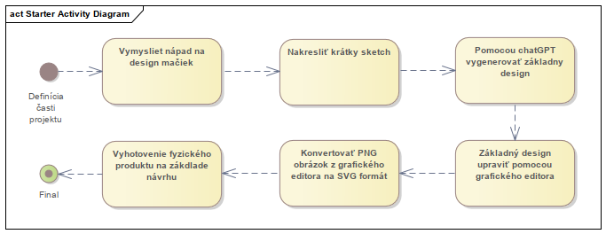
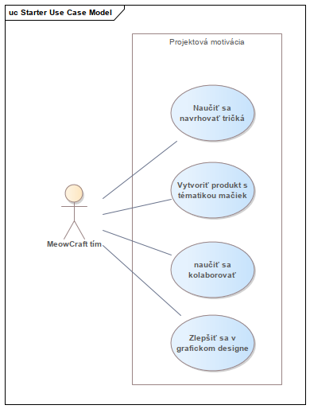

# Diagramy

Pre zvolený produkt sme zatiaľ vytvorili nasledovné diagramy:

## Activity Diagram

Celý proces tejto časti projektu prebiehal v nasledujúcich krokoch:

1. **Návrh nápadov**  
   Vymysleli sme koncept, ako by mali obrázky vyzerať a aký text by mali obsahovať.

2. **Príprava náčrtu**  
   Na tablete sme nakreslili približný návrh toho, čo by malo byť na tričkách.

3. **Generovanie obrázkov**  
   Pomocou ChatGPT sme ku všetkým našim nápadom vygenerovali obrázky.

4. **Úprava obrázkov**  
   Obrázky sme následne upravili v programe GIMP a pridali k nim texty.

5. **Konverzia na SVG formát**  
   Upravené obrázky sme konvertovali do formátu SVG.

6. **Tlač tričiek**  
   Na záver sme obrázky poslali na tlač prostredníctvom stránky [Shirttuning.sk](https://www.shirttuning.sk).

## Use Case Diagram

Tento diagram predstavuje **Use Case Model** pre projekt s názvom "Projektová motivácia" a ilustruje ciele a motivácie tímu **MeowCraft**.

Diagram zobrazuje postavu (aktéra), ktorá reprezentuje tím MeowCraft a štyri hlavné oblasti motivácie pre tento projekt.

### Popis jednotlivých motivačných bodov:

1. **Naučiť sa navrhovať tričká**
2. **Vytvoriť produkt s tématikou mačiek**
3. **Naučiť sa kolaborovať**
4. **Zlepšiť sa v grafickom dizajne**  
