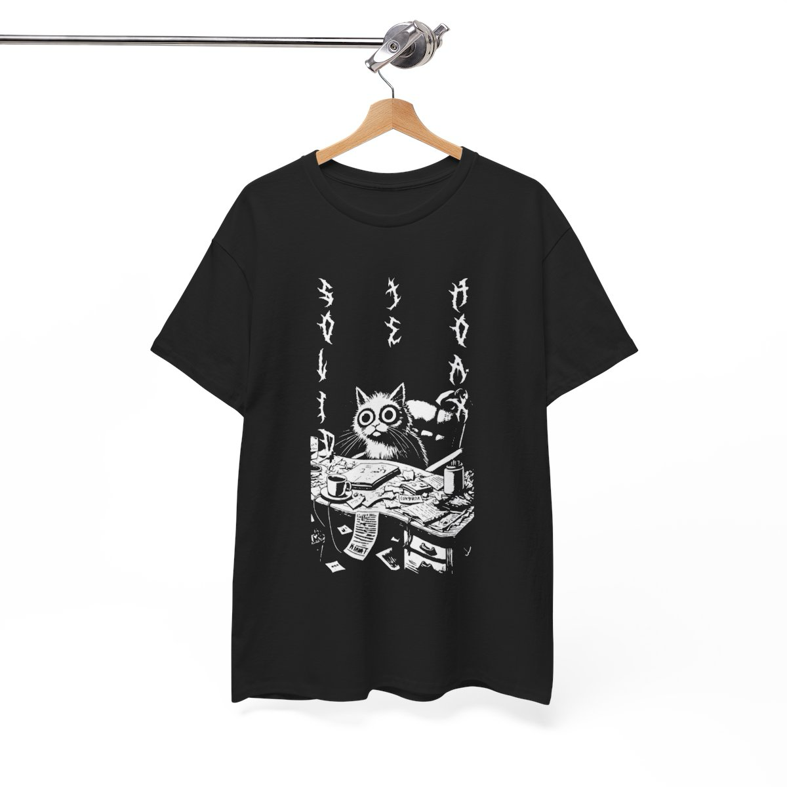

# Mačacie tričká
Motivácia na tvorbu tričiek prišla z toho že sme chceli spracovať naše pocity z nástrojov ktoré používame pri každodennej práci do podoby obrázkov.

Hlavným aktérom pri týchto obrázkoch by mali byť samozrejme mačky, ako plynie z názvu Meowcraft.

Design sme taktiež chceli inšpirovať designom starých rockerskych tričiek, ktoré boli čiernobiele.

### Aktuálny stav projektu:

- [x] Nápad
- [x] Sketch toho, ako by to malo vyzerať
- [x] Pripravený dizajn trička
- [x] Vyhotovené tričko

Spracovali náš nápad, vytvorili úvodný koncept a prepracovali prvotné sketche do finálneho dizajnu tričiek.

Tričká sme objednali u nášho dodávateľa a zatiaľ máme fyzicky k dispozícii jeden kus.

Tento prvý vzorový kus bol vyhodnotený ako kvalitný a vyhovujúci našim očakávaniam.

Po dôkladnom výbere sme sa rozhodli pre dva rôzne strihy tričiek, aby sme oslovili širšiu skupinu zákazníkov. V ponuke sú aktuálne tri rôzne verzie našich tričiek:

1. **Klasický strih**
2. **Moderný boxy strih**

Ponuku tričiek sme zatiaľ sprístupnili iba v našom firemnom chate, napriek tomu už evidujeme takmer 10 predbežných objednávok, čo naznačuje pozitívny záujem.

Plánujeme rozšíriť ponuku aj mimo firemného prostredia, pravdepodobne pomocou socíalnych sieti.

